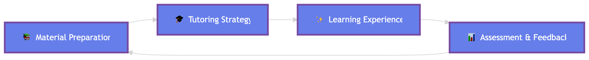

  <h1>Awesome AI and LLM for Education</h1>
  

    A curated list of papers related to artificial intelligence (AI) and large language model (LLM) for education
  

---

> [!IMPORTANT]
> 🚀 Welcome to visit the **[Online Webpage](http://tianfuwang.tech/awesome-ai-llm4education/)** for better experience!
> 
> There are two versions of this repository:
<!-- 
  

    <strong><a href="LLM4EDU.md" style="text-decoration: none; color:rgb(69, 162, 255);">🌟 LLM4EDU Version</a> | <a href="README.md" style="text-decoration: none; color:rgb(170, 125, 252);">🤖 Full Version</a></strong>
  
 -->

We collect papers related to **artificial intelligence (AI) and large language model (LLM) for education** from top conferences, journals, and specialized domain-specific conferences. We then categorize them according to their specific tasks for better organization.

**:sparkles: indicates the papers that are related to LLM.**

> [!note]
> 🎉 Our paper "[LLM-powered Multi-agent Framework for Goal-oriented Learning in Intelligent Tutoring System](https://arxiv.org/abs/2501.15749)" has been accepted by **WWW 2025 (Industry Track) as Oral Presentation**!

## [Content](#content)

<!-- <table>
<tr><td colspan="2"><a href="#survey-papers">1. Survey</a></td></tr>
<tr><td colspan="2"><a href="#tasks">2. Tasks</a></td></tr>  --><table>

<tr>
<tr><td colspan="2"><a href="#survey--analysis">1. Survey & Analysis</a></td>
<tr>
	<td>&emsp;<a href=#comprehensive-survey>1.1 Comprehensive Survey</a></td>
	<td>&emsp;<a href=#empirical-analysis>1.2 Empirical Analysis</a></td>
</tr>
<tr>
<tr><td colspan="2"><a href="#tutoring-strategy">2. Tutoring Strategy</a></td>
<tr>
	<td>&emsp;<a href=#learning-path-recommendation>2.1 Learning Path Recommendation</a></td>
	<td>&emsp;<a href=#tutoring-system>2.2 Tutoring System</a></td>
</tr>
<tr>
<tr><td colspan="2"><a href="#learning-experience">3. Learning Experience</a></td>
<tr>
	<td>&emsp;<a href=#learning-engagement>3.1 Learning Engagement</a></td>
	<td>&emsp;<a href=#student-simulation--profiling>3.2 Student Simulation & Profiling</a></td>
</tr>
<tr>
<tr><td colspan="2"><a href="#assessment--feedback">4. Assessment & Feedback</a></td>
<tr>
	<td>&emsp;<a href=#automated-grading>4.1 Automated Grading</a></td>
	<td>&emsp;<a href=#cognitive-diagnosis>4.2 Cognitive Diagnosis</a></td>
</tr>
<tr>
<tr><td colspan="2"><a href="#material-preparation">5. Material Preparation</a></td>
<tr>
	<td>&emsp;<a href=#content-generation>5.1 Content Generation</a></td>
	<td>&emsp;<a href=#question-generation>5.2 Question Generation</a></td>
</tr>
<tr>
	<td>&emsp;<a href=#question-retrieval>5.3 Question Retrieval</a></td>
	<td></td>
</tr>
<tr>
<tr><td colspan="2"><a href="#specific-scenario">6. Specific Scenario</a></td>
<tr>
	<td>&emsp;<a href=#computer-science>6.1 Computer Science</a></td>
	<td>&emsp;<a href=#language>6.2 Language</a></td>
</tr>
<tr>
	<td>&emsp;<a href=#liberal-arts>6.3 Liberal Arts</a></td>
	<td>&emsp;<a href=#math>6.4 Math</a></td>
</tr>
<tr>
	<td>&emsp;<a href=#medicine>6.5 Medicine</a></td>
	<td>&emsp;<a href=#social-good>6.6 Social Good</a></td>
</tr>
<tr>
<tr><td colspan="2"><a href="#aided-teaching">7. Aided Teaching</a></td>
<tr>
<tr><td colspan="2"><a href="#dataset--benchmark">8. Dataset & Benchmark</a></td>
<tr>
	<td>&emsp;<a href=#benchmark>8.1 Benchmark</a></td>
	<td>&emsp;<a href=#dataset>8.2 Dataset</a></td>
</tr>
</table>

## [Survey & Analysis](#content)

### [Comprehensive Survey](#content)

1. :sparkles: **Generative Artificial Intelligence and Agents in Research and Teaching**

    *Jussi S. Jauhiainen, Aurora Toppari*

    arXiv, 2025. [`preprint`](https://arxiv.org/abs/2508.16701)

2. :sparkles: **Opportunities and Challenges of LLMs in Education: An NLP Perspective**

    *Sowmya Vajjala, Bashar Alhafni, Stefano Bannò, Kaushal Kumar Maurya, Ekaterina Kochmar*

    arXiv, 2025. [`preprint`](https://arxiv.org/abs/2507.22753)

3. :sparkles: **Large Language Models for Education: A Survey**

    *Hanyi Xu, Wensheng Gan, Zhenlian Qi, Jiayang Wu, Philip S. Yu*

    Journal of Machine Learning and Cybernetics, 2024. [`journal`](https://arxiv.org/abs/2405.13001)

4. :sparkles: **Large Language Models for Education: A Survey and Outlook**

    *Shen Wang, Tianlong Xu, Hang Li, Chaoli Zhang, Joleen Liang, Jiliang Tang, Philip S. Yu, Qingsong Wen*

    arXiv, 2024. [`preprint`](https://arxiv.org/abs/2403.18105)

5. :sparkles: **Adapting Large Language Models for Education: Foundational Capabilities, Potentials, and Challenges**

    *Qingyao Li, Lingyue Fu, Weiming Zhang, Xianyu Chen, Jingwei Yu, Wei Xia, Weinan Zhang, Ruiming Tang, Yong Yu*

    arXiv, 2024. [`preprint`](https://arxiv.org/abs/2401.08664)

6. :sparkles: **Large Language Models in Education: Vision and Opportunities**

    *Wensheng Gan, Zhenlian Qi, Jiayang Wu, Jerry Chun-Wei Lin*

    BigData, 2023. [`conference`](https://arxiv.org/abs/2311.13160)

### [Empirical Analysis](#content)

1. :sparkles: **The effect of ChatGPT on students’ learning performance, learning perception, and higher-order thinking: insights from a meta-analysis**

    *Jin Wang, Wenxiang Fan*

    Nature, 2025. [`journal`](https://www.nature.com/articles/s41599-025-04787-y)

2. :sparkles: **A systematic review of AI-driven intelligent tutoring systems (ITS) in K-12 education**

    *Angélique Létourneau, Marion Deslandes Martineau, Patrick Charland, John Alexander Karran, Jared Boasen, Pierre Majorique Léger*

    npj science of learning, 2025. [`journal`](https://www.nature.com/articles/s41539-025-00320-7)

## [Tutoring Strategy](#content)

### [Learning Path Recommendation](#content)

1. :sparkles: **LearnMate: Enhancing Online Education with LLM-Powered Personalized Learning Plans and Support**

    *Xinyu Jessica Wang, Christine P. Lee, Bilge Mutlu*

    CHI Extended Abstract, 2025. [`workshop`](https://arxiv.org/abs/2503.13340)

2. :sparkles: **PlanGlow: Personalized Study Planning with an Explainable and Controllable LLM-Driven System**

    *Jiwon Chun, Yankun Zhao, Hanlin Chen, Meng Xia*

    Learning@Scale, 2025. [`conference`](https://arxiv.org/abs/2503.13340)

3. :sparkles: **Learning Structure and Knowledge Aware Representation with Large Language Models for Concept Recommendation**

    *Qingyao Li, Wei Xia, Kounianhua Du, Qiji Zhang, Weinan Zhang, Ruiming Tang, Yong Yu*

    arXiv, 2024. [`preprint`](https://arxiv.org/abs/2405.12442)

### [Tutoring System](#content)

1. :sparkles: **LLM-powered Multi-agent Framework for Goal-oriented Learning in Intelligent Tutoring System**

    *Tianfu Wang, Yi Zhan, Jianxun Lian, Zhengyu Hu, Nicholas Jing Yuan, Qi Zhang, Xing Xie, Hui Xiong*

    WWW, 2025. [`conference`](https://arxiv.org/abs/2501.15749)

, [`code`](https://github.com/GeminiLight/gen-mentor)

2. :sparkles: **Generative AI in Education: From Foundational Insights to the Socratic Playground for Learning**

    *Xiangen Hu, Sheng Xu, Richard Tong, Art Graesser*

    arXiv, 2025. [`preprint`](https://arxiv.org/abs/2501.06682)

3. :sparkles: **From Problem-Solving to Teaching Problem-Solving: Aligning LLMs with Pedagogy using Reinforcement Learning**

    *David Dinucu-Jianu, Jakub Macina, Nico Daheim, Ido Hakimi, Iryna Gurevych, Mrinmaya Sachan*

    arXiv, 2025. [`preprint`](https://arxiv.org/pdf/2505.15607)

, [`code`](https://github.com/eth-lre/PedagogicalRL)

4. :sparkles: **A Theory of Adaptive Scaffolding for LLM-Based Pedagogical Agents**

    *Clayton Cohn, Surya Rayala, Namrata Srivastava, Joyce Horn Fonteles, Shruti Jain, Xinying Luo, Divya Mereddy, Naveeduddin Mohammed, Gautam Biswas*

    arXiv, 2025. [`preprint`](https://arxiv.org/abs/2508.01503)

5. :sparkles: **Cultivating Helpful, Personalized, and Creative AI Tutors: A Framework for Pedagogical Alignment using Reinforcement Learning**

    *Siyu Song, Wentao Liu, Ye Lu, Ruohua Zhang, Tao Liu, Jinze Lv, Xinyun Wang, Aimin Zhou, Fei Tan, Bo Jiang, Hao Hao*

    arXiv, 2025. [`preprint`](https://arxiv.org/abs/2507.20335)

6. :sparkles: **Exploring Conversational Design Choices in LLMs for Pedagogical Purposes: Socratic and Narrative Approaches for Improving Instructor's Teaching Practice**

    *Si Chen, Isabel R. Molnar, Peiyu Li, Adam Acunin, Ting Hua, Alex Ambrose, Nitesh V. Chawla, Ronald Metoyer*

    arXiv, 2025. [`preprint`](https://arxiv.org/abs/2501.04100)

7. :sparkles: **Empowering Personalized Learning through a Conversation-based Tutoring System with Student Modeling**

    *Minju Park, Sojung Kim, Seunghyun Lee, Soonwoo Kwon, Kyuseok Kim*

    CHI-LBW, 2024. [`workshop`](https://arxiv.org/abs/2403.14071)

8. :sparkles: **AutoTutor meets Large Language Models: A Language Model Tutor with Rich Pedagogy and Guardrails**

    *Sankalan Pal Chowdhury, Vilém Zouhar, Mrinmaya Sachan*

    Learning@Scale, 2024. [`conference`](https://arxiv.org/abs/2402.09216)

9. :sparkles: **SocraticLM: Exploring Socratic Personalized Teaching with Large Language Models**

    *Jiayu Liu, Zhenya Huang, Tong Xiao, Jing Sha, Jinze Wu, Qi Liu, Shijin Wang, Enhong Chen*

    NeurIPS, 2024. [`conference`](https://neurips.cc/virtual/2024/poster/93477)

10. :sparkles: **Personality-aware Student Simulation for Conversational Intelligent Tutoring Systems**

    *Zhengyuan Liu, Stella Xin Yin, Geyu Lin, Nancy F. Chen*

    arXiv, 2024. [`preprint`](https://arxiv.org/abs/2404.06762)

11. :sparkles: **Intelligent Tutor: Leveraging ChatGPT and Microsoft Copilot Studio to Deliver a Generative AI Student Support and Feedback System within Teams**

    *Wei-Yu Chen*

    arXiv, 2024. [`preprint`](https://arxiv.org/abs/2404.06762)

12. :sparkles: **Scaffolding Language Learning via Multi-modal Tutoring Systems with Pedagogical Instructions**

    *Zhengyuan Liu, Stella Xin Yin, Carolyn Lee, Nancy F. Chen*

    arXiv, 2024. [`preprint`](https://arxiv.org/abs/2404.03429)

13. :sparkles: **Apprentice Tutor Builder: A Platform For Users to Create and Personalize Intelligent Tutors**

    *Glen Smith, Adit Gupta, Christopher MacLellan*

    arXiv, 2024. [`preprint`](https://arxiv.org/abs/2404.07883)

14. :sparkles: **AI-TA: Towards an Intelligent Question-Answer Teaching Assistant using Open-Source LLMs**

    *Yann Hicke, Anmol Agarwal, Qianou Ma, Paul Denny*

    NeurIPS - Workshop on Generative AI for Education (GAIED), 2023. [`workshop`](https://arxiv.org/abs/2311.02775)

15. :sparkles: **Empowering Private Tutoring by Chaining Large Language Models**

    *Yulin Chen, Ning Ding, Hai-Tao Zheng, Zhiyuan Liu, Maosong Sun, Bowen Zhou*

    arXiv, 2023. [`preprint`](https://arxiv.org/abs/2309.08112)

16. :sparkles: **How to Build an AI Tutor that Can Adapt to Any Course and Provide Accurate Answers Using Large Language Model and Retrieval-Augmented Generation**

    *Chenxi Dong*

    arXiv, 2023. [`preprint`](https://arxiv.org/abs/2311.17696)

## [Learning Experience](#content)

### [Learning Engagement](#content)

1. :sparkles: **Examining the Role of LLM-Driven Interactions on Attention and Cognitive Engagement in Virtual Classrooms**

    *Suleyman Ozdel, Can Sarpkaya, Efe Bozkir, Hong Gao, Enkelejda Kasneci*

    arXiv, 2025. [`preprint`](https://arxiv.org/pdf/2505.07377)

### [Student Simulation & Profiling](#content)

1. :sparkles: **Agent4Edu: Generating Learner Response Data by Generative Agents for Intelligent Education Systems**

    *Weibo Gao, Qi Liu, Linan Yue, Fangzhou Yao, Rui Lv, Zheng Zhang, Hao Wang, Zhenya Huang*

    AAAI, 2025. [`conference`](https://arxiv.org/abs/2501.10332)

2. :sparkles: **Classroom Simulacra: Building Contextual Student Generative Agents in Online Education for Learning Behavioral Simulation**

    *Songlin Xu, Hao-Ning Wen, Hongyi Pan, Dallas Dominguez, Dong yin Hu, Xinyu Zhang*

    CHI, 2025. [`conference`](https://arxiv.org/abs/2502.02780)

3. :sparkles: **CoderAgent: Simulating Student Behavior for Personalized Programming Learning with Large Language Models**

    *Yi Zhan, Qi Liu, Weibo Gao, Zheng Zhang, Tianfu Wang, Shuanghong Shen, Junyu Lu, Zhenya Huang*

    IJCAI, 2025. [`conference`](https://arxiv.org/abs/2505.20642)

4. :sparkles: **LLM-powered Multi-agent Framework for Goal-oriented Learning in Intelligent Tutoring System**

    *Tianfu Wang, Yi Zhan, Jianxun Lian, Zhengyu Hu, Nicholas Jing Yuan, Qi Zhang, Xing Xie, Hui Xiong*

    WWW, 2025. [`conference`](https://arxiv.org/abs/2501.15749)

5. :sparkles: **FOKE: A Personalized and Explainable Education Framework Integrating Foundation Models, Knowledge Graphs, and Prompt Engineering**

    *Silan Hu, Xiaoning Wang*

    arXiv, 2024. [`preprint`](https://arxiv.org/abs/2405.03734)

6. :sparkles: **EduAgent: Generative Student Agents in Learning**

    *Songlin Xu, Xinyu Zhang, Lianhui Qin*

    arXiv, 2024. [`preprint`](https://arxiv.org/abs/2404.07963)

7. :sparkles: **Contextualizing Problems to Student Interests at Scale in Intelligent Tutoring System Using Large Language Models**

    *Gautam Yadav, Ying-Jui Tseng, Xiaolin Ni*

    AIED - Workshop on Empowering Education with LLMs - the Next-Gen Interface and Content Generation, 2023. [`workshop`](https://arxiv.org/abs/2306.00190)

## [Assessment & Feedback](#content)

### [Automated Grading](#content)

1. :sparkles: **Large Language Models As MOOCs Graders**

    *Shahriar Golchin, Nikhil Garuda, Christopher Impey, Matthew Wenger*

    arXiv, 2024. [`preprint`](https://arxiv.org/abs/2402.03776)

2. :sparkles: **From Automation to Augmentation: Large Language Models Elevating Essay Scoring Landscape**

    *Changrong Xiao, Wenxing Ma, Sean Xin Xu, Kunpeng Zhang, Yufang Wang, Qi Fu*

    arXiv, 2024. [`preprint`](https://arxiv.org/pdf/2401.06431)

3. :sparkles: **Large Language Models as Partners in Student Essay Evaluation**

    *Toru Ishida, Tongxi Liu, Hailong Wang, William K. Cheung*

    arXiv, 2024. [`preprint`](https://arxiv.org/abs/2405.18632)

### [Cognitive Diagnosis](#content)

1. :sparkles: **Generative Students: Using LLM-Simulated Student Profiles to Support Question Item Evaluation**

    *Xinyi Lu, Xu Wang*

    Learning@Scale, 2024. [`conference`](https://arxiv.org/abs/2405.11591)

## [Material Preparation](#content)

### [Content Generation](#content)

1. :sparkles: **The Reel Deal: Designing and Evaluating LLM-Generated Short-Form Educational Videos**

    *Lazaros Stavrinou, Argyris Constantinides, Marios Belk, Vasos Vassiliou, Fotis Liarokapis, Marios Constantinides*

    CHIGreece, 2025. [`conference`](https://arxiv.org/abs/2501.04101)

2. :sparkles: **Classic4Children: Adapting Chinese Literary Classics for Children with Large Language Model**

    *Jiali Chen, Xusen Hei, Yuqi Xue, Zihan Wu, Jiayuan Xie, Yi Cai*

    NAACL Findings, 2025. [`conference`](https://arxiv.org/abs/2502.01090)

3. :sparkles: **COGENT: A Curriculum-oriented Framework for Generating Grade-appropriate Educational Content**

    *Zhengyuan Liu, Stella Xin Yin, Dion Hoe-Lian Goh, Nancy F. Chen*

    arXiv, 2025. [`preprint`](https://arxiv.org/abs/2409.15024)

4. :sparkles: **Instructional Agents: LLM Agents on Automated Course Material Generation for Teaching Faculties**

    *Huaiyuan Yao, Wanpeng Xu, Justin Turnau, Nadia Kellam, Hua Wei*

    arXiv, 2025. [`preprint`](https://arxiv.org/abs/2508.19611)

5. :sparkles: **Assisting in Writing Wikipedia-like Articles From Scratch with Large Language Models**

    *Yijia Shao, Yucheng Jiang, Theodore A. Kanell, Peter Xu, Omar Khattab, Monica S. Lam*

    NAACL, 2024. [`conference`](https://arxiv.org/abs/2402.14207)

6. :sparkles: **Generating and Evaluating Tests for K-12 Students with Language Model Simulations: A Case Study on Sentence Reading Efficiency**

    *Eric Zelikman, Wanjing Anya Ma, Jasmine E. Tran, Diyi Yang, Jason D. Yeatman, Nick Haber*

    EMNLP, 2023. [`conference`](https://arxiv.org/abs/2310.06837)

7. :sparkles: **On the Automatic Generation and Simplification of Children's Stories**

    *Maria Valentini, Jennifer Weber, Jesus Salcido, Téa Wright, Eliana Colunga, Katharina Kann*

    EMNLP, 2023. [`conference`](https://arxiv.org/abs/2310.18502)

8. :sparkles: **FairytaleCQA: Integrating a Commonsense Knowledge Graph into Children's Storybook Narratives**

    *Jiaju Chen, Yuxuan Lu, Shao Zhang, Bingsheng Yao, Yuanzhe Dong, Ying Xu, Yunyao Li, Qianwen Wang, Dakuo Wang, Yuling Su*

    arXiv, 2023. [`preprint`](https://arxiv.org/abs/2311.09756)

9. :sparkles: **Robosourcing Educational Resources – Leveraging Large Language Models for Learnersourcing**

    *Paul Denny, Sami Sarsa, Arto Hellas, Juho Leinonen*

    Learning@Scale - Workshop on Learnersourcing: Student-generated Content @ Scale, 2022. [`workshop`](https://arxiv.org/abs/2211.04715)

### [Question Generation](#content)

1. :sparkles: **Exploring Iterative Enhancement for Improving Learnersourced Multiple-Choice Question Explanations with Large Language Models**

    *Qiming Bao, Juho Leinonen, Alex Yuxuan Peng, Wanjun Zhong, Gaël Gendron, Timothy Pistotti, Alice Huang, Paul Denny, Michael Witbrock, Jiamou Liu*

    AAAI, 2025. [`conference`](https://arxiv.org/abs/2309.10444)

2. :sparkles: **KAQG: A Knowledge‑Graph‑Enhanced RAG for Difficulty‑Controlled Question Generation**

    *Ching Han Chen, Ming Fang Shiu*

    arXiv, 2025. [`preprint`](https://arxiv.org/abs/2505.07618)

3. :sparkles: **Math Multiple Choice Question Generation via Human-Large Language Model Collaboration**

    *Jaewook Lee, Digory Smith, Simon Woodhead, Andrew Lan*

    EDM, 2024. [`conference`](https://arxiv.org/abs/2405.00864)

4. :sparkles: **Improving Automated Distractor Generation for Math Multiple-choice Questions with Overgenerate-and-rank**

    *Alexander Scarlatos, Wanyong Feng, Digory Smith, Simon Woodhead, Andrew Lan*

    NAACL - BEA workshop, 2024. [`workshop`](https://arxiv.org/abs/2405.05144)

5. :sparkles: **Exploring Automated Distractor Generation for Math Multiple-choice Questions via Large Language Models**

    *Wanyong Feng, Jaewook Lee, Hunter McNichols, Alexander Scarlatos, Digory Smith, Simon Woodhead, Nancy Otero Ornelas, Andrew Lan*

    NAACL findings, 2024. [`conference`](https://arxiv.org/abs/2404.02124)

6. :sparkles: **Multiple-Choice Question Generation Using Large Language Models: Methodology and Educator Insights**

    *Giorgio Biancini, Alessio Ferrato, Carla Limongelli*

    UMAP Adjunct, 2024. [`workshop`](https://arxiv.org/abs/2506.04851)

7. :sparkles: **Multiple Choice Questions and Large Languages Models: A Case Study with Fictional Medical Data**

    *Maxime Griot, Jean Vanderdonckt, Demet Yuksel, Coralie Hemptinne*

    arXiv, 2024. [`preprint`](https://arxiv.org/abs/2406.02394)

8. :sparkles: **Leveraging Large Language Models for Concept Graph Recovery and Question Answering in NLP Education**

    *Rui Yang, Boming Yang, Sixun Ouyang, Tianwei She, Aosong Feng, Yuang Jiang, Freddy Lecue, Jinghui Lu, Irene Li*

    arXiv, 2024. [`preprint`](https://arxiv.org/abs/2402.14293)

### [Question Retrieval](#content)

1. :sparkles: **Large Language Model Augmented Exercise Retrieval for Personalized Language Learning**

    *Austin Xu, Will Monroe, Klinton Bicknell*

    Learning Analytics and Knowledge (LAK), 2024. [`conference`](https://arxiv.org/abs/2402.16877)

## [Specific Scenario](#content)

### [Computer Science](#content)

1. :sparkles: **Learning by Teaching: Engaging Students as Instructors of Large Language Models in Computer Science Education**

    *Xinming Yang, Haasil Pujara, Jun Li*

    COLM, 2025. [`conference`](https://arxiv.org/abs/2508.05979)

2. :sparkles: **Partnering with AI: A Pedagogical Feedback System for LLM Integration into Programming Education**

    *Niklas Scholz, Manh Hung Nguyen, Adish Singla, Tomohiro Nagashima*

    ECTEL, 2025. [`conference`](https://arxiv.org/pdf/2507.00406)

3. :sparkles: **CodeAid: Evaluating a Classroom Deployment of an LLM-based Programming Assistant that Balances Student and Educator Needs**

    *Majeed Kazemitabaar, Runlong Ye, Xiaoning Wang, Austin Z. Henley, Paul Denny, Michelle Craig, Tovi Grossman*

    CHI, 2024. [`conference`](https://arxiv.org/abs/2401.11314)

4. :sparkles: **Interactions with Prompt Problems: A New Way to Teach Programming with Large Language Models**

    *James Prather, Paul Denny, Juho Leinonen, David H. Smith IV, Brent N. Reeves, Stephen MacNeil, Brett A. Becker, Andrew Luxton-Reilly, Thezyrie Amarouche, Bailey Kimmel*

    CHI, 2024. [`conference`](https://arxiv.org/abs/2401.10759)

5. :sparkles: **ChatScratch: An AI-Augmented System Toward Autonomous Visual Programming Learning for Children Aged 6-12**

    *Liuqing Chen, Shuhong Xiao, Yunnong Chen, Ruoyu Wu, Yaxuan Song, Lingyun Sun*

    CHI, 2024. [`conference`](https://arxiv.org/abs/2402.04975)

6. :sparkles: **Exploring How Multiple Levels of GPT-Generated Programming Hints Support or Disappoint Novices**

    *Ruiwei Xiao, Xinying Hou, John Stamper*

    CHI, 2024. [`conference`](https://arxiv.org/abs/2404.02213)

7. :sparkles: **AI-Tutoring in Software Engineering Education**

    *Eduard Frankford, Clemens Sauerwein, Patrick Bassner, Stephan Krusche, Ruth Breu*

    ICSE, 2024. [`conference`](https://arxiv.org/abs/2404.02548)

8. :sparkles: **How Far Are We? The Triumphs and Trials of Generative AI in Learning Software Engineering**

    *Rudrajit Choudhuri, Dylan Liu, Igor Steinmacher, Marco Gerosa, Anita Sarma*

    ICSE, 2024. [`conference`](https://arxiv.org/abs/2312.11719)

9. :sparkles: **Evaluating the Effectiveness of LLMs in Introductory Computer Science Education: A Semester-Long Field Study**

    *Wenhan Lyu, Yimeng Wang, Tingting (Rachel)Chung, Yifan Sun, Yixuan Zhang*

    Learning@Scale, 2024. [`conference`](https://arxiv.org/abs/2404.13414)

10. :sparkles: **Accelerating Scientific Discovery with Generative Knowledge Extraction, Graph-Based Representation, and Multimodal Intelligent Graph Reasoning**

    *Markus J. Buehler*

    arXiv, 2024. [`preprint`](https://arxiv.org/abs/2403.11996)

11. :sparkles: **Studying the effect of AI Code Generators on Supporting Novice Learners in Introductory Programming**

    *Majeed Kazemitabaar, Justin Chow, Carl Ka To Ma, Barbara J. Ericson, David Weintrop, Tovi Grossman*

    CHI, 2023. [`conference`](https://arxiv.org/abs/2302.07427)

### [Language](#content)

1. :sparkles: **Position: LLMs Can be Good Tutors in Foreign Language Education**

    *Jingheng Ye, Shen Wang, Deqing Zou, Yibo Yan, Kun Wang, Hai-Tao Zheng, Zenglin Xu, Irwin King, Philip S. Yu, Qingsong Wen*

    arXiv, 2025. [`preprint`](https://arxiv.org/abs/2502.05467)

2. :sparkles: **WordPlay: An Agent Framework for Language Learning Games**

    *Ariel Blobstein, Daniel Izmaylov, Tal Yifat, Michal Levy, Avi Segal, Avi Segal*

    NeurIPS - Workshop on Generative AI for Education (GAIED), 2024. [`workshop`](https://gaied.org/neurips2023/files/9/9_paper.pdf)

### [Liberal Arts](#content)

1. :sparkles: **Exploring LLM-Powered Role and Action-Switching Pedagogical Agents for History Education in Virtual Reality**

    *Zihao Zhu, Ao Yu, Xin Tong, Pan Hui*

    CHI, 2025. [`conference`](https://arxiv.org/pdf/2505.02699)

### [Math](#content)

1. :sparkles: **MathEDU: Towards Adaptive Feedback for Student Mathematical Problem-Solving**

    *Wei-Ling Hsu, Yu-Chien Tang, An-Zi Yen*

    arXiv, 2025. [`conference`](https://arxiv.org/pdf/2505.18056)

2. :sparkles: **One Size doesn’t Fit All: A Personalized Conversational Tutoring Agent for Mathematics Instruction**

    *Ben Liu, Jihan Zhang, Fangquan Lin, Xu Jia, Min Peng*

    arXiv, 2025. [`preprint`](https://arxiv.org/pdf/2502.12633)

3. :sparkles: **Mathemyths: Leveraging Large Language Models to Teach Mathematical Language through Child-AI Co-Creative Storytelling**

    *Chao Zhang, Xuechen Liu, Katherine Ziska, Soobin Jeon, Chi-Lin Yu, Ying Xu*

    CHI, 2024. [`conference`](https://arxiv.org/abs/2402.01927)

### [Medicine](#content)

1. :sparkles: **Leveraging Large Language Model as Simulated Patients for Clinical Education**

    *Yanzeng Li, Cheng Zeng, Jialun Zhong, Ruoyu Zhang, Minhao Zhang, Lei Zou*

    arXiv, 2024. [`preprint`](https://arxiv.org/abs/2404.13066)

### [Social Good](#content)

1. :sparkles: **PatientSim: A Persona-Driven Simulator for Realistic Doctor-Patient Interactions**

    *Daeun Kyung, Hyunseung Chung, Seongsu Bae, Jiho Kim, Jae Ho Sohn, Taerim Kim, Soo Kyung Kim, Edward Choi*

    arXiv, 2025. [`preprint`](https://arxiv.org/pdf/2505.17818)

2. :sparkles: **LLM-Powered AI Tutors with Personas for d/Deaf and Hard-of-Hearing Online Learners**

    *Haocong Cheng, Si Chen, Christopher Perdriau, Yun Huang*

    arXiv, 2024. [`preprint`](https://arxiv.org/abs/2411.09873)

## [Aided Teaching](#content)

1. :sparkles: **Co-designing Large Language Model Tools for Project-Based Learning with K-12 Educators**

    *Prerna Ravi, John Masla, Gisella Kakoti, Grace Lin, Emma Anderson, Matt Taylor, Anastasia Ostrowski, Cynthia Breazeal, Eric Klopfer, Hal Abelson*

    CHI, 2025. [`conference`](https://arxiv.org/abs/2502.09799)

2. :sparkles: **LLMs are Biased Teachers: Evaluating LLM Bias in Personalized Education**

    *Iain Weissburg, Sathvika Anand, Sharon Levy, Haewon Jeong*

    NAACL Findings, 2025. [`conference`](https://aclanthology.org/2025.findings-naacl.314/)

3. :sparkles: **A Humanoid Social Robot as a Teaching Assistant in the Classroom**

    *Thomas Sievers*

    arXiv, 2025. [`preprint`](https://arxiv.org/abs/2508.05646)

4. :sparkles: **Supporting Self-Reflection at Scale with Large Language Models: Insights from Randomized Field Experiments in Classrooms**

    *Harsh Kumar, Ruiwei Xiao, Benjamin Lawson, Ilya Musabirov, Jiakai Shi, Xinyuan Wang, Huayin Luo, Joseph Jay Williams, Anna Rafferty, John Stamper, Michael Liut*

    Learning@Scale, 2024. [`conference`](https://arxiv.org/abs/2406.07571)

5. :sparkles: **The Promises and Pitfalls of Using Language Models to Measure Instruction Quality in Education**

    *Paiheng Xu, Jing Liu, Nathan Jones, Julie Cohen, Wei Ai*

    NAACL, 2024. [`conference`](https://arxiv.org/abs/2404.02444)

6. :sparkles: **MathVC: An LLM-Simulated Multi-Character Virtual Classroom for Mathematics Education**

    *Murong Yue, Wijdane Mifdal, Yixuan Zhang, Jennifer Suh, Ziyu Yao*

    arXiv, 2024. [`preprint`](https://arxiv.org/abs/2404.06711)

7. :sparkles: **Simulating Classroom Education with LLM-Empowered Agents**

    *Zheyuan Zhang, Daniel Zhang-Li, Jifan Yu, Linlu Gong, Jinchang Zhou, Zhanxin Hao, Jianxiao Jiang, Jie Cao, Huiqin Liu, Zhiyuan Liu, Lei Hou, Juanzi Li*

    arXiv, 2024. [`preprint`](https://arxiv.org/abs/2406.19226)

## [Dataset & Benchmark](#content)

### [Benchmark](#content)

1. :sparkles: **Towards Robust Evaluation of STEM Education: Leveraging MLLMs in Project-Based Learning**

    *Yanhao Jia, Xinyi Wu, Qinglin Zhang, Yiran Qin, Luwei Xiao, Shuai Zhao*

    arXiv, 2025. [`preprint`](https://arxiv.org/pdf/2505.17050)

2. :sparkles: **Benchmarking the Pedagogical Knowledge of Large Language Models**

    *Maxime Lelièvre, Amy Waldock, Meng Liu, Natalia Valdés Aspillaga, Alasdair Mackintosh, María José Ogando Portela, Jared Lee, Paul Atherton, Robin A. A. Ince, Oliver G. B. Garrod*

    arXiv, 2025. [`preprint`](https://arxiv.org/abs/2506.18710)

3. :sparkles: **From Answers to Questions: EQGBench for Evaluating LLMs' Educational Question Generation**

    *Chengliang Zhou, Mei Wang, Ting Zhang, Qiannan Zhu, Jian Li, Hua Huang*

    arXiv, 2025. [`preprint`](https://arxiv.org/abs/2508.10005)

4. :sparkles: **E-EVAL: A Comprehensive Chinese K-12 Education Evaluation Benchmark for Large Language Models**

    *Jinchang Hou, Chang Ao, Haihong Wu, Xiangtao Kong, Zhigang Zheng, Daijia Tang, Chengming Li, Xiping Hu, Ruifeng Xu, Shiwen Ni, Min Yang*

    arXiv, 2024. [`preprint`](https://arxiv.org/abs/2401.15927)

5. :sparkles: **Experimental Interface for Multimodal and Large Language Model Based Explanations of Educational Recommender Systems**

    *Hasan Abu-Rasheed, Christian Weber, Madjid Fathi*

    arXiv, 2024. [`preprint`](https://arxiv.org/abs/2402.07910)

### [Dataset](#content)

1. :sparkles: **IntrEx: A Dataset for Modeling Engagement in Educational Conversations**

    *Xingwei Tan, Mahathi Parvatham, Chiara Gambi, Gabriele Pergola*

    EMNLP Findings, 2025. [`conference`](https://arxiv.org/abs/2509.06652)

2. :sparkles: **QACP: An Annotated Question Answering Dataset for Assisting Chinese Python Programming Learners**

    *Rui Xiao, Lu Han, Xiaoying Zhou, Jiong Wang, Na Zong, Pengyu Zhang*

    arXiv, 2024. [`preprint`](https://arxiv.org/abs/2402.07913)

