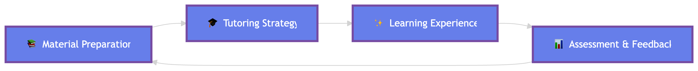

  <h1>Awesome AI and LLM for Education</h1>
  

    A curated list of papers related to artificial intelligence (AI) and large language model (LLM) for education
  

  

    <strong><a href="http://tianfuwang.tech/awesome-ai-llm4education/" style="text-decoration: none; color:rgb(255, 193, 7);">🚀 Online Webpage</a> |
    </strong><a href="LLM4EDU.md" style="text-decoration: none; color:rgb(69, 162, 255);">🌟 LLM4EDU Version</a> | <a href="README.md" style="text-decoration: none; color:rgb(170, 125, 252);">🤖 Full Version</a>
  

---

We collect papers related to **artificial intelligence (AI) and large language model (LLM) for education** from top conferences, journals, and specialized domain-specific conferences. We then categorize them according to their specific tasks for better organization.

The overview section is organized as **Survey, Analysis & Vision** (including Comprehensive Survey, Empirical Analysis, and Position & Vision).
**:sparkles: indicates the papers that are related to LLM.**

> [!note]
> 🎉 Our paper "[LLM-powered Multi-agent Framework for Goal-oriented Learning in Intelligent Tutoring System](https://arxiv.org/abs/2501.15749)" has been accepted by **WWW 2025 (Industry Track) as Oral Presentation**!
>
> 🎈 Welcome to check our [project page](https://tianfuwang.tech/gen-mentor/) and [demo code](https://github.com/GeminiLight/gen-mentor) to enjoy the goal-oriented learning experience!

## [Content](#content)

<!-- <table>
<tr><td colspan="2"><a href="#survey-papers">1. Survey</a></td></tr>
<tr><td colspan="2"><a href="#tasks">2. Tasks</a></td></tr>  -->
<table>

<tr>
<tr><td colspan="2"><a href="#-analysis--vision">1.  Analysis & Vision</a></td>
<tr>
	<td>&emsp;<a href=#comprehensive-survey>1.1 Comprehensive Survey</a></td>
	<td>&emsp;<a href=#empirical-analysis>1.2 Empirical Analysis</a></td>
</tr>
<tr>
<tr><td colspan="2"><a href="#tutoring-system">2. Tutoring System</a></td>
<tr>
	<td>&emsp;<a href=#chi>2.1 CHI</a></td>
	<td>&emsp;<a href=#chi-lbw>2.2 CHI-LBW</a></td>
</tr>
<tr>
	<td>&emsp;<a href=#icalt>2.3 ICALT</a></td>
	<td>&emsp;<a href=#international-conference-on-intelligent-tutoring-systems>2.4 International Conference on Intelligent Tutoring Systems</a></td>
</tr>
<tr>
	<td>&emsp;<a href=#learning@scale>2.5 Learning@Scale</a></td>
	<td>&emsp;<a href=#neurips>2.6 NeurIPS</a></td>
</tr>
<tr>
	<td>&emsp;<a href=#neurips---workshop-on-generative-ai-for-education-(gaied)>2.7 NeurIPS - Workshop on Generative AI for Education (GAIED)</a></td>
	<td>&emsp;<a href=#www>2.8 WWW</a></td>
</tr>
<tr>
	<td>&emsp;<a href=#www-companion>2.9 WWW Companion</a></td>
	<td>&emsp;<a href=#arxiv>2.10 arXiv</a></td>
</tr>
<tr>
<tr><td colspan="2"><a href="#learning-path-recommendation">3. Learning Path Recommendation</a></td>
<tr>
	<td>&emsp;<a href=#aaai>3.1 AAAI</a></td>
	<td>&emsp;<a href=#aied>3.2 AIED</a></td>
</tr>
<tr>
	<td>&emsp;<a href=#chi>3.3 CHI</a></td>
	<td>&emsp;<a href=#chi-extended-abstract>3.4 CHI Extended Abstract</a></td>
</tr>
<tr>
	<td>&emsp;<a href=#cikm>3.5 CIKM</a></td>
	<td>&emsp;<a href=#ieee-international-conference-on-computer-and-communications-(iccc)>3.6 IEEE International Conference on Computer and Communications (ICCC)</a></td>
</tr>
<tr>
	<td>&emsp;<a href=#kdd>3.7 KDD</a></td>
	<td>&emsp;<a href=#knowledge-based-systems-(kbs)>3.8 Knowledge-Based Systems (KBS)</a></td>
</tr>
<tr>
	<td>&emsp;<a href=#learning@scale>3.9 Learning@Scale</a></td>
	<td>&emsp;<a href=#neurips---workshop-on-teaching-machines-humans-and-robots>3.10 NeurIPS - Workshop on Teaching Machines Humans and Robots</a></td>
</tr>
<tr>
	<td>&emsp;<a href=#sigir>3.11 SIGIR</a></td>
	<td>&emsp;<a href=#tsc>3.12 TSC</a></td>
</tr>
<tr>
	<td>&emsp;<a href=#www>3.13 WWW</a></td>
	<td>&emsp;<a href=#www-companion>3.14 WWW Companion</a></td>
</tr>
<tr>
	<td>&emsp;<a href=#arxiv>3.15 arXiv</a></td>
	<td></td>
</tr>
<tr>
<tr><td colspan="2"><a href="#student-simulation--profiling">4. Student Simulation & Profiling</a></td>
<tr>
	<td>&emsp;<a href=#aaai>4.1 AAAI</a></td>
	<td>&emsp;<a href=#aied>4.2 AIED</a></td>
</tr>
<tr>
	<td>&emsp;<a href=#aied---workshop-on-empowering-education-with-llms---the-next-gen-interface-and-content-generation>4.3 AIED - Workshop on Empowering Education with LLMs - the Next-Gen Interface and Content Generation</a></td>
	<td>&emsp;<a href=#chi>4.4 CHI</a></td>
</tr>
<tr>
	<td>&emsp;<a href=#cikm>4.5 CIKM</a></td>
	<td>&emsp;<a href=#emnlp-findings>4.6 EMNLP Findings</a></td>
</tr>
<tr>
	<td>&emsp;<a href=#ijcai>4.7 IJCAI</a></td>
	<td>&emsp;<a href=#kdd>4.8 KDD</a></td>
</tr>
<tr>
	<td>&emsp;<a href=#www>4.9 WWW</a></td>
	<td>&emsp;<a href=#www-companion>4.10 WWW Companion</a></td>
</tr>
<tr>
	<td>&emsp;<a href=#arxiv>4.11 arXiv</a></td>
	<td></td>
</tr>
<tr>
<tr><td colspan="2"><a href="#learning-engagement">5. Learning Engagement</a></td>
<tr>
	<td>&emsp;<a href=#arxiv>5.1 arXiv</a></td>
	<td></td>
</tr>
<tr>
<tr><td colspan="2"><a href="#adaptive-testing">6. Adaptive Testing</a></td>
<tr>
	<td>&emsp;<a href=#aaai>6.1 AAAI</a></td>
	<td>&emsp;<a href=#cikm>6.2 CIKM</a></td>
</tr>
<tr>
	<td>&emsp;<a href=#ijcai>6.3 IJCAI</a></td>
	<td>&emsp;<a href=#kdd>6.4 KDD</a></td>
</tr>
<tr>
	<td>&emsp;<a href=#neurips>6.5 NeurIPS</a></td>
	<td>&emsp;<a href=#sigir>6.6 SIGIR</a></td>
</tr>
<tr>
<tr><td colspan="2"><a href="#cognitive-diagnosis">7. Cognitive Diagnosis</a></td>
<tr>
	<td>&emsp;<a href=#aaai>7.1 AAAI</a></td>
	<td>&emsp;<a href=#ijcai>7.2 IJCAI</a></td>
</tr>
<tr>
	<td>&emsp;<a href=#kdd>7.3 KDD</a></td>
	<td>&emsp;<a href=#learning@scale>7.4 Learning@Scale</a></td>
</tr>
<tr>
	<td>&emsp;<a href=#neurips>7.5 NeurIPS</a></td>
	<td>&emsp;<a href=#sigir>7.6 SIGIR</a></td>
</tr>
<tr>
	<td>&emsp;<a href=#tkde>7.7 TKDE</a></td>
	<td>&emsp;<a href=#www>7.8 WWW</a></td>
</tr>
<tr>
	<td>&emsp;<a href=#arxiv>7.9 arXiv</a></td>
	<td></td>
</tr>
<tr>
<tr><td colspan="2"><a href="#knowledge-tracing">8. Knowledge Tracing</a></td>
<tr>
	<td>&emsp;<a href=#aaai>8.1 AAAI</a></td>
	<td>&emsp;<a href=#iclr>8.2 ICLR</a></td>
</tr>
<tr>
	<td>&emsp;<a href=#ijcai>8.3 IJCAI</a></td>
	<td>&emsp;<a href=#kdd>8.4 KDD</a></td>
</tr>
<tr>
	<td>&emsp;<a href=#mm>8.5 MM</a></td>
	<td>&emsp;<a href=#neurips>8.6 NeurIPS</a></td>
</tr>
<tr>
	<td>&emsp;<a href=#sigir>8.7 SIGIR</a></td>
	<td>&emsp;<a href=#tkde>8.8 TKDE</a></td>
</tr>
<tr>
	<td>&emsp;<a href=#tois>8.9 TOIS</a></td>
	<td>&emsp;<a href=#wsdm>8.10 WSDM</a></td>
</tr>
<tr>
	<td>&emsp;<a href=#www>8.11 WWW</a></td>
	<td>&emsp;<a href=#arxiv>8.12 arXiv</a></td>
</tr>
<tr>
<tr><td colspan="2"><a href="#automated-grading">9. Automated Grading</a></td>
<tr>
	<td>&emsp;<a href=#emnlp-findings>9.1 EMNLP Findings</a></td>
	<td>&emsp;<a href=#arxiv>9.2 arXiv</a></td>
</tr>
<tr>
<tr><td colspan="2"><a href="#knowledge-structuring">10. Knowledge Structuring</a></td>
<tr>
	<td>&emsp;<a href=#www-companion>10.1 WWW Companion</a></td>
	<td>&emsp;<a href=#arxiv>10.2 arXiv</a></td>
</tr>
<tr>
<tr><td colspan="2"><a href="#content-generation">11. Content Generation</a></td>
<tr>
	<td>&emsp;<a href=#chigreece>11.1 CHIGreece</a></td>
	<td>&emsp;<a href=#emnlp>11.2 EMNLP</a></td>
</tr>
<tr>
	<td>&emsp;<a href=#learning@scale---workshop-on-learnersourcing:-student-generated-content-@-scale>11.3 Learning@Scale - Workshop on Learnersourcing: Student-generated Content @ Scale</a></td>
	<td>&emsp;<a href=#naacl>11.4 NAACL</a></td>
</tr>
<tr>
	<td>&emsp;<a href=#naacl-findings>11.5 NAACL Findings</a></td>
	<td>&emsp;<a href=#www>11.6 WWW</a></td>
</tr>
<tr>
	<td>&emsp;<a href=#www-companion>11.7 WWW Companion</a></td>
	<td>&emsp;<a href=#arxiv>11.8 arXiv</a></td>
</tr>
<tr>
<tr><td colspan="2"><a href="#question-generation">12. Question Generation</a></td>
<tr>
	<td>&emsp;<a href=#aaai>12.1 AAAI</a></td>
	<td>&emsp;<a href=#chi>12.2 CHI</a></td>
</tr>
<tr>
	<td>&emsp;<a href=#edm>12.3 EDM</a></td>
	<td>&emsp;<a href=#naacl---bea-workshop>12.4 NAACL - BEA workshop</a></td>
</tr>
<tr>
	<td>&emsp;<a href=#naacl-findings>12.5 NAACL findings</a></td>
	<td>&emsp;<a href=#umap-adjunct>12.6 UMAP Adjunct</a></td>
</tr>
<tr>
	<td>&emsp;<a href=#www>12.7 WWW</a></td>
	<td>&emsp;<a href=#arxiv>12.8 arXiv</a></td>
</tr>
<tr>
<tr><td colspan="2"><a href="#question-retrieval">13. Question Retrieval</a></td>
<tr>
	<td>&emsp;<a href=#learning-analytics-and-knowledge-(lak)>13.1 Learning Analytics and Knowledge (LAK)</a></td>
	<td>&emsp;<a href=#mm>13.2 MM</a></td>
</tr>
<tr>
<tr><td colspan="2"><a href="#computer-science">14. Computer Science</a></td>
<tr>
	<td>&emsp;<a href=#chi>14.1 CHI</a></td>
	<td>&emsp;<a href=#colm>14.2 COLM</a></td>
</tr>
<tr>
	<td>&emsp;<a href=#ectel>14.3 ECTEL</a></td>
	<td>&emsp;<a href=#icse>14.4 ICSE</a></td>
</tr>
<tr>
	<td>&emsp;<a href=#learning@scale>14.5 Learning@Scale</a></td>
	<td>&emsp;<a href=#arxiv>14.6 arXiv</a></td>
</tr>
<tr>
<tr><td colspan="2"><a href="#math">15. Math</a></td>
<tr>
	<td>&emsp;<a href=#chi>15.1 CHI</a></td>
	<td>&emsp;<a href=#emnlp>15.2 EMNLP</a></td>
</tr>
<tr>
	<td>&emsp;<a href=#arxiv>15.3 arXiv</a></td>
	<td></td>
</tr>
<tr>
<tr><td colspan="2"><a href="#liberal-arts">16. Liberal Arts</a></td>
<tr>
	<td>&emsp;<a href=#chi>16.1 CHI</a></td>
	<td></td>
</tr>
<tr>
<tr><td colspan="2"><a href="#medicine">17. Medicine</a></td>
<tr>
	<td>&emsp;<a href=#emnlp>17.1 EMNLP</a></td>
	<td>&emsp;<a href=#arxiv>17.2 arXiv</a></td>
</tr>
<tr>
<tr><td colspan="2"><a href="#language">18. Language</a></td>
<tr>
	<td>&emsp;<a href=#emnlp>18.1 EMNLP</a></td>
	<td>&emsp;<a href=#neurips---workshop-on-generative-ai-for-education-(gaied)>18.2 NeurIPS - Workshop on Generative AI for Education (GAIED)</a></td>
</tr>
<tr>
<tr><td colspan="2"><a href="#social-good">19. Social Good</a></td>
<tr>
	<td>&emsp;<a href=#arxiv>19.1 arXiv</a></td>
	<td></td>
</tr>
<tr>
<tr><td colspan="2"><a href="#aided-teaching">20. Aided Teaching</a></td>
<tr>
	<td>&emsp;<a href=#chi>20.1 CHI</a></td>
	<td>&emsp;<a href=#cognitive-sciences>20.2 Cognitive Sciences</a></td>
</tr>
<tr>
	<td>&emsp;<a href=#learning@scale>20.3 Learning@Scale</a></td>
	<td>&emsp;<a href=#naacl>20.4 NAACL</a></td>
</tr>
<tr>
	<td>&emsp;<a href=#naacl-findings>20.5 NAACL Findings</a></td>
	<td>&emsp;<a href=#www>20.6 WWW</a></td>
</tr>
<tr>
	<td>&emsp;<a href=#arxiv>20.7 arXiv</a></td>
	<td></td>
</tr>
<tr>
<tr><td colspan="2"><a href="#dataset">21. Dataset</a></td>
<tr>
	<td>&emsp;<a href=#aied>21.1 AIED</a></td>
	<td>&emsp;<a href=#emnlp-findings>21.2 EMNLP Findings</a></td>
</tr>
<tr>
	<td>&emsp;<a href=#neurips>21.3 NeurIPS</a></td>
	<td>&emsp;<a href=#arxiv>21.4 arXiv</a></td>
</tr>
<tr>
<tr><td colspan="2"><a href="#benchmark">22. Benchmark</a></td>
<tr>
	<td>&emsp;<a href=#emnlp>22.1 EMNLP</a></td>
	<td>&emsp;<a href=#emnlp-findings>22.2 EMNLP Findings</a></td>
</tr>
<tr>
	<td>&emsp;<a href=#neurips>22.3 NeurIPS</a></td>
	<td>&emsp;<a href=#arxiv>22.4 arXiv</a></td>
</tr>
</table>

## [ Analysis & Vision](#content)

### [Comprehensive Survey](#content)

1. **The Path to Conversational AI Tutors: Integrating Tutoring Best Practices and Targeted Technologies to Produce Scalable AI Agents**

    *Kirk Vanacore, Ryan S. Baker, Avery H. Closser, Jeremy Roschelle*

    arXiv, 2026. [`preprint`](https://arxiv.org/abs/2602.19303)

2. **Generative Artificial Intelligence and Agents in Research and Teaching**

    *Jussi S. Jauhiainen, Aurora Toppari*

    arXiv, 2025. [`preprint`](https://arxiv.org/abs/2508.16701)

3. **Opportunities and Challenges of LLMs in Education: An NLP Perspective**

    *Sowmya Vajjala, Bashar Alhafni, Stefano Bannò, Kaushal Kumar Maurya, Ekaterina Kochmar*

    arXiv, 2025. [`preprint`](https://arxiv.org/abs/2507.22753)

4. **Large Language Models for Education: A Survey**

    *Hanyi Xu, Wensheng Gan, Zhenlian Qi, Jiayang Wu, Philip S. Yu*

    Journal of Machine Learning and Cybernetics, 2024. [`journal`](https://arxiv.org/abs/2405.13001)

5. **Large Language Models for Education: A Survey and Outlook**

    *Shen Wang, Tianlong Xu, Hang Li, Chaoli Zhang, Joleen Liang, Jiliang Tang, Philip S. Yu, Qingsong Wen*

    arXiv, 2024. [`preprint`](https://arxiv.org/abs/2403.18105)

6. **Adapting Large Language Models for Education: Foundational Capabilities, Potentials, and Challenges**

    *Qingyao Li, Lingyue Fu, Weiming Zhang, Xianyu Chen, Jingwei Yu, Wei Xia, Weinan Zhang, Ruiming Tang, Yong Yu*

    arXiv, 2024. [`preprint`](https://arxiv.org/abs/2401.08664)

7. **Survey of Computerized Adaptive Testing: A Machine Learning Perspective**

    *Qi Liu, Yan Zhuang, Haoyang Bi, Zhenya Huang, Weizhe Huang, Jiatong Li, Junhao Yu, Zirui Liu, Zirui Hu, Yuting Hong, Zachary A. Pardos, Haiping Ma, Mengxiao Zhu, Shijin Wang, Enhong Chen*

    arXiv, 2024. [`preprint`](https://arxiv.org/abs/2404.00712)

8. **Large Language Models in Education: Vision and Opportunities**

    *Wensheng Gan, Zhenlian Qi, Jiayang Wu, Jerry Chun-Wei Lin*

    BigData, 2023. [`conference`](https://arxiv.org/abs/2311.13160)

9. **A Comprehensive Survey on Deep Learning Techniques in Educational Data Mining**

    *Yuanguo Lin, Hong Chen, Wei Xia, Fan Lin, Zongyue Wang, Yong Liu*

    arXiv, 2023. [`preprint`](https://arxiv.org/abs/2309.04761)

10. **Reinforcement Learning for Education: Opportunities and Challenges**

    *Adish Singla, Anna N. Rafferty, Goran Radanovic, Neil T. Heffernan*

    EDM-RL4ED, 2021. [`conference`](https://arxiv.org/abs/2107.08828)

### [Empirical Analysis](#content)

1. **The effect of ChatGPT on students’ learning performance, learning perception, and higher-order thinking: insights from a meta-analysis**

    *Jin Wang, Wenxiang Fan*

    Nature, 2025. [`journal`](https://www.nature.com/articles/s41599-025-04787-y)

2. **From Pilots to Practices: A Scoping Review of GenAI-Enabled Personalization in Computer Science Education**

    *Iman Reihanian, Yunfei Hou, Qingquan Sun*

    arXiv, 2025. [`preprint`](https://arxiv.org/abs/2512.20714)

3. **A systematic review of AI-driven intelligent tutoring systems (ITS) in K-12 education**

    *Angélique Létourneau, Marion Deslandes Martineau, Patrick Charland, John Alexander Karran, Jared Boasen, Pierre Majorique Léger*

    npj science of learning, 2025. [`journal`](https://www.nature.com/articles/s41539-025-00320-7)

## [Tutoring System](#content)

### [CHI](#content)

1. **http://pact.cs.cmu.edu/corbett/Corbett&AndersonCHI2001.pdf**

    *nan*

    2001, conference. [`0`](Albert T. Corbett, John R. Anderson)

2. **https://dl.acm.org/doi/10.1145/3313831.3376226**

    *nan*

    2020, conference. [`0`](Daniel Weitekamp, Erik Harpstead, K. Koedinger)

3. **https://dl.acm.org/doi/abs/10.1145/3411764.3445781**

    *nan*

    2021, conference. [`0`](Thiemo Wambsganss, C. Niklaus, Matthias Cetto, Matthias Söllner, S. Handschuh, J. Leimeister)

4. **https://dl.acm.org/doi/10.1145/3544548.3581574**

    *nan*

    2023, conference. [`0`](Z. Pardos, Matthew Tang, Ioannis Anastasopoulos, Shreya K. Sheel, Ethan Zhang)

### [CHI-LBW](#content)

1. **https://arxiv.org/abs/2403.14071**

    *nan*

    2024, workshop. [`1`](Minju Park, Sojung Kim, Seunghyun Lee, Soonwoo Kwon, Kyuseok Kim)

### [ICALT](#content)

1. **https://arxiv.org/abs/2402.01813**

    *nan*

    2024, conference. [`0`](Nicolas Pope, Juho Kahila, Jari Laru, Henriikka Vartiainen, Teemu Roos, Matti Tedre)

### [International Conference on Intelligent Tutoring Systems](#content)

1. **https://figshare.com/articles/journal_contribution/The_Cognitive_Tutor_Authoring_Tools_CTAT_Preliminary_Evaluation_of_Efficiency_Gains/6470495/1/files/11899052.pdf**

    *nan*

    2006, conference. [`0`](V. Aleven, B. McLaren, J. Sewall, K. Koedinger)

### [Learning@Scale](#content)

1. **https://arxiv.org/abs/2402.09216**

    *nan*

    2024, conference. [`1`](Sankalan Pal Chowdhury, Vilém Zouhar, Mrinmaya Sachan)

### [NeurIPS](#content)

1. **https://neurips.cc/virtual/2024/poster/93477**

    *nan*

    2024, conference. [`1`](Jiayu Liu, Zhenya Huang, Tong Xiao, Jing Sha, Jinze Wu, Qi Liu, Shijin Wang, Enhong Chen)

### [NeurIPS - Workshop on Generative AI for Education (GAIED)](#content)

1. **https://arxiv.org/abs/2311.02775**

    *nan*

    2023, workshop. [`1`](Yann Hicke, Anmol Agarwal, Qianou Ma, Paul Denny)

### [WWW](#content)

1. **https://arxiv.org/abs/2501.15749**

    *https://github.com/GeminiLight/gen-mentor*

    2025, conference. [`1`](Tianfu Wang, Yi Zhan, Jianxun Lian, Zhengyu Hu, Nicholas Jing Yuan, Qi Zhang, Xing Xie, Hui Xiong)

### [WWW Companion](#content)

1. **https://arxiv.org/abs/2203.08507**

    *nan*

    2022, workshop. [`0`](Eleni Ilkou)

### [arXiv](#content)

1. **https://arxiv.org/abs/2309.08112**

    *nan*

    2023, preprint. [`1`](Yulin Chen, Ning Ding, Hai-Tao Zheng, Zhiyuan Liu, Maosong Sun, Bowen Zhou)

2. **https://arxiv.org/abs/2311.17696**

    *nan*

    2023, preprint. [`1`](Chenxi Dong)

3. **https://arxiv.org/abs/2404.06762**

    *nan*

    2024, preprint. [`1`](Zhengyuan Liu, Stella Xin Yin, Geyu Lin, Nancy F. Chen)

4. **https://arxiv.org/abs/2404.06762**

    *nan*

    2024, preprint. [`1`](Wei-Yu Chen)

5. **https://arxiv.org/abs/2404.03429**

    *nan*

    2024, preprint. [`1`](Zhengyuan Liu, Stella Xin Yin, Carolyn Lee, Nancy F. Chen)

6. **https://arxiv.org/abs/2404.07883**

    *nan*

    2024, preprint. [`1`](Glen Smith, Adit Gupta, Christopher MacLellan)

7. **https://arxiv.org/abs/2501.06682**

    *nan*

    2025, preprint. [`1`](Xiangen Hu, Sheng Xu, Richard Tong, Art Graesser)

8. **https://arxiv.org/pdf/2505.15607**

    *https://github.com/eth-lre/PedagogicalRL*

    2025, preprint. [`1`](David Dinucu-Jianu, Jakub Macina, Nico Daheim, Ido Hakimi, Iryna Gurevych, Mrinmaya Sachan)

9. **https://arxiv.org/abs/2508.01503**

    *nan*

    2025, preprint. [`1`](Clayton Cohn, Surya Rayala, Namrata Srivastava, Joyce Horn Fonteles, Shruti Jain, Xinying Luo, Divya Mereddy, Naveeduddin Mohammed, Gautam Biswas)

10. **https://arxiv.org/abs/2507.20335**

    *nan*

    2025, preprint. [`1`](Siyu Song, Wentao Liu, Ye Lu, Ruohua Zhang, Tao Liu, Jinze Lv, Xinyun Wang, Aimin Zhou, Fei Tan, Bo Jiang, Hao Hao)

11. **https://arxiv.org/abs/2501.04100**

    *nan*

    2025, preprint. [`1`](Si Chen, Isabel R. Molnar, Peiyu Li, Adam Acunin, Ting Hua, Alex Ambrose, Nitesh V. Chawla, Ronald Metoyer)

12. **https://arxiv.org/abs/2512.11882**

    *nan*

    2025, preprint. [`1`](Lucia Happe, Dominik Fuchs, Luca Huttner, Kai Marquardt, Anne Koziolek)

13. **https://arxiv.org/abs/2512.18669**

    *nan*

    2025, preprint. [`1`](Jones David, Shreya Ghosh)

14. **https://arxiv.org/abs/2512.23633**

    *nan*

    2025, preprint. [`1`](LearnLM Team, Eedi)

15. **https://arxiv.org/abs/2601.04219**

    *nan*

    2025, preprint. [`1`](Yuxin Liu, Zeqing Song, Jiong Lou, Chentao Wu, Jie Li)

16. **https://arxiv.org/abs/2601.02375**

    *nan*

    2025, preprint. [`1`](Madison Bochard, Tim Conser, Alyssa Duran, Lazaro Martull, Pu Tian, Yalong Wu)

17. **https://arxiv.org/abs/2512.11930**

    *nan*

    2025, preprint. [`1`](Mei Jiang, Haihai Shen, Zhuo Luo, Bingdong Li, Wenjing Hong, Ke Tang, Aimin Zhou)

18. **https://arxiv.org/abs/2512.22496**

    *nan*

    2025, preprint. [`1`](Saisab Sadhu, Ashim Dhor)

19. **https://arxiv.org/abs/2601.08402**

    *nan*

    2026, preprint. [`1`](Donya Rooein, Sankalan Pal Chowdhury, Mariia Eremeeva, Yuan Qin, Debora Nozza, Mrinmaya Sachan, Dirk Hovy)

20. **https://arxiv.org/abs/2601.14560**

    *nan*

    2026, preprint. [`1`](Unggi Lee, Jiyeong Bae, Jaehyeon Park, Haeun Park, Taejun Park, Younghoon Jeon, Sungmin Cho, Junbo Koh, Yeil Jeong, Gyeonggeon Lee)

21. **https://arxiv.org/abs/2602.06734**

    *nan*

    2026, preprint. [`1`](Gefei Zhang, Guodao Sun, Meng Xia, Ronghua Liang)

22. **https://arxiv.org/abs/2602.07639**

    *nan*

    2026, preprint. [`1`](Jaewook Lee, Alexander Scarlatos, Simon Woodhead, Andrew Lan)

23. **https://arxiv.org/abs/2602.24036**

    *nan*

    2026, preprint. [`1`](Abhishek Kulkarni, Sharon Lynn Chu)

24. **https://arxiv.org/abs/2602.01415**

    *nan*

    2026, preprint. [`1`](Clayton Cohn, Siyuan Guo, Surya Rayala, Hanchen David Wang, Naveeduddin Mohammed, Umesh Timalsina, Shruti Jain, Angela Eeds, Menton Deweese, Pamela J. Osborn Popp, Rebekah Stanton, Shakeera Walker, Meiyi Ma, Gautam Biswas)

25. **https://arxiv.org/abs/2603.03339**

    *nan*

    2026, preprint. [`1`](Joseph Walusimbi, Ann Move Oguti, Joshua Benjamin Ssentongo, Keith Ainebyona)

## [Learning Path Recommendation](#content)

### [AAAI](#content)

1. **https://arxiv.org/abs/2112.15221**

    *nan*

    2022, conference. [`0`](Tong Mu, Georgios Theocharous, David Arbour, Emma Brunskill)

2. **https://arxiv.org/abs/2306.04234**

    *nan*

    2023, conference. [`0`](Xianyu Chen, Jian Shen, Wei Xia, Jiarui Jin, Yakun Song, Weinan Zhang, Weiwen Liu, Menghui Zhu, Ruiming Tang, Kai Dong, Dingyin Xia, Yong Yu)

### [AIED](#content)

1. **https://dl.acm.org/doi/10.1007/978-3-031-11644-5_26**

    *nan*

    2022, conference. [`0`](Shabana K M, Chandrashekar Lakshminarayanan)

### [CHI](#content)

1. **https://dl.acm.org/doi/10.1145/3313831.3376518**

    *nan*

    2020, conference. [`0`](A. Singla, Anna N. Rafferty, Goran Radanovic, N. Heffernan)

### [CHI Extended Abstract](#content)

1. **https://arxiv.org/abs/2503.13340**

    *nan*

    2025, workshop. [`1`](Xinyu Jessica Wang, Christine P. Lee, Bilge Mutlu)

### [CIKM](#content)

1. **https://dl.acm.org/doi/abs/10.1145/3583780.3614897**

    *nan*

    2023, conference. [`0`](Qingyao Li, Wei Xia, Li'ang Yin, Jian Shen, Renting Rui, Weinan Zhang, Xianyu Chen, Ruiming Tang, Yong Yu)

### [IEEE International Conference on Computer and Communications (ICCC)](#content)

1. **https://ieeexplore.ieee.org/document/9064104**

    *nan*

    2019, conference. [`0`](Dejun Cai, Yuan Zhang, Bintao Dai)

### [KDD](#content)

1. **https://arxiv.org/abs/1905.12470**

    *nan*

    2019, conference. [`0`](Qi Liu, Shiwei Tong, Chuanren Liu, Hongke Zhao, Enhong Chen, Haiping Ma, Shijin Wang)

2. **https://dl.acm.org/doi/10.1145/3637528.3671947**

    *nan*

    2024, conference. [`0`](Haotian Zhang, Shuanghong Shen, Bihan Xu, Zhenya Huang, Jinze Wu, Jing Sha, Shijin Wang)

3. **https://dl.acm.org/doi/10.1145/3637528.3671872**

    *nan*

    2024, conference. [`0`](Qingyao Li, Wei Xia, Li'ang Yin, Jiarui Jin, Yong Yu)

### [Knowledge-Based Systems (KBS)](#content)

1. **https://www.sciencedirect.com/science/article/abs/pii/S0950705123009917**

    *nan*

    2024, journal. [`0`](Yue Yun, Huan Dai, Rui An, Yupei Zhang, Xuequn Shang)

### [Learning@Scale](#content)

1. **https://dl.acm.org/doi/10.1145/3231644.3231672**

    *nan*

    2018, conference. [`0`](Tong Mu, Shuhan Wang, Erik Andersen, Emma Brunskill)

2. **https://scholar.harvard.edu/files/dtingley/files/adaptivelas2018.pdf**

    *nan*

    2018, conference. [`0`](Y. Rosen, I. Rushkin, Rob Rubin, Liberty Munson, Andrew M. Ang, G. Weber, Glenn Lopez, D. Tingley)

3. **https://dl.acm.org/doi/abs/10.1145/3491140.3528267**

    *nan*

    2022, conference. [`0`](Ethan Prihar, Aaron Haim, Adam Sales, Neil Heffernan)

4. **https://arxiv.org/abs/2504.12452**

    *nan*

    2025, conference. [`1`](Jiwon Chun, Yankun Zhao, Hanlin Chen, Meng Xia)

### [NeurIPS - Workshop on Teaching Machines Humans and Robots](#content)

1. **http://www.teaching-machines.cc/nips2017/papers/nips17-teaching_paper-12.pdf**

    *nan*

    2017, workshop. [`0`](Tong Mu, Karan Goel)

### [SIGIR](#content)

1. **https://arxiv.org/abs/2404.10876**

    *nan*

    2024, conference. [`0`](Jibril Frej, Anna Dai, Syrielle Montariol, Antoine Bosselut, Tanja Käser)

### [TSC](#content)

1. **https://ieeexplore.ieee.org/document/10286866**

    *nan*

    2023, journal. [`0`](Yuchen Li, Haoyi Xiong, Linghe Kong, Rui Zhang, Fanqin Xu, Guihai Chen, Minglu Li)

### [WWW](#content)

1. **https://dl.acm.org/doi/10.1145/3442381.3449808**

    *nan*

    2021, conference. [`0`](Chien-Lin Tang, Jingxian Liao, Hao-Chuan Wang, Ching-Ying Sung, Wen-Chieh Lin)

2. **https://arxiv.org/abs/2402.08256**

    *nan*

    2024, conference. [`0`](Hengnian Gu, Zhiyi Duan, Pan Xie, Dongdai Zhou)

### [WWW Companion](#content)

1. **https://dl.acm.org/doi/10.1145/3184558.3191533**

    *nan*

    2018, workshop. [`0`](Charbel Obeid, Inaya Lahoud, Hicham El Khoury,  Pierre-Antoine Champin)

### [arXiv](#content)

1. **https://arxiv.org/abs/2004.08410**

    *nan*

    2020, preprint. [`0`](Xiao Li, Hanchen Xu, Jinming Zhang, Hua-hua Chang)

2. **https://arxiv.org/abs/2405.12442**

    *nan*

    2024, preprint. [`1`](Qingyao Li, Wei Xia, Kounianhua Du, Qiji Zhang, Weinan Zhang, Ruiming Tang, Yong Yu)

3. **https://arxiv.org/abs/2601.17346**

    *nan*

    2026, preprint. [`1`](Haoxin Xu, Changyong Qi, Tong Liu, Bohao Zhang, Anna He, Bingqian Jiang, Longwei Zheng, Xiaoqing Gu)

## [Student Simulation & Profiling](#content)

### [AAAI](#content)

1. **https://arxiv.org/abs/2501.10332**

    *nan*

    2025, conference. [`1`](Weibo Gao, Qi Liu, Linan Yue, Fangzhou Yao, Rui Lv, Zheng Zhang, Hao Wang, Zhenya Huang)

### [AIED](#content)

1. **https://arxiv.org/abs/2305.16851**

    *nan*

    2023, conference. [`0`](Paola Mejia-Domenzain, Eva Laini, Seyed Parsa Neshaei, Thiemo Wambsganss, Tanja Käser)

### [AIED - Workshop on Empowering Education with LLMs - the Next-Gen Interface and Content Generation](#content)

1. **https://arxiv.org/abs/2306.00190**

    *nan*

    2023, workshop. [`1`](Gautam Yadav, Ying-Jui Tseng, Xiaolin Ni)

### [CHI](#content)

1. **https://arxiv.org/abs/2502.02780**

    *nan*

    2025, conference. [`1`](Songlin Xu, Hao-Ning Wen, Hongyi Pan, Dallas Dominguez, Dong yin Hu, Xinyu Zhang)

### [CIKM](#content)

1. **https://arxiv.org/abs/2208.01182**

    *nan*

    2022, conference. [`0`](Yun-Wei Chu, Seyyedali Hosseinalipour, Elizabeth Tenorio, Laura Cruz, Kerrie Douglas, Andrew Lan, Christopher Brinton)

### [EMNLP Findings](#content)

1. **https://arxiv.org/abs/2510.11290**

    *nan*

    2025, conference. [`1`](Sheng Jin, Haoming Wang, Zhiqi Gao, Yongbo Yang, Bao Chunjia, Chengliang Wang)

### [IJCAI](#content)

1. **https://arxiv.org/abs/2505.20642**

    *nan*

    2025, conference. [`1`](Yi Zhan, Qi Liu, Weibo Gao, Zheng Zhang, Tianfu Wang, Shuanghong Shen, Junyu Lu, Zhenya Huang)

### [KDD](#content)

1. **https://dl.acm.org/doi/10.1145/3637528.3671684**

    *nan*

    2024, conference. [`0`](Fangzhou Yao, Qi Liu, Linan Yue, Weibo Gao, Jiatong Li, Xin Li, Yuanjing He)

### [WWW](#content)

1. **https://arxiv.org/abs/2501.15749**

    *nan*

    2025, conference. [`1`](Tianfu Wang, Yi Zhan, Jianxun Lian, Zhengyu Hu, Nicholas Jing Yuan, Qi Zhang, Xing Xie, Hui Xiong)

### [WWW Companion](#content)

1. **https://arxiv.org/abs/2203.08507**

    *nan*

    2017, workshop. [`0`](Ali Daud, Naif Radi Aljohani, Rabeeh Ayaz Abbasi, Miltiadis D. Lytras, Farhat Abbas, Jalal S. Alowibdi)

### [arXiv](#content)

1. **https://arxiv.org/abs/2403.14661**

    *nan*

    2024, preprint. [`0`](Seyed Parsa Neshaei, Richard Lee Davis, Adam Hazimeh, Bojan Lazarevski, Pierre Dillenbourg, Tanja Käser)

2. **https://arxiv.org/abs/2405.03734**

    *nan*

    2024, preprint. [`1`](Silan Hu, Xiaoning Wang)

3. **https://arxiv.org/abs/2404.07963**

    *nan*

    2024, preprint. [`1`](Songlin Xu, Xinyu Zhang, Lianhui Qin)

4. **https://arxiv.org/abs/2601.04025**

    *nan*

    2026, preprint. [`1`](Alexander Scarlatos, Jaewook Lee, Simon Woodhead, Andrew Lan)

5. **https://arxiv.org/abs/2601.05473**

    *nan*

    2026, preprint. [`1`](Zhihao Yuan, Yunze Xiao, Ming Li, Weihao Xuan, Richard Tong, Mona Diab, Tom Mitchell)

6. **https://arxiv.org/abs/2601.06633**

    *nan*

    2026, preprint. [`1`](Zhangqi Duan, Nigel Fernandez, Andrew Lan)

## [Learning Engagement](#content)

### [arXiv](#content)

1. **https://arxiv.org/pdf/2505.07377**

    *nan*

    2025, preprint. [`1`](Suleyman Ozdel, Can Sarpkaya, Efe Bozkir, Hong Gao, Enkelejda Kasneci)

2. **https://arxiv.org/abs/2511.09458**

    *nan*

    2025, preprint. [`1`](Rahul R. Divekar, Sophia Guerra, Lisette Gonzalez, Natasha Boos)

3. **https://arxiv.org/abs/2601.17000**

    *nan*

    2026, preprint. [`1`](Jie Gao, Shasha Li, Jianhua Zhang, Shan Li, Tingting Wang)

4. **https://arxiv.org/abs/2601.20402**

    *nan*

    2026, preprint. [`1`](Ananya Shukla, Chaitanya Modi, Satvik Bajpai, Siddharth Siddharth)

5. **https://arxiv.org/abs/2602.17720**

    *nan*

    2026, preprint. [`1`](Yue Fu, Yifan Lin, Yessica Wang, Sarah Tran, Alexis Hiniker)

6. **https://arxiv.org/abs/2602.11311**

    *nan*

    2026, preprint. [`1`](Caitlin Morris, Pattie Maes)

7. **https://arxiv.org/abs/2602.17067**

    *nan*

    2026, preprint. [`1`](Leixian Shen, Yan Luo, Rui Sheng, Yujia He, Haotian Li, Leni Yang, Huamin Qu)

## [Adaptive Testing](#content)

### [AAAI](#content)

1. **https://ojs.aaai.org/index.php/AAAI/article/view/20399**

    *nan*

    2022, conference. [`0`](Yan Zhuang, Qi Liu, Zhenya Huang, Zhi Li, Shuanghong Shen, Haiping Ma)

### [CIKM](#content)

1. **http://home.ustc.edu.cn/~zykb/files/paper/Yuting_cikm23.pdf**

    *nan*

    2023, conference. [`0`](Yuting Hong, Shiwei Tong, Wei Huang, Yan Zhuang, Qi Liu, Enhong Chen, Xin Li, Yuanjing He)

### [IJCAI](#content)

1. **https://arxiv.org/abs/2108.07386**

    *nan*

    2021, conference. [`0`](Aritra Ghosh, Andrew Lan)

### [KDD](#content)

1. **https://arxiv.org/abs/2310.07477**

    *nan*

    2023, conference. [`0`](Hangyu Wang, Ting Long, Liang Yin, Weinan Zhang, Wei Xia, Qichen Hong, Dingyin Xia, Ruiming Tang, Yong Yu)

### [NeurIPS](#content)

1. **https://openreview.net/forum?id=tAwjG5bM7H**

    *nan*

    2023, conference. [`0`](Yan Zhuang, Qi Liu, GuanHao Zhao, Zhenya Huang, Weizhe Huang, Zachary Pardos, Enhong Chen, Jinze Wu, Xin Li)

### [SIGIR](#content)

1. **http://staff.ustc.edu.cn/~cheneh/paper_pdf/2022/Yan-Zhuang-SIGIR.pdf**

    *nan*

    2022, conference. [`0`](Yan Zhuang, Qi Liu, Zhenya Huang, Zhi Li, Binbin Jin, Haoyang Bi, Enhong Chen, Shijin Wang)

## [Cognitive Diagnosis](#content)

### [AAAI](#content)

1. **https://ojs.aaai.org/index.php/AAAI/article/view/12009**

    *nan*

    2019, conference. [`0`](Florin Bulgarov, Rodney Nielsen)

2. **https://arxiv.org/abs/1908.08733**

    *nan*

    2020, conference. [`0`](Fei Wang,Qi Liu,Enhong Chen,Zhenya Huang,Yuying Chen,Yu Yin,Zai Huang,Shijin Wang)

3. **https://arxiv.org/abs/2312.13434**

    *nan*

    2024, conference. [`0`](Weibo Gao, Qi Liu, Hao Wang, Linan Yue, Haoyang Bi, Yin Gu, Fangzhou Yao, Zheng Zhang, Xin Li, Yuanjing He)

4. **https://arxiv.org/abs/2401.10840**

    *nan*

    2024, conference. [`0`](Junhao Shen, Hong Qian, Wei Zhang, Aimin Zhou)

### [IJCAI](#content)

1. **http://staff.ustc.edu.cn/~qiliuql/files/Publications/QiLiu-IJCAI2021.pdf**

    *nan*

    2021, conference. [`0`](Qi Liu)

2. **http://staff.ustc.edu.cn/~huangzhy/files/papers/ShiweiTong-IJCAI2021.pdf**

    *nan*

    2021, conference. [`0`](Shiwei Tong, Qi Liu, Runlong Yu, Wei Huang, Zhenya Huang, Zachary A Pardos, Weijie Jiang)

3. **https://www.ijcai.org/proceedings/2022/302**

    *nan*

    2022, conference. [`0`](Haiping Ma, Jingyuan Wang, Hengshu Zhu, Xin Xia, Haifeng Zhang, Xingyi Zhang, Lei Zhang)

### [KDD](#content)

1. **http://staff.ustc.edu.cn/~cheneh/paper_pdf/2022/Jiatong-Li-KDD.pdf**

    *nan*

    2022, conference. [`0`](Jiatong Li, Fei Wang, Qi Liu, Mengxiao Zhu, Wei Huang, Zhenya Huang, Enhong Chen, Yu Su, Shijin Wang)

2. **https://arxiv.org/abs/2406.03064**

    *nan*

    2024, conference. [`0`](Dacao Zhang, Kun Zhang, Le Wu, Mi Tian, Richang Hong, Meng Wang)

3. **https://arxiv.org/pdf/2407.17476**

    *nan*

    2024, conference. [`0`](Hong Qian, Shuo Liu, Mingjia Li, Bingdong Li, Zhi Liu, Aimin Zhou)

4. **nan**

    *nan*

    2024, conference. [`0`](Junhao Shen, Hong Qian, Shuo Liu, Wei Zhang, Bo Jiang, Aimin Zhou)

### [Learning@Scale](#content)

1. **https://arxiv.org/abs/2405.11591**

    *nan*

    2024, conference. [`1`](Xinyi Lu, Xu Wang)

### [NeurIPS](#content)

1. **https://openreview.net/forum?id=ogPBujRhiN**

    *nan*

    2023, conference. [`0`](Xiangzhi Chen, Le Wu, Fei Liu, Lei Chen, Kun Zhang, Richang Hong, Meng Wang)

### [SIGIR](#content)

1. **http://staff.ustc.edu.cn/~huangzhy/files/papers/WeiboGao-SIGIR2021.pdf**

    *nan*

    2021, conference. [`0`](Weibo Gao, Qi Liu, Zhenya Huang, Yu Yin, Haoyang Bi, Mu-Chun Wang, Jianhui Ma, Shijin Wang, Yu Su)

2. **http://staff.ustc.edu.cn/~qiliuql/files/Publications/Shiwei-Tong-KDD22.pdf**

    *nan*

    2021, conference. [`0`](Shiwei Tong, Jiayu Liu, Yuting Hong, Zhenya Huang, Le Wu, Qi Liu, Wei Huang, Enhong Chen, Dan Zhang)

3. **https://dl.acm.org/doi/10.1145/3539618.3591774**

    *nan*

    2023, conference. [`0`](Weibo Gao, Hao Wang, Qi Liu, Fei Wang, Xin Lin, Linan Yue, Zheng Zhang, Rui Lv, Shijin Wang)

### [TKDE](#content)

1. **https://ieeexplore.ieee.org/document/10210482**

    *nan*

    2024, journal. [`0`](Lianhong Wang, Xiaoyao Li, Zhihui Luo, Zinan Hu, Qing Yan)

### [WWW](#content)

1. **https://arxiv.org/abs/2404.11290**

    *nan*

    2024, conference. [`0`](Shuo Liu, Junhao Shen, Hong Qian, Aimin Zhou)

2. **https://arxiv.org/abs/2309.00300**

    *nan*

    2024, conference. [`0`](Jiatong Li, Qi Liu, Fei Wang, Jiayu Liu, Zhenya Huang, Fangzhou Yao, Linbo Zhu, Yu Su)

### [arXiv](#content)

1. **https://arxiv.org/abs/2405.14399**

    *nan*

    2024, preprint. [`0`](Shiwei Tong, Qi Liu, Runlong Yu, Wei Huang, Zhenya Huang, Zachary A Pardos, Weijie Jiang)

2. **https://arxiv.org/abs/2601.15551**

    *nan*

    2026, preprint. [`1`](Bismack Tokoli, Luis Jaimes, Ayesha S. Dina)

3. **https://arxiv.org/abs/2602.02414**

    *nan*

    2026, preprint. [`1`](Joshua Mitton, Prarthana Bhattacharyya, Digory Smith, Thomas Christie, Ralph Abboud, Simon Woodhead)

## [Knowledge Tracing](#content)

### [AAAI](#content)

1. **https://ojs.aaai.org/index.php/AAAI/article/view/21560/21309**

    *nan*

    2022, conference. [`0`](Sein Minn, Jill-Jenn Vie, Koh Takeuchi, Hisashi Kashima, Feida Zhu)

2. **https://arxiv.org/abs/2204.14006**

    *nan*

    2022, conference. [`0`](Suyeong An, Junghoon Kim, Minsam Kim, Juneyoung Park)

3. **https://ojs.aaai.org/index.php/AAAI/article/download/21551/21300**

    *nan*

    2022, conference. [`0`](Effat Farhana, Teomara Rutherford, Collin Lynch)

4. **https://ojs.aaai.org/index.php/AAAI/article/view/26214**

    *nan*

    2023, conference. [`0`](Xin-Peng Wang, Liang Chen, M. Zhang)

5. **https://ojs.aaai.org/index.php/AAAI/article/view/26661/26433**

    *nan*

    2023, conference. [`0`](Jiahao Chen, Zitao Liu, Shuyan Huang, Qiongqiong Liu, Weiqing Luo)

### [ICLR](#content)

1. **https://arxiv.org/abs/2302.06881**

    *nan*

    2023, conference. [`0`](Zitao Liu, Qiongqiong Liu, Jiahao Chen, Shuyan Huang, Weiqi Luo)

### [IJCAI](#content)

1. **https://arxiv.org/abs/2012.05031**

    *nan*

    2020, conference. [`0`](Yunfei Liu, Yang Yang, Xianyu Chen, Jian Shen, Haifeng Zhang, Yong Yu)

### [KDD](#content)

1. **https://dl.acm.org/doi/10.1145/3394486.3403282**

    *nan*

    2020, conference. [`0`](Aritra Ghosh, Neil Heffernan, Andrew S. Lan)

2. **http://staff.ustc.edu.cn/~cheneh/paper_pdf/2021/Shuanghong-Shen-KDD.pdf**

    *nan*

    2021, conference. [`0`](Shuanghong Shen, Qi Liu, Enhong Chen, Zhenya Huang, Wei Huang, Yu Yin, Yu Su, Shijin Wang)

3. **http://staff.ustc.edu.cn/~huangzhy/files/papers/BihanXu-KDD2023.pdf**

    *nan*

    2023, conference. [`0`](Bihan Xu, Zhenya Huang, Jia-Yin Liu, Shuanghong Shen, Qi Liu, Enhong Chen, Jinze Wu, Shijin Wang)

4. **https://arxiv.org/abs/2406.12896**

    *nan*

    2024, conference. [`0`](Jiajun Cui, Hong Qian, Bo Jiang, Wei Zhang)

5. **https://www.arxiv.org/abs/2407.20824**

    *nan*

    2024, conference. [`0`](Ke Cheng, Linzhi Peng, Pengyang Wang, Junchen Ye, Leilei Sun, Bowen Du)

6. **https://arxiv.org/abs/2406.12465**

    *nan*

    2024, conference. [`0`](Xiaoshan Yu, Chuan Qin, Dazhong Shen, Shangshang Yang, Haiping Ma, Hengshu Zhu, Xingyi Zhang)

### [MM](#content)

1. **https://dl.acm.org/doi/10.1145/3474085.3475554**

    *nan*

    2021, conference. [`0`](Xiaopeng Guo, Zhijie Huang, Jie Gao, Mingyu Shang, Maojing Shu, Jun Sun)

2. **https://dl.acm.org/doi/10.1145/3581783.3612044**

    *nan*

    2023, conference. [`0`](Jianwen Sun, Fenghua Yu, Sannyuya Liu, Yawei Luo, Ruxia Liang, Xiaoxuan Shen)

### [NeurIPS](#content)

1. **https://arxiv.org/abs/1506.05908**

    *nan*

    2015, conference. [`0`](Chris Piech, Jonathan Spencer, Jonathan Huang, Surya Ganguli, Mehran Sahami, Leonidas Guibas, Jascha Sohl-Dickstein)

2. **https://openreview.net/forum?id=G14N38AjpU**

    *nan*

    2023, conference. [`0`](Shangshang Yang, Xiaoshan Yu, Ye Tian, Xueming Yan, Haiping Ma, Xingyi Zhang)

### [SIGIR](#content)

1. **https://dl.acm.org/doi/10.1145/3331184.3331195**

    *nan*

    2019, conference. [`0`](Ghodai Abdelrahman, Qing Wang)

2. **https://dl.acm.org/doi/10.1145/3404835.3462827**

    *nan*

    2021, conference. [`0`](Ting Long, Yunfei Liu, Jian Shen, Weinan Zhang, Yong Yu)

3. **https://arxiv.org/abs/2006.16915**

    *nan*

    2022, conference. [`0`](Hanshuang Tong, Zhen Wang, Yun Zhou, Shiwei Tong, Wenyuan Han, Qi Liu)

4. **http://staff.ustc.edu.cn/~cheneh/paper_pdf/2022/Shuanghong-Shen-SIGIR.pdf**

    *nan*

    2022, conference. [`0`](Shuanghong Shen, Zhenya Huang, Qi Liu, Yu Su, Shijin Wang, Enhong Chen)

### [TKDE](#content)

1. **https://arxiv.org/abs/1906.05658**

    *nan*

    2019, journal. [`0`](Qi Liu, Zhenya Huang, Yu Yin, Enhong Chen, Hui Xiong, Yu Su, Guoping Hu)

2. **https://ieeexplore.ieee.org/document/9950313**

    *nan*

    2023, journal. [`0`](Shuanghong Shen, Enhong Chen, Qi Liu, Zhenya Huang, Wei Huang, Yu Yin, Yu Su, Shijin Wang)

### [TOIS](#content)

1. **https://dl.acm.org/doi/10.1145/3580595**

    *nan*

    2023, journal. [`0`](Jiajun Cui, Zeyuan Chen, Aimin Zhou, Jianyong Wang, Wei Zhang)

### [WSDM](#content)

1. **https://dl.acm.org/doi/10.1145/3437963.3441802**

    *nan*

    2021, conference. [`0`](Chenyang Wang, Weizhi Ma, Min Zhang, Chuancheng Lv, Fengyuan Wan, Huijie Lin, Taoran Tang, Yiqun Liu, Shaoping Ma)

2. **https://dl.acm.org/doi/10.1145/3488560.3498374**

    *nan*

    2022, conference. [`0`](Ting Long, Jiarui Qin, Jian Shen, Weinan Zhang, Wei Xia, Ruiming Tang, Xiuqiang He, Yong Yu)

### [WWW](#content)

1. **https://arxiv.org/abs/1611.08108**

    *nan*

    2017, conference. [`0`](Jiani Zhang, Xingjian Shi, Irwin King, Dit-Yan Yeung)

2. **https://dl.acm.org/doi/10.1145/3308558.3313565**

    *nan*

    2019, conference. [`0`](Koki Nagatani, Qian Zhang, Masahiro Sato, Yan-Ying Chen, Francine Chen, Tomoko Ohkuma)

3. **https://dl.acm.org/doi/10.1145/3485447.3512105**

    *nan*

    2022, conference. [`0`](Wonsung Lee, Jaeyoon Chun, Youngmin Lee, Kyoungsoo Park, Sungrae Park)

4. **https://dl.acm.org/doi/10.1145/3543507.3583255**

    *nan*

    2023, conference. [`0`](Yu Yin, Le Dai, Zhenya Huang, Shuanghong Shen, Fei Wang, Qi Liu, Enhong Chen, Xin Li)

5. **https://dl.acm.org/doi/10.1145/3543507.3583866**

    *nan*

    2023, conference. [`0`](Zitao Liu, Qiongqiong Liu, Jiahao Chen, Shuyan Huang, Boyu Gao, Weiqing Luo, Jian Weng)

6. **https://dl.acm.org/doi/10.1145/3589334.3645373**

    *nan*

    2024, conference. [`0`](Jianwen Sun, Fenghua Yu, Qian Wan, Qing Li, Sannyuya Liu, Xiaoxuan Shen)

7. **https://dl.acm.org/doi/10.1145/3589334.3645582**

    *nan*

    2024, conference. [`0`](Guimei Liu, Huijing Zhan, Jung-jae Kim)

### [arXiv](#content)

1. **https://arxiv.org/abs/2002.05505**

    *nan*

    2020, preprint. [`0`](Youngduck Choi, Youngnam Lee, Junghyun Cho, Jineon Baek, Dongmin Shin, Hangyeol Yu, Yugeun Shim, Seewoo Lee, Jonghun Shin, Chan Bae, Byungsoo Kim, Jaewe Heo)

2. **https://arxiv.org/abs/2406.02893**

    *nan*

    2024, preprint. [`0`](Shangshang Yang, Linrui Qin, Xiaoshan Yu)

3. **https://arxiv.org/abs/2405.05134**

    *nan*

    2024, preprint. [`0`](Ming Kuo, Shouvon Sarker, Lijun Qian, Yujian Fu, Xiangfang Li, Xishuang Dong)

4. **https://arxiv.org/abs/2512.23036**

    *nan*

    2025, preprint. [`1`](Danial Hooshyar, Yeongwook Yang, Gustav Sir, Tommi Karkkainen, Raija Hamalainen, Mutlu Cukurova, Roger Azevedo)

5. **https://arxiv.org/abs/2512.07179**

    *nan*

    2025, preprint. [`1`](Wonbeen Lee, Channyoung Lee, Junho Sohn, Hansam Cho)

6. **https://arxiv.org/abs/2601.01708**

    *nan*

    2026, preprint. [`1`](Unggi Lee, Joo Young Kim, Ran Ju, Minyoung Jung, Jeyeon Eo)

7. **https://arxiv.org/abs/2602.22879**

    *nan*

    2026, preprint. [`1`](Xingcheng Fu, Shengpeng Wang, Yisen Gao, Xianxian Li, Chunpei Li, Qingyun Sun, Dongran Yu)

## [Automated Grading](#content)

### [EMNLP Findings](#content)

1. **https://arxiv.org/pdf/2507.05528**

    *nan*

    2025, conference. [`1`](Jiahuan Pei, Fanghua Ye, Xin Sun, Wentao Deng, Koen Hindriks, Junxiao Wang)

### [arXiv](#content)

1. **https://arxiv.org/abs/2402.03776**

    *nan*

    2024, preprint. [`1`](Shahriar Golchin, Nikhil Garuda, Christopher Impey, Matthew Wenger)

2. **https://arxiv.org/pdf/2401.06431**

    *nan*

    2024, preprint. [`1`](Changrong Xiao, Wenxing Ma, Sean Xin Xu, Kunpeng Zhang, Yufang Wang, Qi Fu)

3. **https://arxiv.org/abs/2405.18632**

    *nan*

    2024, preprint. [`1`](Toru Ishida, Tongxi Liu, Hailong Wang, William K. Cheung)

4. **https://arxiv.org/abs/2512.19903**

    *nan*

    2025, preprint. [`1`](Kirk Vanacore, Rene F. Kizilcec)

5. **https://arxiv.org/abs/2512.20780**

    *nan*

    2025, preprint. [`1`](Ramatu Oiza Abdulsalam, Segun Aroyehun)

6. **https://arxiv.org/abs/2512.18597**

    *nan*

    2025, preprint. [`1`](H. M. Shadman Tabib, Jaber Ahmed Deedar)

7. **https://arxiv.org/abs/2601.03458**

    *nan*

    2026, preprint. [`1`](Aron Gohr, Marie-Amelie Lawn, Kevin Gao, Inigo Serjeant, Stephen Heslip)

8. **https://arxiv.org/abs/2601.16314**

    *nan*

    2026, preprint. [`1`](Andres Karjus, Kais Allkivi, Silvia Maine, Katarin Leppik, Krister Kruusmaa, Merilin Aruvee)

9. **https://arxiv.org/abs/2602.16039**

    *nan*

    2026, preprint. [`1`](Hang Li, Kaiqi Yang, Xianxuan Long, Fedor Filippov, Yucheng Chu, Yasemin Copur-Gencturk, Peng He, Cory Miller, Namsoo Shin, Joseph Krajcik, Hui Liu, Jiliang Tang)

## [Knowledge Structuring](#content)

### [WWW Companion](#content)

1. **https://dl.acm.org/doi/abs/10.1145/3308560.3316583**

    *nan*

    2019, workshop. [`0`](Oghenemaro Anuyah, Ion Madrazo Azpiazu, Maria Soledad Pera)

### [arXiv](#content)

1. **https://arxiv.org/abs/2602.17111**

    *nan*

    2026, preprint. [`1`](Abdulrahman AlRabah, Priyanka Kargupta, Jiawei Han, Abdussalam Alawini)

## [Content Generation](#content)

### [CHIGreece](#content)

1. **https://arxiv.org/abs/2501.04101**

    *nan*

    2025, conference. [`1`](Lazaros Stavrinou, Argyris Constantinides, Marios Belk, Vasos Vassiliou, Fotis Liarokapis, Marios Constantinides)

### [EMNLP](#content)

1. **https://arxiv.org/abs/2310.06837**

    *nan*

    2023, conference. [`1`](Eric Zelikman, Wanjing Anya Ma, Jasmine E. Tran, Diyi Yang, Jason D. Yeatman, Nick Haber)

2. **https://arxiv.org/abs/2310.18502**

    *nan*

    2023, conference. [`1`](Maria Valentini, Jennifer Weber, Jesus Salcido, Téa Wright, Eliana Colunga, Katharina Kann)

3. **https://aclanthology.org/2025.emnlp-main.1401/**

    *nan*

    2025, conference. [`1`](Qian Wu, Zheyao Gao, Longfei Gou, Yifan Hou, Qi Dou)

### [Learning@Scale - Workshop on Learnersourcing: Student-generated Content @ Scale](#content)

1. **https://arxiv.org/abs/2211.04715**

    *nan*

    2022, workshop. [`1`](Paul Denny, Sami Sarsa, Arto Hellas, Juho Leinonen)

### [NAACL](#content)

1. **https://arxiv.org/abs/2402.14207**

    *nan*

    2024, conference. [`1`](Yijia Shao, Yucheng Jiang, Theodore A. Kanell, Peter Xu, Omar Khattab, Monica S. Lam)

### [NAACL Findings](#content)

1. **https://arxiv.org/abs/2502.01090**

    *nan*

    2025, conference. [`1`](Jiali Chen, Xusen Hei, Yuqi Xue, Zihan Wu, Jiayuan Xie, Yi Cai)

### [WWW](#content)

1. **https://dl.acm.org/doi/10.1145/3184558.3186336**

    *nan*

    2018, conference. [`0`](Debabrata Mahapatra, Ragunathan Mariappan, Vaibhav Rajan)

2. **https://dl.acm.org/doi/10.1145/3589335.3651511**

    *nan*

    2024, conference. [`0`](Quanlong Guan, Yanchong Yu, Xiujie Huang, Liangda Fang, Chaobo He, Lusheng Wu, Weiqi Luo, Guanliang Chen)

### [WWW Companion](#content)

1. **https://dl.acm.org/doi/10.1145/3184558.3191534**

    *nan*

    2018, workshop. [`0`](Oscar Rodríguez Rocha, Catherine Faron Zucker)

2. **https://dl.acm.org/doi/abs/10.1145/3487553.3524267**

    *nan*

    2022, workshop. [`0`](Daria Gurtovoy, Simon Gottschalk)

3. **https://arxiv.org/abs/2203.08507**

    *nan*

    2022, workshop. [`0`](Eleni Ilkou)

### [arXiv](#content)

1. **https://arxiv.org/abs/2311.09756**

    *nan*

    2023, preprint. [`1`](Jiaju Chen, Yuxuan Lu, Shao Zhang, Bingsheng Yao, Yuanzhe Dong, Ying Xu, Yunyao Li, Qianwen Wang, Dakuo Wang, Yuling Su)

2. **https://arxiv.org/abs/2409.15024**

    *nan*

    2025, preprint. [`1`](Zhengyuan Liu, Stella Xin Yin, Dion Hoe-Lian Goh, Nancy F. Chen)

3. **https://arxiv.org/abs/2508.19611**

    *nan*

    2025, preprint. [`1`](Huaiyuan Yao, Wanpeng Xu, Justin Turnau, Nadia Kellam, Hua Wei)

4. **https://arxiv.org/abs/2601.08950**

    *nan*

    2026, preprint. [`1`](Mayank Sharma, Roy Pea, Hari Subramonyam)

## [Question Generation](#content)

### [AAAI](#content)

1. **https://arxiv.org/abs/2012.06106**

    *nan*

    2021, conference. [`0`](Xin Jia, Wenjie Zhou, Xu Sun, Yunfang Wu)

2. **https://arxiv.org/abs/2111.10058**

    *nan*

    2022, conference. [`0`](Lin Ni, Qiming Bao, Xiaoxuan Li, Qianqian Qi, Paul Denny, Jim Warren, Michael Witbrock, Jiamou Liu)

3. **https://arxiv.org/abs/2309.10444**

    *nan*

    2025, conference. [`1`](Qiming Bao, Juho Leinonen, Alex Yuxuan Peng, Wanjun Zhong, Gaël Gendron, Timothy Pistotti, Alice Huang, Paul Denny, Michael Witbrock, Jiamou Liu)

### [CHI](#content)

1. **https://dl.acm.org/doi/10.1145/3544548.3580957**

    *nan*

    2023, conference. [`0`](Xinyi Lu, Simin Fan, Jessica Houghton, Lu Wang, Xu Wang)

### [EDM](#content)

1. **https://arxiv.org/abs/2405.00864**

    *nan*

    2024, conference. [`1`](Jaewook Lee, Digory Smith, Simon Woodhead, Andrew Lan)

### [NAACL - BEA workshop](#content)

1. **https://arxiv.org/abs/2405.05144**

    *nan*

    2024, workshop. [`1`](Alexander Scarlatos, Wanyong Feng, Digory Smith, Simon Woodhead, Andrew Lan)

### [NAACL findings](#content)

1. **https://arxiv.org/abs/2404.02124**

    *nan*

    2024, conference. [`1`](Wanyong Feng, Jaewook Lee, Hunter McNichols, Alexander Scarlatos, Digory Smith, Simon Woodhead, Nancy Otero Ornelas, Andrew Lan)

### [UMAP Adjunct](#content)

1. **https://arxiv.org/abs/2506.04851**

    *nan*

    2025, workshop. [`1`](Giorgio Biancini, Alessio Ferrato, Carla Limongelli)

### [WWW](#content)

1. **https://dl.acm.org/doi/10.1145/3366423.3380240**

    *nan*

    2020, conference. [`0`](Rohail Syed, Kevyn Collins-Thompson, Paul N. Bennett, Mengqiu Teng, Shane Williams, Dr. Wendy W. Tay, Shamsi Iqbal)

### [arXiv](#content)

1. **https://arxiv.org/abs/2406.02394**

    *nan*

    2024, preprint. [`1`](Maxime Griot, Jean Vanderdonckt, Demet Yuksel, Coralie Hemptinne)

2. **https://arxiv.org/abs/2402.14293**

    *nan*

    2024, preprint. [`1`](Rui Yang, Boming Yang, Sixun Ouyang, Tianwei She, Aosong Feng, Yuang Jiang, Freddy Lecue, Jinghui Lu, Irene Li)

3. **https://arxiv.org/abs/2505.07618**

    *nan*

    2025, preprint. [`1`](Ching Han Chen, Ming Fang Shiu)

4. **https://arxiv.org/abs/2601.16134**

    *nan*

    2026, preprint. [`1`](Langdon Holmes, Adam Coscia, Scott Crossley, Joon Suh Choi, Wesley Morris)

## [Question Retrieval](#content)

### [Learning Analytics and Knowledge (LAK)](#content)

1. **https://arxiv.org/abs/2402.16877**

    *nan*

    2024, conference. [`1`](Austin Xu, Will Monroe, Klinton Bicknell)

### [MM](#content)

1. **https://dl.acm.org/doi/10.1145/3394171.3413783**

    *nan*

    2020, conference. [`0`](Xin Wang, Wei Huang, Qi Liu, Yu Yin, Zhenya Huang, Le Wu, Jianhui Ma, Xue Wang)

## [Computer Science](#content)

### [CHI](#content)

1. **https://arxiv.org/abs/2302.07427**

    *nan*

    2023, conference. [`1`](Majeed Kazemitabaar, Justin Chow, Carl Ka To Ma, Barbara J. Ericson, David Weintrop, Tovi Grossman)

2. **https://arxiv.org/abs/2401.11314**

    *nan*

    2024, conference. [`1`](Majeed Kazemitabaar, Runlong Ye, Xiaoning Wang, Austin Z. Henley, Paul Denny, Michelle Craig, Tovi Grossman)

3. **https://arxiv.org/abs/2401.10759**

    *nan*

    2024, conference. [`1`](James Prather, Paul Denny, Juho Leinonen, David H. Smith IV, Brent N. Reeves, Stephen MacNeil, Brett A. Becker, Andrew Luxton-Reilly, Thezyrie Amarouche, Bailey Kimmel)

4. **https://arxiv.org/abs/2402.04975**

    *nan*

    2024, conference. [`1`](Liuqing Chen, Shuhong Xiao, Yunnong Chen, Ruoyu Wu, Yaxuan Song, Lingyun Sun)

5. **https://arxiv.org/abs/2404.02213**

    *nan*

    2024, conference. [`1`](Ruiwei Xiao, Xinying Hou, John Stamper)

### [COLM](#content)

1. **https://arxiv.org/abs/2508.05979**

    *nan*

    2025, conference. [`1`](Xinming Yang, Haasil Pujara, Jun Li)

### [ECTEL](#content)

1. **https://arxiv.org/pdf/2507.00406**

    *nan*

    2025, conference. [`1`](Niklas Scholz, Manh Hung Nguyen, Adish Singla, Tomohiro Nagashima)

### [ICSE](#content)

1. **https://arxiv.org/abs/2404.02548**

    *nan*

    2024, conference. [`1`](Eduard Frankford, Clemens Sauerwein, Patrick Bassner, Stephan Krusche, Ruth Breu)

2. **https://arxiv.org/abs/2312.11719**

    *nan*

    2024, conference. [`1`](Rudrajit Choudhuri, Dylan Liu, Igor Steinmacher, Marco Gerosa, Anita Sarma)

### [Learning@Scale](#content)

1. **https://arxiv.org/abs/2404.13414**

    *nan*

    2024, conference. [`1`](Wenhan Lyu, Yimeng Wang, Tingting (Rachel)Chung, Yifan Sun, Yixuan Zhang)

### [arXiv](#content)

1. **https://arxiv.org/abs/2403.11996**

    *nan*

    2024, preprint. [`1`](Markus J. Buehler)

2. **https://arxiv.org/abs/2512.05506**

    *nan*

    2025, preprint. [`1`](Junho Myung, Hyunseung Lim, Hana Oh, Hyoungwook Jin, Nayeon Kang, So-Yeon Ahn, Hwajung Hong, Alice Oh, Juho Kim)

3. **https://arxiv.org/abs/2602.05506**

    *nan*

    2026, preprint. [`1`](Xinrui Lin, Heyan Huang, Shumin Shi, John Vines)

## [Math](#content)

### [CHI](#content)

1. **https://arxiv.org/abs/2402.01927**

    *nan*

    2024, conference. [`1`](Chao Zhang, Xuechen Liu, Katherine Ziska, Soobin Jeon, Chi-Lin Yu, Ying Xu)

### [EMNLP](#content)

1. **https://arxiv.org/abs/2502.18940**

    *nan*

    2025, conference. [`1`](Jakub Macina, Nico Daheim, Ido Hakimi, Manu Kapur, Iryna Gurevych, Mrinmaya Sachan)

### [arXiv](#content)

1. **https://arxiv.org/pdf/2502.12633**

    *nan*

    2025, preprint. [`1`](Ben Liu, Jihan Zhang, Fangquan Lin, Xu Jia, Min Peng)

2. **https://arxiv.org/pdf/2505.18056**

    *nan*

    2025, conference. [`1`](Wei-Ling Hsu, Yu-Chien Tang, An-Zi Yen)

## [Liberal Arts](#content)

### [CHI](#content)

1. **https://arxiv.org/pdf/2505.02699**

    *nan*

    2025, conference. [`1`](Zihao Zhu, Ao Yu, Xin Tong, Pan Hui)

## [Medicine](#content)

### [EMNLP](#content)

1. **https://arxiv.org/abs/2509.07188**

    *nan*

    2025, conference. [`1`](Zonghai Yao, Michael Sun, Won Seok Jang, SUNJAE KWON, Soie Kwon, Hong Yu)

2. **https://aclanthology.org/2025.emnlp-main.1401/**

    *nan*

    2025, conference. [`1`](Qian Wu, Zheyao Gao, Longfei Gou, Yifan Hou, Qi Dou)

### [arXiv](#content)

1. **https://arxiv.org/abs/2404.13066**

    *nan*

    2024, preprint. [`1`](Yanzeng Li, Cheng Zeng, Jialun Zhong, Ruoyu Zhang, Minhao Zhang, Lei Zou)

2. **https://arxiv.org/abs/2601.19332**

    *nan*

    2026, preprint. [`1`](Yang Ouyang, Yuansong Xu, Chang Jiang, Yifan Jin, Haoran Jiang, Quan Li)

## [Language](#content)

### [EMNLP](#content)

1. **https://arxiv.org/abs/2502.05467**

    *nan*

    2025, conference. [`1`](Jingheng Ye, Shen Wang, Deqing Zou, Yibo Yan, Kun Wang, Hai-Tao Zheng, Zenglin Xu, Irwin King, Philip S. Yu, Qingsong Wen)

### [NeurIPS - Workshop on Generative AI for Education (GAIED)](#content)

1. **https://gaied.org/neurips2023/files/9/9_paper.pdf**

    *nan*

    2024, workshop. [`1`](Ariel Blobstein, Daniel Izmaylov, Tal Yifat, Michal Levy, Avi Segal, Avi Segal)

## [Social Good](#content)

### [arXiv](#content)

1. **https://arxiv.org/abs/2411.09873**

    *nan*

    2024, preprint. [`1`](Haocong Cheng, Si Chen, Christopher Perdriau, Yun Huang)

2. **https://arxiv.org/pdf/2505.17818**

    *nan*

    2025, preprint. [`1`](Daeun Kyung, Hyunseung Chung, Seongsu Bae, Jiho Kim, Jae Ho Sohn, Taerim Kim, Soo Kyung Kim, Edward Choi)

## [Aided Teaching](#content)

### [CHI](#content)

1. **https://arxiv.org/abs/2502.09799**

    *nan*

    2025, conference. [`1`](Prerna Ravi, John Masla, Gisella Kakoti, Grace Lin, Emma Anderson, Matt Taylor, Anastasia Ostrowski, Cynthia Breazeal, Eric Klopfer, Hal Abelson)

### [Cognitive Sciences](#content)

1. **http://pact.cs.cmu.edu/pubs/Koedinger,%20Corbett,%20Perfetti%202012-KLI.pdf**

    *nan*

    2012, journal. [`0`](K. Koedinger, Albert T. Corbett, C. Perfetti)

### [Learning@Scale](#content)

1. **https://arxiv.org/abs/2406.07571**

    *nan*

    2024, conference. [`1`](Harsh Kumar, Ruiwei Xiao, Benjamin Lawson, Ilya Musabirov, Jiakai Shi, Xinyuan Wang, Huayin Luo, Joseph Jay Williams, Anna Rafferty, John Stamper, Michael Liut)

### [NAACL](#content)

1. **https://arxiv.org/abs/2404.02444**

    *nan*

    2024, conference. [`1`](Paiheng Xu, Jing Liu, Nathan Jones, Julie Cohen, Wei Ai)

### [NAACL Findings](#content)

1. **https://aclanthology.org/2025.findings-naacl.314/**

    *nan*

    2025, conference. [`1`](Iain Weissburg, Sathvika Anand, Sharon Levy, Haewon Jeong)

### [WWW](#content)

1. **https://dl.acm.org/doi/10.1145/3308558.3314140**

    *nan*

    2019, conference. [`0`](Huan He, Qinghua Zheng, Bo Dong)

### [arXiv](#content)

1. **https://arxiv.org/abs/2404.06711**

    *nan*

    2024, preprint. [`1`](Murong Yue, Wijdane Mifdal, Yixuan Zhang, Jennifer Suh, Ziyu Yao)

2. **https://arxiv.org/abs/2406.19226**

    *nan*

    2024, preprint. [`1`](Zheyuan Zhang, Daniel Zhang-Li, Jifan Yu, Linlu Gong, Jinchang Zhou, Zhanxin Hao, Jianxiao Jiang, Jie Cao, Huiqin Liu, Zhiyuan Liu, Lei Hou, Juanzi Li)

3. **https://arxiv.org/abs/2508.05646**

    *nan*

    2025, preprint. [`1`](Thomas Sievers)

### [EACL](#content)

1. **Instructional Agents: LLM Agents Can Reduce Teaching Faculty Workload through Multi-Agent Instructional Design**

    *Huaiyuan Yao, Wanpeng Xu, Justin Turnau, Nadia Kellam, Hua Wei*

    EACL, 2026. [`preprint`](https://arxiv.org/abs/2508.19611) [`code`](https://github.com/DaRL-GenAI/instructional_agents) [`plugin`](https://github.com/DaRL-GenAI/instructional_agents-skills)
   

## [Dataset](#content)

### [AIED](#content)

1. **https://arxiv.org/abs/1912.03072**

    *nan*

    2020, conference. [`0`](Youngduck Choi, Youngnam Lee, Dongmin Shin, Junghyun Cho, Seoyon Park, Seewoo Lee, Jineon Baek, Byungsoo Kim, Youngjun Jang)

### [EMNLP Findings](#content)

1. **https://arxiv.org/abs/2509.06652**

    *nan*

    2025, conference. [`1`](Xingwei Tan, Mahathi Parvatham, Chiara Gambi, Gabriele Pergola)

### [NeurIPS](#content)

1. **https://openreview.net/forum?id=EIydMrHBHP**

    *nan*

    2023, conference. [`0`](Liya Hu, Zhiang Dong, Jingyuan Chen, Guifeng Wang, Zhihua Wang, Zhou Zhao, Fei Wu)

### [arXiv](#content)

1. **https://arxiv.org/abs/2402.07913**

    *nan*

    2024, preprint. [`1`](Rui Xiao, Lu Han, Xiaoying Zhou, Jiong Wang, Na Zong, Pengyu Zhang)

2. **https://arxiv.org/abs/2602.00070**

    *nan*

    2026, preprint. [`1`](Eamon Worden, Cristina Heffernan, Neil Heffernan, Shashank Sonkar)

3. **https://arxiv.org/abs/2602.15531**

    *nan*

    2026, preprint. [`1`](Javier Irigoyen, Roberto Daza, Aythami Morales, Julian Fierrez, Francisco Jurado, Alvaro Ortigosa, Ruben Tolosana)

## [Benchmark](#content)

### [EMNLP](#content)

1. **https://arxiv.org/abs/2502.18940**

    *nan*

    2025, conference. [`1`](Jakub Macina, Nico Daheim, Ido Hakimi, Manu Kapur, Iryna Gurevych, Mrinmaya Sachan)

### [EMNLP Findings](#content)

1. **https://aclanthology.org/2025.findings-emnlp.889/**

    *nan*

    2025, conference. [`1`](Hao Chen, TIANYU SHI, Pengran huang, Zeyuan Li, Jiahui Pan, Qianglong Chen, Lewei He)

### [NeurIPS](#content)

1. **https://arxiv.org/abs/2206.11460**

    *nan*

    2022, conference. [`0`](Zitao Liu, Qiongqiong Liu, Jiahao Chen, Shuyan Huang, Jiliang Tang, Weiqing Luo)

### [arXiv](#content)

1. **https://arxiv.org/abs/2406.01276**

    *nan*

    2024, preprint. [`0`](Zhenya Huang, Yuting Ning, Longhu Qin, Shiwei Tong, Shangzi Xue, Tong Xiao, Xin Lin, Jiayu Liu, Qi Liu, Enhong Chen, Shijing Wang)

2. **https://arxiv.org/abs/2401.15927**

    *nan*

    2024, preprint. [`1`](Jinchang Hou, Chang Ao, Haihong Wu, Xiangtao Kong, Zhigang Zheng, Daijia Tang, Chengming Li, Xiping Hu, Ruifeng Xu, Shiwen Ni, Min Yang)

3. **https://arxiv.org/abs/2402.07910**

    *nan*

    2024, preprint. [`1`](Hasan Abu-Rasheed, Christian Weber, Madjid Fathi)

4. **https://arxiv.org/pdf/2505.17050**

    *nan*

    2025, preprint. [`1`](Yanhao Jia, Xinyi Wu, Qinglin Zhang, Yiran Qin, Luwei Xiao, Shuai Zhao)

5. **https://arxiv.org/abs/2506.18710**

    *nan*

    2025, preprint. [`1`](Maxime Lelièvre, Amy Waldock, Meng Liu, Natalia Valdés Aspillaga, Alasdair Mackintosh, María José Ogando Portela, Jared Lee, Paul Atherton, Robin A. A. Ince, Oliver G. B. Garrod)

6. **https://arxiv.org/abs/2508.10005**

    *nan*

    2025, preprint. [`1`](Chengliang Zhou, Mei Wang, Ting Zhang, Qiannan Zhu, Jian Li, Hua Huang)

7. **https://arxiv.org/abs/2602.12196**

    *nan*

    2026, preprint. [`1`](Mohamed Huti, Alasdair Mackintosh, Amy Waldock, Dominic Andrews, Maxime Lelievre, Moritz Boos, Tobias Murray, Paul Atherton, Robin A. A. Ince, Oliver G. B. Garrod)

8. **https://arxiv.org/abs/2602.05633**

    *nan*

    2026, preprint. [`1`](Rui Jia, Ruiyi Lan, Fengrui Liu, Zhongxiang Dai, Bo Jiang, Jing Shao, Jingyuan Chen, Guandong Xu, Fei Wu, Min Zhang)

9. **https://arxiv.org/abs/2602.10620**

    *nan*

    2026, preprint. [`1`](YoungHoon Jeon, Suwan Kim, Haein Son, Sookbun Lee, Yeil Jeong, Unggi Lee)

