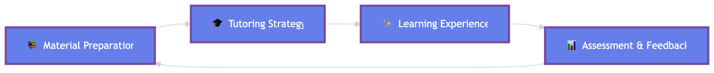

  <h1>Awesome AI and LLM for Education</h1>
  

    A curated list of papers related to artificial intelligence (AI) and large language model (LLM) for education
  

  

    <strong><a href="http://tianfuwang.tech/awesome-ai-llm4education/" style="text-decoration: none; color:rgb(255, 193, 7);">🚀 Online Webpage</a> |
    </strong><a href="LLM4EDU.md" style="text-decoration: none; color:rgb(69, 162, 255);">🌟 LLM4EDU Version</a> | <a href="README.md" style="text-decoration: none; color:rgb(170, 125, 252);">🤖 Full Version</a>
  

---

We collect papers related to **artificial intelligence (AI) and large language model (LLM) for education** from top conferences, journals, and specialized domain-specific conferences. We then categorize them according to their specific tasks for better organization.

The catalog is organized into **Surveys, Analyses & Perspectives**, **Teaching & Learning Lifecycle**, **Application Domains**, and **Datasets, Benchmarks & Toolkits**. Lifecycle papers use a third level to distinguish concrete tasks such as tutoring, material preparation, learner modeling, and assessment.
**:sparkles: indicates the papers that are related to LLM.**

> [!note]
> 🎉 Our paper "[SocialCoach: Personalized Social Skill Learning with RL-based Agentic Tutoring and Practice](https://arxiv.org/abs/2606.04155)" has been released!
>
> 🎉 Our paper "[LLM-powered Multi-agent Framework for Goal-oriented Learning in Intelligent Tutoring System](https://arxiv.org/abs/2501.15749)" has been accepted by **WWW 2025 (Industry Track) as Oral Presentation**!
>
> 🎈 Welcome to check our [project page](https://tianfuwang.tech/gen-mentor/) and [demo code](https://github.com/GeminiLight/gen-mentor) to enjoy the goal-oriented learning experience!

## Survey Scope

This catalog monitors representative venues across AI, computing, and education. The list is indicative rather than exhaustive; relevant workshops, journals, and arXiv preprints are also considered.

- **Artificial Intelligence:** AAAI, IJCAI
- **Data Mining, Web & Information Retrieval:** KDD, WWW, SIGIR, CIKM, WSDM
- **Education & Learning Sciences:** AIED, EDM, LAK, Learning@Scale, ITS, ICALT
- **Human-Computer Interaction:** CHI, CSCW, UIST, IUI
- **Machine Learning:** NeurIPS, ICML, ICLR
- **Natural Language Processing:** ACL, EMNLP, NAACL, EACL, COLING, COLM, and Findings tracks
- **Software Engineering & Computing Education:** ICSE, SIGCSE
- **Selected Journals:** IJAIED, Computers & Education, IEEE TLT, TKDE, TOIS, npj Science of Learning

## Catalog Trends

> [!NOTE]
> These charts summarize this curated catalog. Coverage changes may reflect collection activity as well as research activity, and 2026 is an incomplete publication year.

  

  

- **Catalog coverage:** 331 papers spanning **2001–2026**.
- **LLM-related coverage:** 195 papers (**58.9%** of the catalog).
- **Publication sources:** 50 venues and preprint sources.
- **Largest catalog section:** Teaching & Learning Lifecycle — **251 papers (75.8%)**.

*Source: `data/papers.csv`; generated by `scripts/generate_statistics.py`.*

## [Content](#content)

<!-- <table>
<tr><td colspan="2"><a href="#survey-papers">1. Survey</a></td></tr>
<tr><td colspan="2"><a href="#tasks">2. Tasks</a></td></tr>  -->

<table>
<tr><td colspan="2"><strong><a href="#surveys-analyses-perspectives">1. Surveys, Analyses & Perspectives</a></strong></td></tr>
<tr><td colspan="2">&emsp;<a href="#comprehensive-surveys">1.1. Comprehensive Surveys</a></td></tr>
<tr><td colspan="2">&emsp;<a href="#empirical-analyses">1.2. Empirical Analyses</a></td></tr>
<tr><td colspan="2"><strong><a href="#teaching-learning-lifecycle">2. Teaching & Learning Lifecycle</a></strong></td></tr>
<tr><td colspan="2">&emsp;<a href="#tutoring-systems">2.1. Tutoring Systems</a></td></tr>
<tr>
<td>&emsp;&emsp;<a href="#general-tutoring">2.1.1. General Tutoring</a></td>
<td>&emsp;&emsp;<a href="#learning-path-recommendation">2.1.2. Learning Path Recommendation</a></td>
</tr>
<tr><td colspan="2">&emsp;<a href="#material-preparation">2.2. Material Preparation</a></td></tr>
<tr>
<td>&emsp;&emsp;<a href="#content-generation">2.2.1. Content Generation</a></td>
<td>&emsp;&emsp;<a href="#question-generation">2.2.2. Question Generation</a></td>
</tr>
<tr>
<td>&emsp;&emsp;<a href="#knowledge-structuring">2.2.3. Knowledge Structuring</a></td>
<td>&emsp;&emsp;<a href="#resource-retrieval">2.2.4. Resource Retrieval</a></td>
</tr>
<tr>
<td>&emsp;&emsp;<a href="#instructional-design">2.2.5. Instructional Design</a></td>
<td></td>
</tr>
<tr><td colspan="2">&emsp;<a href="#teaching-support">2.3. Teaching Support</a></td></tr>
<tr>
<td>&emsp;&emsp;<a href="#teaching-assistance">2.3.1. Teaching Assistance</a></td>
<td></td>
</tr>
<tr><td colspan="2">&emsp;<a href="#learner-modeling">2.4. Learner Modeling</a></td></tr>
<tr>
<td>&emsp;&emsp;<a href="#knowledge-tracing">2.4.1. Knowledge Tracing</a></td>
<td>&emsp;&emsp;<a href="#cognitive-diagnosis">2.4.2. Cognitive Diagnosis</a></td>
</tr>
<tr>
<td>&emsp;&emsp;<a href="#student-profiling">2.4.3. Student Profiling</a></td>
<td>&emsp;&emsp;<a href="#student-simulation">2.4.4. Student Simulation</a></td>
</tr>
<tr>
<td>&emsp;&emsp;<a href="#learning-engagement">2.4.5. Learning Engagement</a></td>
<td></td>
</tr>
<tr><td colspan="2">&emsp;<a href="#learning-assessment">2.5. Learning Assessment</a></td></tr>
<tr>
<td>&emsp;&emsp;<a href="#adaptive-testing">2.5.1. Adaptive Testing</a></td>
<td>&emsp;&emsp;<a href="#automated-grading">2.5.2. Automated Grading</a></td>
</tr>
<tr>
<td>&emsp;&emsp;<a href="#feedback">2.5.3. Feedback</a></td>
<td></td>
</tr>
<tr><td colspan="2"><strong><a href="#application-domains">3. Application Domains</a></strong></td></tr>
<tr><td colspan="2">&emsp;<a href="#computer-science">3.1. Computer Science</a></td></tr>
<tr><td colspan="2">&emsp;<a href="#mathematics">3.2. Mathematics</a></td></tr>
<tr><td colspan="2">&emsp;<a href="#language-learning">3.3. Language Learning</a></td></tr>
<tr><td colspan="2">&emsp;<a href="#medical-education">3.4. Medical Education</a></td></tr>
<tr><td colspan="2">&emsp;<a href="#humanities">3.5. Humanities</a></td></tr>
<tr><td colspan="2">&emsp;<a href="#social-good">3.6. Social Good</a></td></tr>
<tr><td colspan="2">&emsp;<a href="#social-skills">3.7. Social Skills</a></td></tr>
<tr><td colspan="2"><strong><a href="#datasets-benchmarks-toolkits">4. Datasets, Benchmarks & Toolkits</a></strong></td></tr>
<tr><td colspan="2">&emsp;<a href="#datasets">4.1. Datasets</a></td></tr>
<tr><td colspan="2">&emsp;<a href="#benchmarks">4.2. Benchmarks</a></td></tr>
<tr><td colspan="2">&emsp;<a href="#toolkits">4.3. Toolkits</a></td></tr>
</table>

## [Surveys, Analyses & Perspectives](#content)

### [Comprehensive Surveys](#content)

1. **The Path to Conversational AI Tutors: Integrating Tutoring Best Practices and Targeted Technologies to Produce Scalable AI Agents**

    *Kirk Vanacore, Ryan S. Baker, Avery H. Closser, Jeremy Roschelle*

    arXiv, 2026. [`preprint`](https://arxiv.org/abs/2602.19303)

2. **Generative Artificial Intelligence and Agents in Research and Teaching**

    *Jussi S. Jauhiainen, Aurora Toppari*

    arXiv, 2025. [`preprint`](https://arxiv.org/abs/2508.16701)

3. **Opportunities and Challenges of LLMs in Education: An NLP Perspective**

    *Sowmya Vajjala, Bashar Alhafni, Stefano Bannò, Kaushal Kumar Maurya, Ekaterina Kochmar*

    arXiv, 2025. [`preprint`](https://arxiv.org/abs/2507.22753)

4. **Large Language Models for Education: A Survey**

    *Hanyi Xu, Wensheng Gan, Zhenlian Qi, Jiayang Wu, Philip S. Yu*

    Journal of Machine Learning and Cybernetics, 2024. [`journal`](https://arxiv.org/abs/2405.13001)

5. **Adapting Large Language Models for Education: Foundational Capabilities, Potentials, and Challenges**

    *Qingyao Li, Lingyue Fu, Weiming Zhang, Xianyu Chen, Jingwei Yu, Wei Xia, Weinan Zhang, Ruiming Tang, Yong Yu*

    arXiv, 2024. [`preprint`](https://arxiv.org/abs/2401.08664)

6. **Large Language Models for Education: A Survey and Outlook**

    *Shen Wang, Tianlong Xu, Hang Li, Chaoli Zhang, Joleen Liang, Jiliang Tang, Philip S. Yu, Qingsong Wen*

    arXiv, 2024. [`preprint`](https://arxiv.org/abs/2403.18105)

7. **Survey of Computerized Adaptive Testing: A Machine Learning Perspective**

    *Qi Liu, Yan Zhuang, Haoyang Bi, Zhenya Huang, Weizhe Huang, Jiatong Li, Junhao Yu, Zirui Liu, Zirui Hu, Yuting Hong, Zachary A. Pardos, Haiping Ma, Mengxiao Zhu, Shijin Wang, Enhong Chen*

    arXiv, 2024. [`preprint`](https://arxiv.org/abs/2404.00712)

8. **Large Language Models in Education: Vision and Opportunities**

    *Wensheng Gan, Zhenlian Qi, Jiayang Wu, Jerry Chun-Wei Lin*

    BigData, 2023. [`conference`](https://arxiv.org/abs/2311.13160)

9. **A Comprehensive Survey on Deep Learning Techniques in Educational Data Mining**

    *Yuanguo Lin, Hong Chen, Wei Xia, Fan Lin, Zongyue Wang, Yong Liu*

    arXiv, 2023. [`preprint`](https://arxiv.org/abs/2309.04761)

10. **Reinforcement Learning for Education: Opportunities and Challenges**

    *Adish Singla, Anna N. Rafferty, Goran Radanovic, Neil T. Heffernan*

    EDM-RL4ED, 2021. [`conference`](https://arxiv.org/abs/2107.08828)

### [Empirical Analyses](#content)

1. **The effect of ChatGPT on students’ learning performance, learning perception, and higher-order thinking: insights from a meta-analysis**

    *Jin Wang, Wenxiang Fan*

    Nature, 2025. [`journal`](https://www.nature.com/articles/s41599-025-04787-y)

2. **From Pilots to Practices: A Scoping Review of GenAI-Enabled Personalization in Computer Science Education**

    *Iman Reihanian, Yunfei Hou, Qingquan Sun*

    arXiv, 2025. [`preprint`](https://arxiv.org/abs/2512.20714)

3. **A systematic review of AI-driven intelligent tutoring systems (ITS) in K-12 education**

    *Angélique Létourneau, Marion Deslandes Martineau, Patrick Charland, John Alexander Karran, Jared Boasen, Pierre Majorique Léger*

    npj science of learning, 2025. [`journal`](https://www.nature.com/articles/s41539-025-00320-7)

## [Teaching & Learning Lifecycle](#content)

### [Tutoring Systems](#content)

#### [General Tutoring](#content)

1. **Beyond Pedagogical Principles: Multi-Horizon Preference Optimization for Efficient Socratic Tutoring**

    *Xin Shi, Chao Zhang, Yifan Zhu, Xueqiao Zhang, Yawei Luo*

    ACL, 2026. [`conference`](https://aclanthology.org/2026.acl-long.518/)

2. **LearnerCoMPASS: Intelligent Tutoring System with Dynamic Cognitive Diagnosis and Multi-Model Path Planning**

    *Ziji Sheng, Guiyao Tie, Weidong Wang, Pan Zhou, Daizong Liu*

    ACL, 2026. [`conference`](https://aclanthology.org/2026.acl-long.408/)

3. **Planning-Guided Tutoring with Assessment-Driven Memory for Pedagogical LLM Tutors**

    *Zechen Li, Qiannan Zhu, Mei Wang, Jia Li, Hua Huang*

    ACL, 2026. [`conference`](https://aclanthology.org/2026.acl-long.325/)

4. **SHAPE: Unifying Safety, Helpfulness and Pedagogy for Educational LLMs**

    *Sihang Zhao, Kangrui Yu, Youliang Yuan, Pinjia He, Hongyi Wen*

    ACL, 2026. [`conference`](https://aclanthology.org/2026.acl-long.529/)

5. **CogNet-KG: Empowering Tutoring Dialogues with a Cognitively-Structured Knowledge Graph for STEM Learning**

    *Ding Yu, Yu Lu, Tengju Li, Shasha Xiong, Shengquan Yu*

    ACL Findings, 2026. [`conference`](https://aclanthology.org/2026.findings-acl.639/)

6. **Arapai: An Offline-First AI Chatbot Architecture for Low-Connectivity Educational Environments**

    *Joseph Walusimbi, Ann Move Oguti, Joshua Benjamin Ssentongo, Keith Ainebyona*

    arXiv, 2026. [`preprint`](https://arxiv.org/abs/2603.03339)

7. **ClassAid: A Real-time Instructor-AI-Student Orchestration System for Classroom Programming Activities**

    *Gefei Zhang, Guodao Sun, Meng Xia, Ronghua Liang*

    arXiv, 2026. [`preprint`](https://arxiv.org/abs/2602.06734)

8. **Designing AI Tutors for Interest-Based Learning: Insights from Human Instructors**

    *Abhishek Kulkarni, Sharon Lynn Chu*

    arXiv, 2026. [`preprint`](https://arxiv.org/abs/2602.24036)

9. **Evidence-Decision-Feedback: Theory-Driven Adaptive Scaffolding for LLM Agents**

    *Clayton Cohn, Siyuan Guo, Surya Rayala, Hanchen David Wang, Naveeduddin Mohammed, Umesh Timalsina, Shruti Jain, Angela Eeds, Menton Deweese, Pamela J. Osborn Popp, Rebekah Stanton, Shakeera Walker, Meiyi Ma, Gautam Biswas*

    arXiv, 2026. [`preprint`](https://arxiv.org/abs/2602.01415)

10. **Letting Tutor Personas Speak Up for LLMs: Learning Steering Vectors from Dialogue via Preference Optimization**

    *Jaewook Lee, Alexander Scarlatos, Simon Woodhead, Andrew Lan*

    arXiv, 2026. [`preprint`](https://arxiv.org/abs/2602.07639)

11. **PATS: Personality-Aware Teaching Strategies with Large Language Model Tutors**

    *Donya Rooein, Sankalan Pal Chowdhury, Mariia Eremeeva, Yuan Qin, Debora Nozza, Mrinmaya Sachan, Dirk Hovy*

    arXiv, 2026. [`preprint`](https://arxiv.org/abs/2601.08402)

12. **Rewarding How Models Think Pedagogically: Integrating Pedagogical Reasoning and Thinking Rewards for LLMs in Education**

    *Unggi Lee, Jiyeong Bae, Jaehyeon Park, Haeun Park, Taejun Park, Younghoon Jeon, Sungmin Cho, Junbo Koh, Yeil Jeong, Gyeonggeon Lee*

    arXiv, 2026. [`preprint`](https://arxiv.org/abs/2601.14560)

13. **LLM-powered Multi-agent Framework for Goal-oriented Learning in Intelligent Tutoring System**

    *Tianfu Wang, Yi Zhan, Jianxun Lian, Zhengyu Hu, Nicholas Jing Yuan, Qi Zhang, Xing Xie, Hui Xiong*

    WWW, 2025. [`conference`](https://arxiv.org/abs/2501.15749), [`code`](https://github.com/GeminiLight/gen-mentor)

14. **A Theory of Adaptive Scaffolding for LLM-Based Pedagogical Agents**

    *Clayton Cohn, Surya Rayala, Namrata Srivastava, Joyce Horn Fonteles, Shruti Jain, Xinying Luo, Divya Mereddy, Naveeduddin Mohammed, Gautam Biswas*

    arXiv, 2025. [`preprint`](https://arxiv.org/abs/2508.01503)

15. **AI tutoring can safely and effectively support students: An exploratory RCT in UK classrooms**

    *LearnLM Team, Eedi*

    arXiv, 2025. [`preprint`](https://arxiv.org/abs/2512.23633)

16. **AgentTutor: Empowering Personalized Learning with Multi-Turn Interactive Teaching in Intelligent Education Systems**

    *Yuxin Liu, Zeqing Song, Jiong Lou, Chentao Wu, Jie Li*

    arXiv, 2025. [`preprint`](https://arxiv.org/abs/2601.04219)

17. **An Experience Report on a Pedagogically Controlled Curriculum-Constrained AI Tutor for SE Education**

    *Lucia Happe, Dominik Fuchs, Luca Huttner, Kai Marquardt, Anne Koziolek*

    arXiv, 2025. [`preprint`](https://arxiv.org/abs/2512.11882)

18. **Cultivating Helpful, Personalized, and Creative AI Tutors: A Framework for Pedagogical Alignment using Reinforcement Learning**

    *Siyu Song, Wentao Liu, Ye Lu, Ruohua Zhang, Tao Liu, Jinze Lv, Xinyun Wang, Aimin Zhou, Fei Tan, Bo Jiang, Hao Hao*

    arXiv, 2025. [`preprint`](https://arxiv.org/abs/2507.20335)

19. **Evolutionary Reinforcement Learning based AI tutor for Socratic Interdisciplinary Instruction**

    *Mei Jiang, Haihai Shen, Zhuo Luo, Bingdong Li, Wenjing Hong, Ke Tang, Aimin Zhou*

    arXiv, 2025. [`preprint`](https://arxiv.org/abs/2512.11930)

20. **Exploring Conversational Design Choices in LLMs for Pedagogical Purposes: Socratic and Narrative Approaches for Improving Instructor's Teaching Practice**

    *Si Chen, Isabel R. Molnar, Peiyu Li, Adam Acunin, Ting Hua, Alex Ambrose, Nitesh V. Chawla, Ronald Metoyer*

    arXiv, 2025. [`preprint`](https://arxiv.org/abs/2501.04100)

21. **From Problem-Solving to Teaching Problem-Solving: Aligning LLMs with Pedagogy using Reinforcement Learning**

    *David Dinucu-Jianu, Jakub Macina, Nico Daheim, Ido Hakimi, Iryna Gurevych, Mrinmaya Sachan*

    arXiv, 2025. [`preprint`](https://arxiv.org/pdf/2505.15607), [`code`](https://github.com/eth-lre/PedagogicalRL)

22. **Generative AI in Education: From Foundational Insights to the Socratic Playground for Learning**

    *Xiangen Hu, Sheng Xu, Richard Tong, Art Graesser*

    arXiv, 2025. [`preprint`](https://arxiv.org/abs/2501.06682)

23. **Hierarchical Pedagogical Oversight: A Multi-Agent Adversarial Framework for Reliable AI Tutoring**

    *Saisab Sadhu, Ashim Dhor*

    arXiv, 2025. [`preprint`](https://arxiv.org/abs/2512.22496)

24. **IntelliCode: A Multi-Agent LLM Tutoring System with Centralized Learner Modeling**

    *Jones David, Shreya Ghosh*

    arXiv, 2025. [`preprint`](https://arxiv.org/abs/2512.18669)

25. **LeafTutor: An AI Agent for Programming Assignment Tutoring**

    *Madison Bochard, Tim Conser, Alyssa Duran, Lazaro Martull, Pu Tian, Yalong Wu*

    arXiv, 2025. [`preprint`](https://arxiv.org/abs/2601.02375)

26. **Empowering Personalized Learning through a Conversation-based Tutoring System with Student Modeling**

    *Minju Park, Sojung Kim, Seunghyun Lee, Soonwoo Kwon, Kyuseok Kim*

    CHI-LBW, 2024. [`workshop`](https://arxiv.org/abs/2403.14071)

27. **An Educational Tool for Learning about Social Media Tracking, Profiling, and Recommendation**

    *Nicolas Pope, Juho Kahila, Jari Laru, Henriikka Vartiainen, Teemu Roos, Matti Tedre*

    ICALT, 2024. [`conference`](https://arxiv.org/abs/2402.01813)

28. **AutoTutor meets Large Language Models: A Language Model Tutor with Rich Pedagogy and Guardrails**

    *Sankalan Pal Chowdhury, Vilém Zouhar, Mrinmaya Sachan*

    Learning@Scale, 2024. [`conference`](https://arxiv.org/abs/2402.09216)

29. **Multi-turn Reinforcement Learning with Preference Human Feedback**

    *Lior Shani, Aviv Rosenberg, Asaf Cassel, Oran Lang, Daniele Calandriello, Avital Zipori, Hila Noga, Orgad Keller, Bilal Piot, Idan Szpektor, Avinatan Hassidim, Yossi Matias, Rémi Munos*

    NeurIPS, 2024. [`conference`](https://proceedings.neurips.cc/paper_files/paper/2024/hash/d77a7b289361abff82bdd2fb537ae152-Abstract-Conference.html)

30. **SocraticLM: Exploring Socratic Personalized Teaching with Large Language Models**

    *Jiayu Liu, Zhenya Huang, Tong Xiao, Jing Sha, Jinze Wu, Qi Liu, Shijin Wang, Enhong Chen*

    NeurIPS, 2024. [`conference`](https://neurips.cc/virtual/2024/poster/93477)

31. **Apprentice Tutor Builder: A Platform For Users to Create and Personalize Intelligent Tutors**

    *Glen Smith, Adit Gupta, Christopher MacLellan*

    arXiv, 2024. [`preprint`](https://arxiv.org/abs/2404.07883)

32. **Intelligent Tutor: Leveraging ChatGPT and Microsoft Copilot Studio to Deliver a Generative AI Student Support and Feedback System within Teams**

    *Wei-Yu Chen*

    arXiv, 2024. [`preprint`](https://arxiv.org/abs/2404.06762)

33. **Scaffolding Language Learning via Multi-modal Tutoring Systems with Pedagogical Instructions**

    *Zhengyuan Liu, Stella Xin Yin, Carolyn Lee, Nancy F. Chen*

    arXiv, 2024. [`preprint`](https://arxiv.org/abs/2404.03429)

34. **OATutor: An Open-source Adaptive Tutoring System and Curated Content Library for Learning Sciences Research**

    *Z. Pardos, Matthew Tang, Ioannis Anastasopoulos, Shreya K. Sheel, Ethan Zhang*

    CHI, 2023. [`conference`](https://dl.acm.org/doi/10.1145/3544548.3581574)

35. **AI-TA: Towards an Intelligent Question-Answer Teaching Assistant using Open-Source LLMs**

    *Yann Hicke, Anmol Agarwal, Qianou Ma, Paul Denny*

    NeurIPS - Workshop on Generative AI for Education (GAIED), 2023. [`workshop`](https://arxiv.org/abs/2311.02775)

36. **Empowering Private Tutoring by Chaining Large Language Models**

    *Yulin Chen, Ning Ding, Hai-Tao Zheng, Zhiyuan Liu, Maosong Sun, Bowen Zhou*

    arXiv, 2023. [`preprint`](https://arxiv.org/abs/2309.08112)

37. **How to Build an AI Tutor that Can Adapt to Any Course and Provide Accurate Answers Using Large Language Model and Retrieval-Augmented Generation**

    *Chenxi Dong*

    arXiv, 2023. [`preprint`](https://arxiv.org/abs/2311.17696)

38. **Personal Knowledge Graphs: Use Cases in e-learning Platforms**

    *Eleni Ilkou*

    WWW Companion, 2022. [`workshop`](https://arxiv.org/abs/2203.08507)

39. **ArgueTutor: An Adaptive Dialog-Based Learning System for Argumentation Skills**

    *Thiemo Wambsganss, C. Niklaus, Matthias Cetto, Matthias Söllner, S. Handschuh, J. Leimeister*

    CHI, 2021. [`conference`](https://dl.acm.org/doi/abs/10.1145/3411764.3445781)

40. **An Interaction Design for Machine Teaching to Develop AI Tutors**

    *Daniel Weitekamp, Erik Harpstead, K. Koedinger*

    CHI, 2020. [`conference`](https://dl.acm.org/doi/10.1145/3313831.3376226)

41. **The Cognitive Tutor Authoring Tools (CTAT): Preliminary Evaluation of Efficiency Gains**

    *V. Aleven, B. McLaren, J. Sewall, K. Koedinger*

    International Conference on Intelligent Tutoring Systems, 2006. [`conference`](https://figshare.com/articles/journal_contribution/The_Cognitive_Tutor_Authoring_Tools_CTAT_Preliminary_Evaluation_of_Efficiency_Gains/6470495/1/files/11899052.pdf)

42. **Locus of Feedback Control in Computer-Based Tutoring**

    *Albert T. Corbett, John R. Anderson*

    CHI, 2001. [`conference`](http://pact.cs.cmu.edu/corbett/Corbett&AndersonCHI2001.pdf)

#### [Learning Path Recommendation](#content)

1. **Multi-Agent Learning Path Planning via LLMs**

    *Haoxin Xu, Changyong Qi, Tong Liu, Bohao Zhang, Anna He, Bingqian Jiang, Longwei Zheng, Xiaoqing Gu*

    arXiv, 2026. [`preprint`](https://arxiv.org/abs/2601.17346)

2. **LearnMate: Enhancing Online Education with LLM-Powered Personalized Learning Plans and Support**

    *Xinyu Jessica Wang, Christine P. Lee, Bilge Mutlu*

    CHI Extended Abstract, 2025. [`workshop`](https://arxiv.org/abs/2503.13340)

3. **PlanGlow: Personalized Study Planning with an Explainable and Controllable LLM-Driven System**

    *Jiwon Chun, Yankun Zhao, Hanlin Chen, Meng Xia*

    Learning@Scale, 2025. [`conference`](https://arxiv.org/abs/2504.12452)

4. **Knowledge Starts with Practice: Knowledge-Aware Exercise Generative Recommendation with Adaptive Multi-Agent Cooperation**

    *Yangtao Zhou, Hua Chu, Yongxiang Chen, Ziwen Wang, Jiacheng Liu, Jianan Li, Yueying Feng, Xiangming Li, Zihan Han, Qingshan Li*

    NeurIPS, 2025. [`conference`](https://proceedings.neurips.cc/paper_files/paper/2025/hash/85dbd2fb8b355e4231b51e454c08ec1c-Abstract-Conference.html), [`code`](https://github.com/dsz532/exeGen)

5. **Item-Difficulty-Aware Learning Path Recommendation: From a Real Walking Perspective**

    *Haotian Zhang, Shuanghong Shen, Bihan Xu, Zhenya Huang, Jinze Wu, Jing Sha, Shijin Wang*

    KDD, 2024. [`conference`](https://dl.acm.org/doi/10.1145/3637528.3671947)

6. **Privileged Knowledge State Distillation for Reinforcement Learning-based Educational Path Recommendation**

    *Qingyao Li, Wei Xia, Li'ang Yin, Jiarui Jin, Yong Yu*

    KDD, 2024. [`conference`](https://dl.acm.org/doi/10.1145/3637528.3671872)

7. **Doubly constrained offline reinforcement learning for learning path recommendation**

    *Yue Yun, Huan Dai, Rui An, Yupei Zhang, Xuequn Shang*

    Knowledge-Based Systems (KBS), 2024. [`journal`](https://www.sciencedirect.com/science/article/abs/pii/S0950705123009917)

8. **Course Recommender Systems Need to Consider the Job Market**

    *Jibril Frej, Anna Dai, Syrielle Montariol, Antoine Bosselut, Tanja Käser*

    SIGIR, 2024. [`conference`](https://arxiv.org/abs/2404.10876)

9. **Modeling Balanced Explicit and Implicit Relations with Contrastive Learning for Knowledge Concept Recommendation in MOOCs**

    *Hengnian Gu, Zhiyi Duan, Pan Xie, Dongdai Zhou*

    WWW, 2024. [`conference`](https://arxiv.org/abs/2402.08256)

10. **Learning Structure and Knowledge Aware Representation with Large Language Models for Concept Recommendation**

    *Qingyao Li, Wei Xia, Kounianhua Du, Qiji Zhang, Weinan Zhang, Ruiming Tang, Yong Yu*

    arXiv, 2024. [`preprint`](https://arxiv.org/abs/2405.12442)

11. **Set-to-Sequence Ranking-based Concept-aware Learning Path Recommendation**

    *Xianyu Chen, Jian Shen, Wei Xia, Jiarui Jin, Yakun Song, Weinan Zhang, Weiwen Liu, Menghui Zhu, Ruiming Tang, Kai Dong, Dingyin Xia, Yong Yu*

    AAAI, 2023. [`conference`](https://arxiv.org/abs/2306.04234)

12. **Graph Enhanced Hierarchical Reinforcement Learning for Goal-oriented Learning Path Recommendation**

    *Qingyao Li, Wei Xia, Li'ang Yin, Jian Shen, Renting Rui, Weinan Zhang, Xianyu Chen, Ruiming Tang, Yong Yu*

    CIKM, 2023. [`conference`](https://dl.acm.org/doi/abs/10.1145/3583780.3614897)

13. **MHRR: MOOCs Recommender Service With Meta Hierarchical Reinforced Ranking**

    *Yuchen Li, Haoyi Xiong, Linghe Kong, Rui Zhang, Fanqin Xu, Guihai Chen, Minglu Li*

    TSC, 2023. [`journal`](https://ieeexplore.ieee.org/document/10286866)

14. **Constraint Sampling Reinforcement Learning: Incorporating Expertise For Faster Learning**

    *Tong Mu, Georgios Theocharous, David Arbour, Emma Brunskill*

    AAAI, 2022. [`conference`](https://arxiv.org/abs/2112.15221)

15. **CurriculumTutor: An Adaptive Algorithm for Mastering a Curriculum**

    *Shabana K M, Chandrashekar Lakshminarayanan*

    AIED, 2022. [`conference`](https://dl.acm.org/doi/10.1007/978-3-031-11644-5_26)

16. **Automatic Interpretable Personalized Learning**

    *Ethan Prihar, Aaron Haim, Adam Sales, Neil Heffernan*

    Learning@Scale, 2022. [`conference`](https://dl.acm.org/doi/abs/10.1145/3491140.3528267)

17. **ConceptGuide: Supporting Online Video Learning with Concept Map-based Recommendation of Learning Path**

    *Chien-Lin Tang, Jingxian Liao, Hao-Chuan Wang, Ching-Ying Sung, Wen-Chieh Lin*

    WWW, 2021. [`conference`](https://dl.acm.org/doi/10.1145/3442381.3449808)

18. **Reinforcement Learning for the Adaptive Scheduling of Educational Activities**

    *A. Singla, Anna N. Rafferty, Goran Radanovic, N. Heffernan*

    CHI, 2020. [`conference`](https://dl.acm.org/doi/10.1145/3313831.3376518)

19. **Deep Reinforcement Learning for Adaptive Learning Systems**

    *Xiao Li, Hanchen Xu, Jinming Zhang, Hua-hua Chang*

    arXiv, 2020. [`preprint`](https://arxiv.org/abs/2004.08410)

20. **Learning Path Recommendation Based on Knowledge Tracing Model and Reinforcement Learning**

    *Dejun Cai, Yuan Zhang, Bintao Dai*

    IEEE International Conference on Computer and Communications (ICCC), 2019. [`conference`](https://ieeexplore.ieee.org/document/9064104)

21. **Exploiting Cognitive Structure for Adaptive Learning**

    *Qi Liu, Shiwei Tong, Chuanren Liu, Hongke Zhao, Enhong Chen, Haiping Ma, Shijin Wang*

    KDD, 2019. [`conference`](https://arxiv.org/abs/1905.12470)

22. **Combining Adaptivity with Progression Ordering for Intelligent Tutoring Systems**

    *Tong Mu, Shuhan Wang, Erik Andersen, Emma Brunskill*

    Learning@Scale, 2018. [`conference`](https://dl.acm.org/doi/10.1145/3231644.3231672)

23. **The Effects of Adaptive Learning in a Massive Open Online Course on Learners' Skill Development**

    *Y. Rosen, I. Rushkin, Rob Rubin, Liberty Munson, Andrew M. Ang, G. Weber, Glenn Lopez, D. Tingley*

    Learning@Scale, 2018. [`conference`](https://scholar.harvard.edu/files/dtingley/files/adaptivelas2018.pdf)

24. **Ontology-based Recommender System in Higher Education**

    *Charbel Obeid, Inaya Lahoud, Hicham El Khoury,  Pierre-Antoine Champin*

    WWW Companion, 2018. [`workshop`](https://dl.acm.org/doi/10.1145/3184558.3191533)

25. **Program2Tutor: Combining Automatic Curriculum Generation with Multi-Armed Bandits for Intelligent Tutoring Systems**

    *Tong Mu, Karan Goel*

    NeurIPS - Workshop on Teaching Machines Humans and Robots, 2017. [`workshop`](http://www.teaching-machines.cc/nips2017/papers/nips17-teaching_paper-12.pdf)

### [Material Preparation](#content)

#### [Content Generation](#content)

1. **KCVR: Knowledge-Centric Video Reconstruction for Structured Pedagogical Summarization via Dynamic Graph Planning**

    *Jingjiang Liu, Jia Zhu, Hanghui Guo, Weijie Shi, Yue Cui, Xiaokang Jin, Yilin Wang, Qingyu Niu, Jiawei Shen, Guoqing Ma, Yidan Liang, Shimin Di, Jiajie Xu*

    ACL, 2026. [`conference`](https://aclanthology.org/2026.acl-long.414/)

2. **Code2Video: A Code-centric Paradigm for Educational Video Creation**

    *Yanzhe Chen, Kevin Qinghong Lin, Mike Zheng Shou*

    ICML, 2026. [`conference`](https://openreview.net/forum?id=HJ0JFzdwUo)

3. **ConvoLearn: A Dataset of Constructivist Tutor-Student Dialogue**

    *Mayank Sharma, Roy Pea, Hari Subramonyam*

    arXiv, 2026. [`preprint`](https://arxiv.org/abs/2601.08950)

4. **The Reel Deal: Designing and Evaluating LLM-Generated Short-Form Educational Videos**

    *Lazaros Stavrinou, Argyris Constantinides, Marios Belk, Vasos Vassiliou, Fotis Liarokapis, Marios Constantinides*

    CHIGreece, 2025. [`conference`](https://arxiv.org/abs/2501.04101)

5. **HealthCards: Exploring Text-to-Image Generation as Visual Aids for Healthcare Knowledge Democratizing and Education**

    *Qian Wu, Zheyao Gao, Longfei Gou, Yifan Hou, Qi Dou*

    EMNLP, 2025. [`conference`](https://aclanthology.org/2025.emnlp-main.1401/)

6. **Classic4Children: Adapting Chinese Literary Classics for Children with Large Language Model**

    *Jiali Chen, Xusen Hei, Yuqi Xue, Zihan Wu, Jiayuan Xie, Yi Cai*

    NAACL Findings, 2025. [`conference`](https://arxiv.org/abs/2502.01090)

7. **COGENT: A Curriculum-oriented Framework for Generating Grade-appropriate Educational Content**

    *Zhengyuan Liu, Stella Xin Yin, Dion Hoe-Lian Goh, Nancy F. Chen*

    arXiv, 2025. [`preprint`](https://arxiv.org/abs/2409.15024)

8. **Assisting in Writing Wikipedia-like Articles From Scratch with Large Language Models**

    *Yijia Shao, Yucheng Jiang, Theodore A. Kanell, Peter Xu, Omar Khattab, Monica S. Lam*

    NAACL, 2024. [`conference`](https://arxiv.org/abs/2402.14207)

9. **Generating Privacy-preserving Educational Data Records with Diffusion Model**

    *Quanlong Guan, Yanchong Yu, Xiujie Huang, Liangda Fang, Chaobo He, Lusheng Wu, Weiqi Luo, Guanliang Chen*

    WWW, 2024. [`conference`](https://dl.acm.org/doi/10.1145/3589335.3651511)

10. **Generating and Evaluating Tests for K-12 Students with Language Model Simulations: A Case Study on Sentence Reading Efficiency**

    *Eric Zelikman, Wanjing Anya Ma, Jasmine E. Tran, Diyi Yang, Jason D. Yeatman, Nick Haber*

    EMNLP, 2023. [`conference`](https://arxiv.org/abs/2310.06837)

11. **On the Automatic Generation and Simplification of Children's Stories**

    *Maria Valentini, Jennifer Weber, Jesus Salcido, Téa Wright, Eliana Colunga, Katharina Kann*

    EMNLP, 2023. [`conference`](https://arxiv.org/abs/2310.18502)

12. **FairytaleCQA: Integrating a Commonsense Knowledge Graph into Children's Storybook Narratives**

    *Jiaju Chen, Yuxuan Lu, Shao Zhang, Bingsheng Yao, Yuanzhe Dong, Ying Xu, Yunyao Li, Qianwen Wang, Dakuo Wang, Yuling Su*

    arXiv, 2023. [`preprint`](https://arxiv.org/abs/2311.09756)

13. **Robosourcing Educational Resources – Leveraging Large Language Models for Learnersourcing**

    *Paul Denny, Sami Sarsa, Arto Hellas, Juho Leinonen*

    Learning@Scale - Workshop on Learnersourcing: Student-generated Content @ Scale, 2022. [`workshop`](https://arxiv.org/abs/2211.04715)

14. **Linking Streets in OpenStreetMap to Persons in Wikidata**

    *Daria Gurtovoy, Simon Gottschalk*

    WWW Companion, 2022. [`workshop`](https://dl.acm.org/doi/abs/10.1145/3487553.3524267)

15. **Automatic Hierarchical Table of Contents Generation for Educational Videos**

    *Debabrata Mahapatra, Ragunathan Mariappan, Vaibhav Rajan*

    WWW, 2018. [`conference`](https://dl.acm.org/doi/10.1145/3184558.3186336)

16. **Automatic Generation of Quizzes from DBpedia According to Educational Standards**

    *Oscar Rodríguez Rocha, Catherine Faron Zucker*

    WWW Companion, 2018. [`workshop`](https://dl.acm.org/doi/10.1145/3184558.3191534)

#### [Question Generation](#content)

1. **From Memorization to Creation: Evaluating the Cognitive Depth of LLM-Generated Educational Questions**

    *Xiaolong Wang, Zhe Zhao, Song Lai, Chaoli Zhang, Zijie Geng, Yu Tong, Ye Wei, Qingsong Wen*

    KDD, 2026. [`conference`](https://arxiv.org/abs/2606.18257)

2. **LLM Prompt Evaluation for Educational Applications**

    *Langdon Holmes, Adam Coscia, Scott Crossley, Joon Suh Choi, Wesley Morris*

    arXiv, 2026. [`preprint`](https://arxiv.org/abs/2601.16134)

3. **Exploring Iterative Enhancement for Improving Learnersourced Multiple-Choice Question Explanations with Large Language Models**

    *Qiming Bao, Juho Leinonen, Alex Yuxuan Peng, Wanjun Zhong, Gaël Gendron, Timothy Pistotti, Alice Huang, Paul Denny, Michael Witbrock, Jiamou Liu*

    AAAI, 2025. [`conference`](https://arxiv.org/abs/2309.10444)

4. **Multiple-Choice Question Generation Using Large Language Models: Methodology and Educator Insights**

    *Giorgio Biancini, Alessio Ferrato, Carla Limongelli*

    UMAP Adjunct, 2025. [`workshop`](https://arxiv.org/abs/2506.04851)

5. **KAQG: A Knowledge‑Graph‑Enhanced RAG for Difficulty‑Controlled Question Generation**

    *Ching Han Chen, Ming Fang Shiu*

    arXiv, 2025. [`preprint`](https://arxiv.org/abs/2505.07618)

6. **Math Multiple Choice Question Generation via Human-Large Language Model Collaboration**

    *Jaewook Lee, Digory Smith, Simon Woodhead, Andrew Lan*

    EDM, 2024. [`conference`](https://arxiv.org/abs/2405.00864)

7. **Improving Automated Distractor Generation for Math Multiple-choice Questions with Overgenerate-and-rank**

    *Alexander Scarlatos, Wanyong Feng, Digory Smith, Simon Woodhead, Andrew Lan*

    NAACL - BEA workshop, 2024. [`workshop`](https://arxiv.org/abs/2405.05144)

8. **Exploring Automated Distractor Generation for Math Multiple-choice Questions via Large Language Models**

    *Wanyong Feng, Jaewook Lee, Hunter McNichols, Alexander Scarlatos, Digory Smith, Simon Woodhead, Nancy Otero Ornelas, Andrew Lan*

    NAACL Findings, 2024. [`conference`](https://arxiv.org/abs/2404.02124)

9. **Leveraging Large Language Models for Concept Graph Recovery and Question Answering in NLP Education**

    *Rui Yang, Boming Yang, Sixun Ouyang, Tianwei She, Aosong Feng, Yuang Jiang, Freddy Lecue, Jinghui Lu, Irene Li*

    arXiv, 2024. [`preprint`](https://arxiv.org/abs/2402.14293)

10. **Multiple Choice Questions and Large Languages Models: A Case Study with Fictional Medical Data**

    *Maxime Griot, Jean Vanderdonckt, Demet Yuksel, Coralie Hemptinne*

    arXiv, 2024. [`preprint`](https://arxiv.org/abs/2406.02394)

11. **ReadingQizMaker: A Human-NLP Collaborative System that Supports Instructors to Design High-Qality Reading Qiz Qestions**

    *Xinyi Lu, Simin Fan, Jessica Houghton, Lu Wang, Xu Wang*

    CHI, 2023. [`conference`](https://dl.acm.org/doi/10.1145/3544548.3580957)

12. **DeepQR: Neural-based Quality Ratings for Learnersourced Multiple-Choice Questions**

    *Lin Ni, Qiming Bao, Xiaoxuan Li, Qianqian Qi, Paul Denny, Jim Warren, Michael Witbrock, Jiamou Liu*

    AAAI, 2022. [`conference`](https://arxiv.org/abs/2111.10058)

13. **EQG-RACE: Examination-Type Question Generation**

    *Xin Jia, Wenjie Zhou, Xu Sun, Yunfang Wu*

    AAAI, 2021. [`conference`](https://arxiv.org/abs/2012.06106)

14. **Improving Learning Outcomes with Gaze Tracking and Automatic Question Generation**

    *Rohail Syed, Kevyn Collins-Thompson, Paul N. Bennett, Mengqiu Teng, Shane Williams, Dr. Wendy W. Tay, Shamsi Iqbal*

    WWW, 2020. [`conference`](https://dl.acm.org/doi/10.1145/3366423.3380240)

#### [Knowledge Structuring](#content)

1. **CSG: Cognitive Structure Generation for Intelligent Education**

    *Hengnian Gu, Zhifu Chen, Yuxin Chen, Jin Zhou, Dongdai Zhou*

    ICML, 2026. [`conference`](https://openreview.net/forum?id=PfarHkQG8e)

2. **Instructor-Aligned Knowledge Graphs for Personalized Learning**

    *Abdulrahman AlRabah, Priyanka Kargupta, Jiawei Han, Abdussalam Alawini*

    arXiv, 2026. [`preprint`](https://arxiv.org/abs/2602.17111)

3. **Using structured knowledge and traditional word embeddings to generate concept representations in the educational domain**

    *Oghenemaro Anuyah, Ion Madrazo Azpiazu, Maria Soledad Pera*

    WWW Companion, 2019. [`workshop`](https://dl.acm.org/doi/abs/10.1145/3308560.3316583)

#### [Resource Retrieval](#content)

1. **Large Language Model Augmented Exercise Retrieval for Personalized Language Learning**

    *Austin Xu, Will Monroe, Klinton Bicknell*

    Learning Analytics and Knowledge (LAK), 2024. [`conference`](https://arxiv.org/abs/2402.16877)

2. **Fine-Grained Similarity Measurement between Educational Videos and Exercises**

    *Xin Wang, Wei Huang, Qi Liu, Yu Yin, Zhenya Huang, Le Wu, Jianhui Ma, Xue Wang*

    MM, 2020. [`conference`](https://dl.acm.org/doi/10.1145/3394171.3413783)

#### [Instructional Design](#content)

1. **Instructional Agents: LLM Agents Can Reduce Teaching Faculty Workload through Multi-Agent Instructional Design**

    *Huaiyuan Yao, Wanpeng Xu, Justin Turnau, Nadia Kellam, Hua Wei*

    EACL, 2026. [`conference`](https://arxiv.org/abs/2508.19611), [`code`](https://github.com/DaRL-GenAI/instructional_agents)

2. **COMA: A Collaborative Multi-Role Agent Framework for Automated Lesson Plan Generation**

    *Xiaoli Zeng, Ying Zheng, Shuyan Huang, Zitao Liu, Mi Tian, Mingliang Hou, Jiaqi Zheng, Wenzhou Dou*

    WWW, 2026. [`conference`](https://doi.org/10.1145/3774904.3792982), [`code`](https://github.com/ai4ed/COMA-LessonPlan)

### [Teaching Support](#content)

#### [Teaching Assistance](#content)

1. **Double-Edged Sword or Sharp Tool? Designing and Evaluating Triadic LLM-Teacher Collaboration for K-12 Writing at Scale**

    *Canran WANG, Yuwen Yang, Zhen Wang, Ming MA, Ding Yu, Chentai Wang, Keman Huang, Xiaoyong Du*

    ACL Findings, 2026. [`conference`](https://aclanthology.org/2026.findings-acl.597/)

2. **Co-designing Large Language Model Tools for Project-Based Learning with K-12 Educators**

    *Prerna Ravi, John Masla, Gisella Kakoti, Grace Lin, Emma Anderson, Matt Taylor, Anastasia Ostrowski, Cynthia Breazeal, Eric Klopfer, Hal Abelson*

    CHI, 2025. [`conference`](https://arxiv.org/abs/2502.09799)

3. **LLMs are Biased Teachers: Evaluating LLM Bias in Personalized Education**

    *Iain Weissburg, Sathvika Anand, Sharon Levy, Haewon Jeong*

    NAACL Findings, 2025. [`conference`](https://aclanthology.org/2025.findings-naacl.314/)

4. **A Humanoid Social Robot as a Teaching Assistant in the Classroom**

    *Thomas Sievers*

    arXiv, 2025. [`preprint`](https://arxiv.org/abs/2508.05646)

5. **Supporting Self-Reflection at Scale with Large Language Models: Insights from Randomized Field Experiments in Classrooms**

    *Harsh Kumar, Ruiwei Xiao, Benjamin Lawson, Ilya Musabirov, Jiakai Shi, Xinyuan Wang, Huayin Luo, Joseph Jay Williams, Anna Rafferty, John Stamper, Michael Liut*

    Learning@Scale, 2024. [`conference`](https://arxiv.org/abs/2406.07571)

6. **The Promises and Pitfalls of Using Language Models to Measure Instruction Quality in Education**

    *Paiheng Xu, Jing Liu, Nathan Jones, Julie Cohen, Wei Ai*

    NAACL, 2024. [`conference`](https://arxiv.org/abs/2404.02444)

7. **MathVC: An LLM-Simulated Multi-Character Virtual Classroom for Mathematics Education**

    *Murong Yue, Wijdane Mifdal, Yixuan Zhang, Jennifer Suh, Ziyu Yao*

    arXiv, 2024. [`preprint`](https://arxiv.org/abs/2404.06711)

8. **Simulating Classroom Education with LLM-Empowered Agents**

    *Zheyuan Zhang, Daniel Zhang-Li, Jifan Yu, Linlu Gong, Jinchang Zhou, Zhanxin Hao, Jianxiao Jiang, Jie Cao, Huiqin Liu, Zhiyuan Liu, Lei Hou, Juanzi Li*

    arXiv, 2024. [`preprint`](https://arxiv.org/abs/2406.19226)

9. **LearnerExp: Exploring and Explaining the Time Management of Online Learning Activity**

    *Huan He, Qinghua Zheng, Bo Dong*

    WWW, 2019. [`conference`](https://dl.acm.org/doi/10.1145/3308558.3314140)

10. **The Knowledge-Learning-Instruction Framework: Bridging the Science-Practice Chasm to Enhance Robust Student Learning**

    *K. Koedinger, Albert T. Corbett, C. Perfetti*

    Cognitive Sciences, 2012. [`journal`](http://pact.cs.cmu.edu/pubs/Koedinger,%20Corbett,%20Perfetti%202012-KLI.pdf)

### [Learner Modeling](#content)

#### [Knowledge Tracing](#content)

1. **RAG-KT: Cross-platform Explainable Knowledge Tracing with Multi-view Fusion Retrieval Generation**

    *Zhiyi Duan, Hongyu Yuan, Rui Liu*

    ACL Findings, 2026. [`conference`](https://aclanthology.org/2026.findings-acl.257/)

2. **A Frequency-Aware Mixture of Heterogeneous Experts Framework for Knowledge Tracing**

    *Youheng Bai, Mingliang Hou, Teng Guo, Zitao Liu, Weiqi Luo*

    WWW, 2026. [`conference`](https://doi.org/10.1145/3774904.3792272)

3. **DTransKT: A Dual Transferable Knowledge Tracing Framework for Cross-Disciplinary Self-Adaptation**

    *Kun Liang, Jiake Ge, Xin Wang, Yiying Zhang*

    WWW, 2026. [`conference`](https://doi.org/10.1145/3774904.3792501)

4. **Leveraging LLM and Multiscale Knowledge States to Improve Knowledge Tracing in Programming Tasks**

    *Mingxing Shao, Tiancheng Zhang, Yifang Yin, Wenhui Wu, Zikai Li, Minghe Yu, Fangling Leng, Ge Yu*

    WWW, 2026. [`conference`](https://doi.org/10.1145/3774904.3792525)

5. **S²KT: Modeling Uncertainty in Knowledge Tracing via Semantic-aware Structured Gaussian Distributions**

    *Wenhui Wu, Tiancheng Zhang, Hengyu Liu, Lun Du, Zikai Li, Mingxing Shao, Minghe Yu, Yifang Yin, Ge Yu*

    WWW, 2026. [`conference`](https://arxiv.org/abs/2601.05930)

6. **A Training-Free Large Reasoning Model-based Knowledge Tracing Framework for Unified Prediction and Prescription**

    *Unggi Lee, Joo Young Kim, Ran Ju, Minyoung Jung, Jeyeon Eo*

    arXiv, 2026. [`preprint`](https://arxiv.org/abs/2601.01708)

7. **Towards LLM-Empowered Knowledge Tracing via LLM-Student Hierarchical Behavior Alignment in Hyperbolic Space**

    *Xingcheng Fu, Shengpeng Wang, Yisen Gao, Xianxian Li, Chunpei Li, Qingyun Sun, Dongran Yu*

    arXiv, 2026. [`preprint`](https://arxiv.org/abs/2602.22879)

8. **Priority Guided Explanation for Knowledge Tracing with Dual Ranking and Similarity Consistency**

    *Fan Li, Tiancheng Zhang, Yifang Yin, Minghe Yu, Mengxiang Wang, Ge Yu*

    IJCAI, 2025. [`conference`](https://www.ijcai.org/proceedings/2025/49)

9. **Denoising Programming Knowledge Tracing with a Code Graph-based Tuning Adaptor**

    *Weibo Gao, Qi Liu, Rui Li, Yuze Zhao, Hao Wang, Linan Yue, Fangzhou Yao, Zheng Zhang*

    KDD, 2025. [`conference`](https://doi.org/10.1145/3690624.3709172)

10. **Learning Patterns-Guided Data Generation for Knowledge Tracing**

    *Haiping Ma, Yi Yin, Ziwen Wang, Changqian Wang, Xiaoshan Yu, Shangshang Yang, Xingyi Zhang*

    KDD, 2025. [`conference`](https://doi.org/10.1145/3711896.3737021)

11. **PICKT: Practical Interlinked Concept Knowledge Tracing for Personalized Learning using Knowledge Map Concept Relations**

    *Wonbeen Lee, Channyoung Lee, Junho Sohn, Hansam Cho*

    arXiv, 2025. [`preprint`](https://arxiv.org/abs/2512.07179)

12. **Problems With Large Language Models for Learner Modelling: Why LLMs Alone Fall Short for Responsible Tutoring in K--12 Education**

    *Danial Hooshyar, Yeongwook Yang, Gustav Sir, Tommi Karkkainen, Raija Hamalainen, Mutlu Cukurova, Roger Azevedo*

    arXiv, 2025. [`preprint`](https://arxiv.org/abs/2512.23036)

13. **Predictive, scalable and interpretable knowledge tracing on structured domains**

    *Hanqi Zhou, Robert Bamler, Charley M. Wu, Álvaro Tejero-Cantero*

    ICLR, 2024. [`conference`](https://openreview.net/forum?id=NgaLU2fP5D)

14. **Enhancing Length Generalization for Attention Based Knowledge Tracing Models with Linear Biases**

    *Xueyi Li, Youheng Bai, Teng Guo, Zitao Liu, Yaying Huang, Xiangyu Zhao, Feng Xia, Weiqi Luo, Jian Weng*

    IJCAI, 2024. [`conference`](https://www.ijcai.org/proceedings/2024/0654)

15. **DyGKT: Dynamic Graph Learning for Knowledge Tracing**

    *Ke Cheng, Linzhi Peng, Pengyang Wang, Junchen Ye, Leilei Sun, Bowen Du*

    KDD, 2024. [`conference`](https://www.arxiv.org/abs/2407.20824)

16. **Leveraging Pedagogical Theories to Understand Student Learning Process with Graph-based Reasonable Knowledge Tracing**

    *Jiajun Cui, Hong Qian, Bo Jiang, Wei Zhang*

    KDD, 2024. [`conference`](https://arxiv.org/abs/2406.12896)

17. **RIGL: A Unified Reciprocal Approach for Tracing the Independent and Group Learning Processes**

    *Xiaoshan Yu, Chuan Qin, Dazhong Shen, Shangshang Yang, Haiping Ma, Hengshu Zhu, Xingyi Zhang*

    KDD, 2024. [`conference`](https://arxiv.org/abs/2406.12465)

18. **Interpretable Knowledge Tracing with Multiscale State Representation**

    *Jianwen Sun, Fenghua Yu, Qian Wan, Qing Li, Sannyuya Liu, Xiaoxuan Shen*

    WWW, 2024. [`conference`](https://dl.acm.org/doi/10.1145/3589334.3645373)

19. **Question Difficulty Consistent Knowledge Tracing**

    *Guimei Liu, Huijing Zhan, Jung-jae Kim*

    WWW, 2024. [`conference`](https://dl.acm.org/doi/10.1145/3589334.3645582)

20. **Enhancing Deep Knowledge Tracing via Diffusion Models for Personalized Adaptive Learning**

    *Ming Kuo, Shouvon Sarker, Lijun Qian, Yujian Fu, Xiangfang Li, Xishuang Dong*

    arXiv, 2024. [`preprint`](https://arxiv.org/abs/2405.05134)

21. **Language Model Can Do Knowledge Tracing: Simple but Effective Method to Integrate Language Model and Knowledge Tracing Task**

    *Shangshang Yang, Linrui Qin, Xiaoshan Yu*

    arXiv, 2024. [`preprint`](https://arxiv.org/abs/2406.02893)

22. **Deep Attentive Model for Knowledge Tracing**

    *Xin-Peng Wang, Liang Chen, M. Zhang*

    AAAI, 2023. [`conference`](https://ojs.aaai.org/index.php/AAAI/article/view/26214)

23. **Improving Interpretability of Deep Sequential Knowledge Tracing Models with Question-centric Cognitive Representations**

    *Jiahao Chen, Zitao Liu, Shuyan Huang, Qiongqiong Liu, Weiqing Luo*

    AAAI, 2023. [`conference`](https://ojs.aaai.org/index.php/AAAI/article/view/26661/26433)

24. **simpleKT: A Simple But Tough-to-Beat Baseline for Knowledge Tracing**

    *Zitao Liu, Qiongqiong Liu, Jiahao Chen, Shuyan Huang, Weiqi Luo*

    ICLR, 2023. [`conference`](https://arxiv.org/abs/2302.06881)

25. **Learning Behavior-oriented Knowledge Tracing**

    *Bihan Xu, Zhenya Huang, Jia-Yin Liu, Shuanghong Shen, Qi Liu, Enhong Chen, Jinze Wu, Shijin Wang*

    KDD, 2023. [`conference`](http://staff.ustc.edu.cn/~huangzhy/files/papers/BihanXu-KDD2023.pdf)

26. **Adversarial Bootstrapped Question Representation Learning for Knowledge Tracing**

    *Jianwen Sun, Fenghua Yu, Sannyuya Liu, Yawei Luo, Ruxia Liang, Xiaoxuan Shen*

    MM, 2023. [`conference`](https://dl.acm.org/doi/10.1145/3581783.3612044)

27. **Evolutionary Neural Architecture Search for Transformer in Knowledge Tracing**

    *Shangshang Yang, Xiaoshan Yu, Ye Tian, Xueming Yan, Haiping Ma, Xingyi Zhang*

    NeurIPS, 2023. [`conference`](https://openreview.net/forum?id=G14N38AjpU)

28. **Monitoring Student Progress for Learning Process-Consistent Knowledge Tracing**

    *Shuanghong Shen, Enhong Chen, Qi Liu, Zhenya Huang, Wei Huang, Yu Yin, Yu Su, Shijin Wang*

    TKDE, 2023. [`journal`](https://ieeexplore.ieee.org/document/9950313)

29. **Fine-Grained Interaction Modeling with Multi-Relational Transformer for Knowledge Tracing**

    *Jiajun Cui, Zeyuan Chen, Aimin Zhou, Jianyong Wang, Wei Zhang*

    TOIS, 2023. [`journal`](https://dl.acm.org/doi/10.1145/3580595)

30. **Enhancing Deep Knowledge Tracing with Auxiliary Tasks**

    *Zitao Liu, Qiongqiong Liu, Jiahao Chen, Shuyan Huang, Boyu Gao, Weiqing Luo, Jian Weng*

    WWW, 2023. [`conference`](https://dl.acm.org/doi/10.1145/3543507.3583866)

31. **Tracing Knowledge Instead of Patterns: Stable Knowledge Tracing with Diagnostic Transformer**

    *Yu Yin, Le Dai, Zhenya Huang, Shuanghong Shen, Fei Wang, Qi Liu, Enhong Chen, Xin Li*

    WWW, 2023. [`conference`](https://dl.acm.org/doi/10.1145/3543507.3583255)

32. **Interpretable Knowledge Tracing: Simple and Efficient Student Modeling with Causal Relations**

    *Sein Minn, Jill-Jenn Vie, Koh Takeuchi, Hisashi Kashima, Feida Zhu*

    AAAI, 2022. [`conference`](https://ojs.aaai.org/index.php/AAAI/article/view/21560/21309)

33. **No Task Left Behind: Multi-Task Learning of Knowledge Tracing and Option Tracing for Better Student Assessment**

    *Suyeong An, Junghoon Kim, Minsam Kim, Juneyoung Park*

    AAAI, 2022. [`conference`](https://arxiv.org/abs/2204.14006)

34. **Predictive Student Modelling in an Online Reading Platform**

    *Effat Farhana, Teomara Rutherford, Collin Lynch*

    AAAI, 2022. [`conference`](https://ojs.aaai.org/index.php/AAAI/article/download/21551/21300)

35. **Assessing Student's Dynamic Knowledge State by Exploring the Question Difficulty Effect**

    *Shuanghong Shen, Zhenya Huang, Qi Liu, Yu Su, Shijin Wang, Enhong Chen*

    SIGIR, 2022. [`conference`](http://staff.ustc.edu.cn/~cheneh/paper_pdf/2022/Shuanghong-Shen-SIGIR.pdf)

36. **HGKT: Introducing Hierarchical Exercise Graph for Knowledge Tracing**

    *Hanshuang Tong, Zhen Wang, Yun Zhou, Shiwei Tong, Wenyuan Han, Qi Liu*

    SIGIR, 2022. [`conference`](https://arxiv.org/abs/2006.16915)

37. **Improving Knowledge Tracing with Collaborative Information**

    *Ting Long, Jiarui Qin, Jian Shen, Weinan Zhang, Wei Xia, Ruiming Tang, Xiuqiang He, Yong Yu*

    WSDM, 2022. [`conference`](https://dl.acm.org/doi/10.1145/3488560.3498374)

38. **Contrastive Learning for Knowledge Tracing**

    *Wonsung Lee, Jaeyoon Chun, Youngmin Lee, Kyoungsoo Park, Sungrae Park*

    WWW, 2022. [`conference`](https://dl.acm.org/doi/10.1145/3485447.3512105)

39. **Learning Process-consistent Knowledge Tracing**

    *Shuanghong Shen, Qi Liu, Enhong Chen, Zhenya Huang, Wei Huang, Yu Yin, Yu Su, Shijin Wang*

    KDD, 2021. [`conference`](http://staff.ustc.edu.cn/~cheneh/paper_pdf/2021/Shuanghong-Shen-KDD.pdf)

40. **Enhancing Knowledge Tracing via Adversarial Training**

    *Xiaopeng Guo, Zhijie Huang, Jie Gao, Mingyu Shang, Maojing Shu, Jun Sun*

    MM, 2021. [`conference`](https://dl.acm.org/doi/10.1145/3474085.3475554)

41. **Tracing Knowledge State with Individual Cognition and Acquisition Estimation**

    *Ting Long, Yunfei Liu, Jian Shen, Weinan Zhang, Yong Yu*

    SIGIR, 2021. [`conference`](https://dl.acm.org/doi/10.1145/3404835.3462827)

42. **Temporal Cross-Effects in Knowledge Tracing**

    *Chenyang Wang, Weizhi Ma, Min Zhang, Chuancheng Lv, Fengyuan Wan, Huijie Lin, Taoran Tang, Yiqun Liu, Shaoping Ma*

    WSDM, 2021. [`conference`](https://dl.acm.org/doi/10.1145/3437963.3441802)

43. **Improving Knowledge Tracing via Pre-training Question Embeddings**

    *Yunfei Liu, Yang Yang, Xianyu Chen, Jian Shen, Haifeng Zhang, Yong Yu*

    IJCAI, 2020. [`conference`](https://arxiv.org/abs/2012.05031)

44. **Context-Aware Attentive Knowledge Tracing**

    *Aritra Ghosh, Neil Heffernan, Andrew S. Lan*

    KDD, 2020. [`conference`](https://dl.acm.org/doi/10.1145/3394486.3403282)

45. **Assessment Modeling: Fundamental Pre-training Tasks for Interactive Educational Systems**

    *Youngduck Choi, Youngnam Lee, Junghyun Cho, Jineon Baek, Dongmin Shin, Hangyeol Yu, Yugeun Shim, Seewoo Lee, Jonghun Shin, Chan Bae, Byungsoo Kim, Jaewe Heo*

    arXiv, 2020. [`preprint`](https://arxiv.org/abs/2002.05505)

46. **Knowledge Tracing with Sequential Key-Value Memory Networks**

    *Ghodai Abdelrahman, Qing Wang*

    SIGIR, 2019. [`conference`](https://dl.acm.org/doi/10.1145/3331184.3331195)

47. **EKT: Exercise-Aware Knowledge Tracing for Student Performance Prediction**

    *Qi Liu, Zhenya Huang, Yu Yin, Enhong Chen, Hui Xiong, Yu Su, Guoping Hu*

    TKDE, 2019. [`journal`](https://arxiv.org/abs/1906.05658)

48. **Augmenting Knowledge Tracing by Considering Forgetting Behavior**

    *Koki Nagatani, Qian Zhang, Masahiro Sato, Yan-Ying Chen, Francine Chen, Tomoko Ohkuma*

    WWW, 2019. [`conference`](https://dl.acm.org/doi/10.1145/3308558.3313565)

49. **Dynamic Key-Value Memory Networks for Knowledge Tracing**

    *Jiani Zhang, Xingjian Shi, Irwin King, Dit-Yan Yeung*

    WWW, 2017. [`conference`](https://arxiv.org/abs/1611.08108)

50. **Deep Knowledge Tracing**

    *Chris Piech, Jonathan Spencer, Jonathan Huang, Surya Ganguli, Mehran Sahami, Leonidas Guibas, Jascha Sohl-Dickstein*

    NeurIPS, 2015. [`conference`](https://arxiv.org/abs/1506.05908)

#### [Cognitive Diagnosis](#content)

1. **Breaking Robustness Barriers in Cognitive Diagnosis: A One-Shot Neural Architecture Search Perspective**

    *Ziwen Wang, Shangshang Yang, Xiaoshan Yu, Haiping Ma, Xingyi Zhang*

    KDD, 2026. [`conference`](https://doi.org/10.1145/3770854.3780159)

2. **Multi-Agent Debate based Concept Augmentation for Enhanced Cognitive Diagnosis**

    *Pengyang Shao, Lei Chen, Fei Liu, Yonghui Yang, Xun Yang, Meng Wang*

    KDD, 2026. [`conference`](https://doi.org/10.1145/3770854.3780196)

3. **Harnessing LLM for Noise-Robust Cognitive Diagnosis in Web-Based Intelligent Education Systems**

    *Guixian Zhang, Guan Yuan, Ziqi Xu, Yanmei Zhang, Jing Ren, Zhenyun Deng, Debo Cheng*

    WWW, 2026. [`conference`](https://doi.org/10.1145/3774904.3792493)

4. **ALIGNAgent: Adaptive Learner Intelligence for Gap Identification and Next-step guidance**

    *Bismack Tokoli, Luis Jaimes, Ayesha S. Dina*

    arXiv, 2026. [`preprint`](https://arxiv.org/abs/2601.15551)

5. **Misconception Diagnosis From Student-Tutor Dialogue: Generate Retrieve Rerank**

    *Joshua Mitton, Prarthana Bhattacharyya, Digory Smith, Thomas Christie, Ralph Abboud, Simon Woodhead*

    arXiv, 2026. [`preprint`](https://arxiv.org/abs/2602.02414)

6. **Knowledge Is Power: Harnessing Large Language Models for Enhanced Cognitive Diagnosis**

    *Zhiang Dong, Jingyuan Chen, Fei Wu*

    AAAI, 2025. [`conference`](https://ojs.aaai.org/index.php/AAAI/article/view/31992)

7. **A Dual-Fusion Cognitive Diagnosis Framework for Open Student Learning Environments**

    *Yuanhao Liu, Shuo Liu, Yimeng Liu, Chanjin Zheng, Wei Zhang, Hong Qian*

    KDD, 2025. [`conference`](https://doi.org/10.1145/3711896.3736820)

8. **Exploring Heterogeneity and Uncertainty for Graph-based Cognitive Diagnosis Models in Intelligent Education**

    *Pengyang Shao, Yonghui Yang, Chen Gao, Lei Chen, Kun Zhang, Chenyi Zhuang, Le Wu, Yong Li, Meng Wang*

    KDD, 2025. [`conference`](https://doi.org/10.1145/3690624.3709264)

9. **Language Representation Favored Zero-Shot Cross-Domain Cognitive Diagnosis**

    *Shuo Liu, Zihan Zhou, Yuanhao Liu, Jing Zhang, Hong Qian*

    KDD, 2025. [`conference`](https://doi.org/10.1145/3690624.3709281)

10. **Revisiting Cognition in Neural Cognitive Diagnosis**

    *Hengnian Gu, Guoqian Luo, Xiaoxiao Dong, Shulin Li, Dongdai Zhou*

    KDD, 2025. [`conference`](https://doi.org/10.1145/3690624.3709319)

11. **Boosting Neural Cognitive Diagnosis with Student’s Affective State Modeling**

    *Shanshan Wang, Zhen Zeng, Xun Yang, Ke Xu, Xingyi Zhang*

    AAAI, 2024. [`conference`](https://ojs.aaai.org/index.php/AAAI/article/view/27818)

12. **Symbolic Cognitive Diagnosis via Hybrid Optimization for Intelligent Education Systems**

    *Junhao Shen, Hong Qian, Wei Zhang, Aimin Zhou*

    AAAI, 2024. [`conference`](https://arxiv.org/abs/2401.10840)

13. **Zero-1-to-3: Domain-level Zero-shot Cognitive Diagnosis via One Batch of Early-bird Students towards Three Diagnostic Objectives**

    *Weibo Gao, Qi Liu, Hao Wang, Linan Yue, Haoyang Bi, Yin Gu, Fangzhou Yao, Zheng Zhang, Xin Li, Yuanjing He*

    AAAI, 2024. [`conference`](https://arxiv.org/abs/2312.13434)

14. **DGCD: An Adaptive Denoising GNN for Group-level Cognitive Diagnosis**

    *Haiping Ma, Siyu Song, Chuan Qin, Xiaoshan Yu, Limiao Zhang, Xingyi Zhang, Hengshu Zhu*

    IJCAI, 2024. [`conference`](https://www.ijcai.org/proceedings/2024/250)

15. **Capturing Homogeneous Influence among Students: Hypergraph Cognitive Diagnosis for Intelligent Education Systems**

    *Junhao Shen, Hong Qian, Shuo Liu, Wei Zhang, Bo Jiang, Aimin Zhou*

    KDD, 2024. [`conference`]()

16. **ORCDF: An Oversmoothing-Resistant Cognitive Diagnosis Framework for Student Learning in Online Education Systems**

    *Hong Qian, Shuo Liu, Mingjia Li, Bingdong Li, Zhi Liu, Aimin Zhou*

    KDD, 2024. [`conference`](https://arxiv.org/pdf/2407.17476)

17. **Path-Specific Causal Reasoning for Fairness-aware Cognitive Diagnosis**

    *Dacao Zhang, Kun Zhang, Le Wu, Mi Tian, Richang Hong, Meng Wang*

    KDD, 2024. [`conference`](https://arxiv.org/abs/2406.03064)

18. **Generative Students: Using LLM-Simulated Student Profiles to Support Question Item Evaluation**

    *Xinyi Lu, Xu Wang*

    Learning@Scale, 2024. [`conference`](https://arxiv.org/abs/2405.11591)

19. **An Autoencoder-Like Nonnegative Matrix Co-Factorization for Improved Student Cognitive Modeling**

    *Shenbao Yu, Yinghui Pan, Yifeng Zeng, Prashant Doshi, Guoquan Liu, Kim-Leng Poh, Mingwei Lin*

    NeurIPS, 2024. [`conference`](https://proceedings.neurips.cc/paper_files/paper/2024/hash/db2808c312de68420ef20f055b726549-Abstract-Conference.html)

20. **Multivariate Cognitive Response Framework for Student Performance Prediction on MOOC**

    *Lianhong Wang, Xiaoyao Li, Zhihui Luo, Zinan Hu, Qing Yan*

    TKDE, 2024. [`journal`](https://ieeexplore.ieee.org/document/10210482)

21. **Inductive Cognitive Diagnosis for Fast Student Learning in Web-Based Online Intelligent Education Systems**

    *Shuo Liu, Junhao Shen, Hong Qian, Aimin Zhou*

    WWW, 2024. [`conference`](https://arxiv.org/abs/2404.11290)

22. **Towards the Identifiability and Explainability for Personalized Learner Modeling: An Inductive Paradigm**

    *Jiatong Li, Qi Liu, Fei Wang, Jiayu Liu, Zhenya Huang, Fangzhou Yao, Linbo Zhu, Yu Su*

    WWW, 2024. [`conference`](https://arxiv.org/abs/2309.00300)

23. **Endowing Interpretability for Neural Cognitive Diagnosis by Efficient Kolmogorov-Arnold Networks**

    *Shiwei Tong, Qi Liu, Runlong Yu, Wei Huang, Zhenya Huang, Zachary A Pardos, Weijie Jiang*

    arXiv, 2024. [`preprint`](https://arxiv.org/abs/2405.14399)

24. **BETA-CD: A Bayesian Meta-Learned Cognitive Diagnosis Framework for Personalized Learning**

    *Haoyang Bi, Enhong Chen, Weidong He, Han Wu, Weihao Zhao, Shijin Wang, Jinze Wu*

    AAAI, 2023. [`conference`](https://ojs.aaai.org/index.php/AAAI/article/view/25629)

25. **Exploiting Non-Interactive Exercises in Cognitive Diagnosis**

    *Fangzhou Yao, Qi Liu, Min Hou, Shiwei Tong, Zhenya Huang, Enhong Chen, Jing Sha, Shijin Wang*

    IJCAI, 2023. [`conference`](https://www.ijcai.org/proceedings/2023/266)

26. **Disentangling Cognitive Diagnosis with Limited Exercise Labels**

    *Xiangzhi Chen, Le Wu, Fei Liu, Lei Chen, Kun Zhang, Richang Hong, Meng Wang*

    NeurIPS, 2023. [`conference`](https://openreview.net/forum?id=ogPBujRhiN)

27. **Leveraging Transferable Knowledge Concept Graph Embedding for Cold-Start Cognitive Diagnosis**

    *Weibo Gao, Hao Wang, Qi Liu, Fei Wang, Xin Lin, Linan Yue, Zheng Zhang, Rui Lv, Shijin Wang*

    SIGIR, 2023. [`conference`](https://dl.acm.org/doi/10.1145/3539618.3591774)

28. **Reconciling Cognitive Modeling with Knowledge Forgetting: A Continuous Time-aware Neural Network Approach**

    *Haiping Ma, Jingyuan Wang, Hengshu Zhu, Xin Xia, Haifeng Zhang, Xingyi Zhang, Lei Zhang*

    IJCAI, 2022. [`conference`](https://www.ijcai.org/proceedings/2022/302)

29. **HierCDF: A Bayesian Network-based Hierarchical Cognitive Diagnosis Framework**

    *Jiatong Li, Fei Wang, Qi Liu, Mengxiao Zhu, Wei Huang, Zhenya Huang, Enhong Chen, Yu Su, Shijin Wang*

    KDD, 2022. [`conference`](http://staff.ustc.edu.cn/~cheneh/paper_pdf/2022/Jiatong-Li-KDD.pdf)

30. **Item Response Ranking for Cognitive Diagnosis**

    *Shiwei Tong, Qi Liu, Runlong Yu, Wei Huang, Zhenya Huang, Zachary A Pardos, Weijie Jiang*

    IJCAI, 2021. [`conference`](http://staff.ustc.edu.cn/~huangzhy/files/papers/ShiweiTong-IJCAI2021.pdf)

31. **Towards a New Generation of Cognitive Diagnosis**

    *Qi Liu*

    IJCAI, 2021. [`conference`](http://staff.ustc.edu.cn/~qiliuql/files/Publications/QiLiu-IJCAI2021.pdf)

32. **Incremental Cognitive Diagnosis for Intelligent Education**

    *Shiwei Tong, Jiayu Liu, Yuting Hong, Zhenya Huang, Le Wu, Qi Liu, Wei Huang, Enhong Chen, Dan Zhang*

    SIGIR, 2021. [`conference`](http://staff.ustc.edu.cn/~qiliuql/files/Publications/Shiwei-Tong-KDD22.pdf)

33. **RCD: Relation Map Driven Cognitive Diagnosis for Intelligent Education Systems**

    *Weibo Gao, Qi Liu, Zhenya Huang, Yu Yin, Haoyang Bi, Mu-Chun Wang, Jianhui Ma, Shijin Wang, Yu Su*

    SIGIR, 2021. [`conference`](http://staff.ustc.edu.cn/~huangzhy/files/papers/WeiboGao-SIGIR2021.pdf)

34. **Neural Cognitive Diagnosis for Intelligent Education Systems**

    *Fei Wang,Qi Liu,Enhong Chen,Zhenya Huang,Yuying Chen,Yu Yin,Zai Huang,Shijin Wang*

    AAAI, 2020. [`conference`](https://arxiv.org/abs/1908.08733)

35. **Proposition Entailment in Educational Applications using Deep Neural Networks**

    *Florin Bulgarov, Rodney Nielsen*

    AAAI, 2019. [`conference`](https://ojs.aaai.org/index.php/AAAI/article/view/12009)

#### [Student Profiling](#content)

1. **AdaRD: An Adaptive Response Denoising Framework for Robust Learner Modeling**

    *Fangzhou Yao, Qi Liu, Linan Yue, Weibo Gao, Jiatong Li, Xin Li, Yuanjing He*

    KDD, 2024. [`conference`](https://dl.acm.org/doi/10.1145/3637528.3671684)

2. **FOKE: A Personalized and Explainable Education Framework Integrating Foundation Models, Knowledge Graphs, and Prompt Engineering**

    *Silan Hu, Xiaoning Wang*

    arXiv, 2024. [`preprint`](https://arxiv.org/abs/2405.03734)

3. **Towards Modeling Learner Performance with Large Language Models**

    *Seyed Parsa Neshaei, Richard Lee Davis, Adam Hazimeh, Bojan Lazarevski, Pierre Dillenbourg, Tanja Käser*

    arXiv, 2024. [`preprint`](https://arxiv.org/abs/2403.14661)

4. **Visualizing Self-Regulated Learner Profiles in Dashboards: Design Insights from Teachers**

    *Paola Mejia-Domenzain, Eva Laini, Seyed Parsa Neshaei, Thiemo Wambsganss, Tanja Käser*

    AIED, 2023. [`conference`](https://arxiv.org/abs/2305.16851)

5. **Contextualizing Problems to Student Interests at Scale in Intelligent Tutoring System Using Large Language Models**

    *Gautam Yadav, Ying-Jui Tseng, Xiaolin Ni*

    AIED - Workshop on Empowering Education with LLMs - the Next-Gen Interface and Content Generation, 2023. [`workshop`](https://arxiv.org/abs/2306.00190)

6. **Mitigating Biases in Student Performance Prediction via Attention-Based Personalized Federated Learning**

    *Yun-Wei Chu, Seyyedali Hosseinalipour, Elizabeth Tenorio, Laura Cruz, Kerrie Douglas, Andrew Lan, Christopher Brinton*

    CIKM, 2022. [`conference`](https://arxiv.org/abs/2208.01182)

7. **Predicting Student Performance using Advanced Learning Analytics**

    *Ali Daud, Naif Radi Aljohani, Rabeeh Ayaz Abbasi, Miltiadis D. Lytras, Farhat Abbas, Jalal S. Alowibdi*

    WWW Companion, 2017. [`workshop`](https://arxiv.org/abs/2203.08507)

#### [Student Simulation](#content)

1. **One LLM Does Not Simulate All Students: Ability-Aware Student Simulation via Cognitive Diagnosis Guided LLM Assignment**

    *Huixing Que, Qi Liu, Weibo Gao, Zhenya Huang*

    ACL Findings, 2026. [`conference`](https://aclanthology.org/2026.findings-acl.302/)

2. **EduMirror: Modeling Educational Social Dynamics with Value-driven Multi-agent Simulation**

    *Jingzhe Lin, Hengbin Yu, Yongdan Zeng, Fangwei Zhong*

    ICML, 2026. [`conference`](https://openreview.net/forum?id=9CPlmQzUtF)

3. **KASER: Knowledge-Aligned Student Error Simulator for Open-Ended Coding Tasks**

    *Zhangqi Duan, Nigel Fernandez, Andrew Lan*

    arXiv, 2026. [`preprint`](https://arxiv.org/abs/2601.06633)

4. **Simulated Students in Tutoring Dialogues: Substance or Illusion?**

    *Alexander Scarlatos, Jaewook Lee, Simon Woodhead, Andrew Lan*

    arXiv, 2026. [`preprint`](https://arxiv.org/abs/2601.04025)

5. **Towards Valid Student Simulation with Large Language Models**

    *Zhihao Yuan, Yunze Xiao, Ming Li, Weihao Xuan, Richard Tong, Mona Diab, Tom Mitchell*

    arXiv, 2026. [`preprint`](https://arxiv.org/abs/2601.05473)

6. **Agent4Edu: Generating Learner Response Data by Generative Agents for Intelligent Education Systems**

    *Weibo Gao, Qi Liu, Linan Yue, Fangzhou Yao, Rui Lv, Zheng Zhang, Hao Wang, Zhenya Huang*

    AAAI, 2025. [`conference`](https://arxiv.org/abs/2501.10332)

7. **Classroom Simulacra: Building Contextual Student Generative Agents in Online Education for Learning Behavioral Simulation**

    *Songlin Xu, Hao-Ning Wen, Hongyi Pan, Dallas Dominguez, Dong yin Hu, Xinyu Zhang*

    CHI, 2025. [`conference`](https://arxiv.org/abs/2502.02780)

8. **Evolution in Simulation: AI-Agent School with Dual Memory for High-Fidelity Educational Dynamics**

    *Sheng Jin, Haoming Wang, Zhiqi Gao, Yongbo Yang, Bao Chunjia, Chengliang Wang*

    EMNLP Findings, 2025. [`conference`](https://arxiv.org/abs/2510.11290)

9. **CoderAgent: Simulating Student Behavior for Personalized Programming Learning with Large Language Models**

    *Yi Zhan, Qi Liu, Weibo Gao, Zheng Zhang, Tianfu Wang, Shuanghong Shen, Junyu Lu, Zhenya Huang*

    IJCAI, 2025. [`conference`](https://arxiv.org/abs/2505.20642)

10. **Simulating Question-answering Correctness with a Conditional Diffusion**

    *Ting Long, Li'ang Yin, Yi Chang, Wei Xia, Yong Yu*

    WWW, 2025. [`conference`](https://doi.org/10.1145/3696410.3714508)

11. **Personality-aware Student Simulation for Conversational Intelligent Tutoring Systems**

    *Zhengyuan Liu, Stella Xin Yin, Geyu Lin, Nancy F. Chen*

    EMNLP, 2024. [`conference`](https://aclanthology.org/2024.emnlp-main.37/)

12. **EduAgent: Generative Student Agents in Learning**

    *Songlin Xu, Xinyu Zhang, Lianhui Qin*

    arXiv, 2024. [`preprint`](https://arxiv.org/abs/2404.07963)

#### [Learning Engagement](#content)

1. **Everyone's using it but no one is allowed to talk about it: College Students' Experiences Navigating the Higher Education Environment in a Generative AI World**

    *Yue Fu, Yifan Lin, Yessica Wang, Sarah Tran, Alexis Hiniker*

    arXiv, 2026. [`preprint`](https://arxiv.org/abs/2602.17720)

2. **GuideAI: A Real-time Personalized Learning Solution with Adaptive Interventions**

    *Ananya Shukla, Chaitanya Modi, Satvik Bajpai, Siddharth Siddharth*

    arXiv, 2026. [`preprint`](https://arxiv.org/abs/2601.20402)

3. **Investigating Self-regulated Learning Sequences within a Generative AI-based Intelligent Tutoring System**

    *Jie Gao, Shasha Li, Jianhua Zhang, Shan Li, Tingting Wang*

    arXiv, 2026. [`preprint`](https://arxiv.org/abs/2601.17000)

4. **Same Feedback Different Source: How AI vs Human Feedback Shapes Learner Engagement**

    *Caitlin Morris, Pattie Maes*

    arXiv, 2026. [`preprint`](https://arxiv.org/abs/2602.11311)

5. **StoryLensEdu: Personalized Learning Report Generation through Narrative-Driven Multi-Agent Systems**

    *Leixian Shen, Yan Luo, Rui Sheng, Yujia He, Haotian Li, Leni Yang, Huamin Qu*

    arXiv, 2026. [`preprint`](https://arxiv.org/abs/2602.17067)

6. **Examining the Role of LLM-Driven Interactions on Attention and Cognitive Engagement in Virtual Classrooms**

    *Suleyman Ozdel, Can Sarpkaya, Efe Bozkir, Hong Gao, Enkelejda Kasneci*

    arXiv, 2025. [`preprint`](https://arxiv.org/pdf/2505.07377)

7. **Exploring The Interaction-Outcome Paradox: Seemingly Richer and More Self-Aware Interactions with LLMs May Not Yet Lead to Better Learning**

    *Rahul R. Divekar, Sophia Guerra, Lisette Gonzalez, Natasha Boos*

    arXiv, 2025. [`preprint`](https://arxiv.org/abs/2511.09458)

### [Learning Assessment](#content)

#### [Adaptive Testing](#content)

1. **Efficient Adaptive Testing via Gradient Path Matching Subset Selection for AI Education**

    *Yan Zhuang, Junhao Yu, Bohou Zhang, Zachary Pardos, Jinze Wu, Daoqiang Zhang*

    ICML, 2026. [`conference`](https://openreview.net/forum?id=XnK6Jr0i8D)

2. **Diffusion-Inspired Cold Start with Sufficient Prior in Computerized Adaptive Testing**

    *Haiping Ma, Aoqing Xia, Changqian Wang, Hai Wang, Xingyi Zhang*

    KDD, 2025. [`conference`](https://doi.org/10.1145/3690624.3709317)

3. **Paper-Level Computerized Adaptive Testing for High-Stakes Examination via Multi-Objective Optimization**

    *Mingjia Li, Junkai Tong, Yiyang Huang, Yifei Ding, Hong Qian, Aimin Zhou*

    KDD, 2025. [`conference`](https://doi.org/10.1145/3711896.3737073)

4. **Search-Efficient Computerized Adaptive Testing**

    *Yuting Hong, Shiwei Tong, Wei Huang, Yan Zhuang, Qi Liu, Enhong Chen, Xin Li, Yuanjing He*

    CIKM, 2023. [`conference`](http://home.ustc.edu.cn/~zykb/files/paper/Yuting_cikm23.pdf)

5. **GMOCAT: A Graph-Enhanced Multi-Objective Method for Computerized Adaptive Testing**

    *Hangyu Wang, Ting Long, Liang Yin, Weinan Zhang, Wei Xia, Qichen Hong, Dingyin Xia, Ruiming Tang, Yong Yu*

    KDD, 2023. [`conference`](https://arxiv.org/abs/2310.07477)

6. **A Bounded Ability Estimation for Computerized Adaptive Testing**

    *Yan Zhuang, Qi Liu, GuanHao Zhao, Zhenya Huang, Weizhe Huang, Zachary Pardos, Enhong Chen, Jinze Wu, Xin Li*

    NeurIPS, 2023. [`conference`](https://openreview.net/forum?id=tAwjG5bM7H)

7. **Fully Adaptive Framework: Neural Computerized Adaptive Testing for Online Education**

    *Yan Zhuang, Qi Liu, Zhenya Huang, Zhi Li, Shuanghong Shen, Haiping Ma*

    AAAI, 2022. [`conference`](https://ojs.aaai.org/index.php/AAAI/article/view/20399)

8. **A Robust Computerized Adaptive Testing Approach in Educational Question Retrieval**

    *Yan Zhuang, Qi Liu, Zhenya Huang, Zhi Li, Binbin Jin, Haoyang Bi, Enhong Chen, Shijin Wang*

    SIGIR, 2022. [`conference`](http://staff.ustc.edu.cn/~cheneh/paper_pdf/2022/Yan-Zhuang-SIGIR.pdf)

9. **BOBCAT: Bilevel Optimization-Based Computerized Adaptive Testing**

    *Aritra Ghosh, Andrew Lan*

    IJCAI, 2021. [`conference`](https://arxiv.org/abs/2108.07386)

#### [Automated Grading](#content)

1. **EduMARS: Can Vision-Language Models Grade Like Teachers? Benchmarking Multimodal, Rubric-Based Assessment on Chinese K-12 Answers**

    *Xuan Zhao, Jiashun Chen, Wanting xu, Huiyuan Yan, Chaowei Fang, Xing Wei*

    ACL Findings, 2026. [`conference`](https://aclanthology.org/2026.findings-acl.466/)

2. **FeedEval: Pedagogically Aligned Evaluation of LLM-Generated Essay Feedback**

    *Seongyeub Chu, Jongwoo Kim, Munyong Yi*

    ACL Findings, 2026. [`conference`](https://aclanthology.org/2026.findings-acl.615/)

3. **From Scoring to Explanations: Evaluating SHAP and LLM Rationales for Rubric-based Teaching Quality Assessment**

    *Ivo Bueno, Babette Bühler, Philipp Stark, Tim Fütterer, Ulrich Trautwein, Dorottya Demszky, Heather Hill, Enkelejda Kasneci*

    ACL Findings, 2026. [`conference`](https://aclanthology.org/2026.findings-acl.375/)

4. **PsyScore: A Psychometrically-Aware Framework for Trait-Adaptive Essay Scoring and ZPD-Scaffolded Feedback**

    *Wei Xia, Jin Wu, Haoran Shi, Xiangyu Wang, Chanjin Zheng*

    ACL Findings, 2026. [`conference`](https://aclanthology.org/2026.findings-acl.384/)

5. **Evaluating AI Grading on Real-World Handwritten College Mathematics: A Large-Scale Study Toward a Benchmark**

    *Zhiqi Yu, Xingping Liu, Haobin Mao, Mingshuo Liu, Long Chen, Jack Xin, Yifeng Yu*

    ICML, 2026. [`conference`](https://openreview.net/forum?id=vcdsMrNGqP)

6. **TRACE: Toulmin-based Reasoning Assessment through Constructive Elements for LLM CoT Evaluation**

    *Yundong Kim, Heyoung Yang*

    ICML, 2026. [`conference`](https://openreview.net/forum?id=NJ9MZkCLAG)

7. **Automated Feedback Generation for Undergraduate Mathematics: Development and Evaluation of an AI Teaching Assistant**

    *Aron Gohr, Marie-Amelie Lawn, Kevin Gao, Inigo Serjeant, Stephen Heslip*

    arXiv, 2026. [`preprint`](https://arxiv.org/abs/2601.03458)

8. **How Uncertain Is the Grade? A Benchmark of Uncertainty Metrics for LLM-Based Automatic Assessment**

    *Hang Li, Kaiqi Yang, Xianxuan Long, Fedor Filippov, Yucheng Chu, Yasemin Copur-Gencturk, Peng He, Cory Miller, Namsoo Shin, Joseph Krajcik, Hui Liu, Jiliang Tang*

    arXiv, 2026. [`preprint`](https://arxiv.org/abs/2602.16039)

9. **Machine-Assisted Grading of Nationwide School-Leaving Essay Exams with LLMs and Statistical NLP**

    *Andres Karjus, Kais Allkivi, Silvia Maine, Katarin Leppik, Krister Kruusmaa, Merilin Aruvee*

    arXiv, 2026. [`preprint`](https://arxiv.org/abs/2601.16314)

10. **Conversational Education at Scale: A Multi-LLM Agent Workflow for Procedural Learning and Pedagogic Quality Assessment**

    *Jiahuan Pei, Fanghua Ye, Xin Sun, Wentao Deng, Koen Hindriks, Junxiao Wang*

    EMNLP Findings, 2025. [`conference`](https://arxiv.org/pdf/2507.05528)

11. **How well do Large Language Models Recognize Instructional Moves? Establishing Baselines for Foundation Models in Educational Discourse**

    *Kirk Vanacore, Rene F. Kizilcec*

    arXiv, 2025. [`preprint`](https://arxiv.org/abs/2512.19903)

12. **Large Language Models Approach Expert Pedagogical Quality in Math Tutoring but Differ in Instructional and Linguistic Profiles**

    *Ramatu Oiza Abdulsalam, Segun Aroyehun*

    arXiv, 2025. [`preprint`](https://arxiv.org/abs/2512.20780)

13. **Toward Trustworthy Difficulty Assessments: Large Language Models as Judges in Programming and Synthetic Tasks**

    *H. M. Shadman Tabib, Jaber Ahmed Deedar*

    arXiv, 2025. [`preprint`](https://arxiv.org/abs/2512.18597)

14. **From Automation to Augmentation: Large Language Models Elevating Essay Scoring Landscape**

    *Changrong Xiao, Wenxing Ma, Sean Xin Xu, Kunpeng Zhang, Yufang Wang, Qi Fu*

    arXiv, 2024. [`preprint`](https://arxiv.org/pdf/2401.06431)

15. **Large Language Models As MOOCs Graders**

    *Shahriar Golchin, Nikhil Garuda, Christopher Impey, Matthew Wenger*

    arXiv, 2024. [`preprint`](https://arxiv.org/abs/2402.03776)

16. **Large Language Models as Partners in Student Essay Evaluation**

    *Toru Ishida, Tongxi Liu, Hailong Wang, William K. Cheung*

    arXiv, 2024. [`preprint`](https://arxiv.org/abs/2405.18632)

#### [Feedback](#content)

1. **More Insightful Feedback for Tutoring: Enhancing Generation Mechanisms and Automatic Evaluation**

    *Wencke Liermann, Jin-Xia Huang, Yohan Lee, Kong Joo Lee*

    EMNLP, 2024. [`conference`](https://aclanthology.org/2024.emnlp-main.605/)

## [Application Domains](#content)

### [Computer Science](#content)

1. **ALGOGEN: Tool-Generated Verifiable Traces for Reliable Algorithm Visualization**

    *Liaokunpeng, Yuexiao Ma, Yisheng Lin, Hualin Zeng, Xiawu Zheng, Rongrong Ji*

    ACL Findings, 2026. [`conference`](https://aclanthology.org/2026.findings-acl.156/)

2. **Relying on LLMs: Student Practices and Instructor Norms are Changing in Computer Science Education**

    *Xinrui Lin, Heyan Huang, Shumin Shi, John Vines*

    arXiv, 2026. [`preprint`](https://arxiv.org/abs/2602.05506)

3. **Learning by Teaching: Engaging Students as Instructors of Large Language Models in Computer Science Education**

    *Xinming Yang, Haasil Pujara, Jun Li*

    COLM, 2025. [`conference`](https://arxiv.org/abs/2508.05979)

4. **Partnering with AI: A Pedagogical Feedback System for LLM Integration into Programming Education**

    *Niklas Scholz, Manh Hung Nguyen, Adish Singla, Tomohiro Nagashima*

    ECTEL, 2025. [`conference`](https://arxiv.org/pdf/2507.00406)

5. **When Scaffolding Breaks: Investigating Student Interaction with LLM-Based Writing Support in Real-Time K-12 EFL Classrooms**

    *Junho Myung, Hyunseung Lim, Hana Oh, Hyoungwook Jin, Nayeon Kang, So-Yeon Ahn, Hwajung Hong, Alice Oh, Juho Kim*

    arXiv, 2025. [`preprint`](https://arxiv.org/abs/2512.05506)

6. **ChatScratch: An AI-Augmented System Toward Autonomous Visual Programming Learning for Children Aged 6-12**

    *Liuqing Chen, Shuhong Xiao, Yunnong Chen, Ruoyu Wu, Yaxuan Song, Lingyun Sun*

    CHI, 2024. [`conference`](https://arxiv.org/abs/2402.04975)

7. **CodeAid: Evaluating a Classroom Deployment of an LLM-based Programming Assistant that Balances Student and Educator Needs**

    *Majeed Kazemitabaar, Runlong Ye, Xiaoning Wang, Austin Z. Henley, Paul Denny, Michelle Craig, Tovi Grossman*

    CHI, 2024. [`conference`](https://arxiv.org/abs/2401.11314)

8. **Exploring How Multiple Levels of GPT-Generated Programming Hints Support or Disappoint Novices**

    *Ruiwei Xiao, Xinying Hou, John Stamper*

    CHI, 2024. [`conference`](https://arxiv.org/abs/2404.02213)

9. **Interactions with Prompt Problems: A New Way to Teach Programming with Large Language Models**

    *James Prather, Paul Denny, Juho Leinonen, David H. Smith IV, Brent N. Reeves, Stephen MacNeil, Brett A. Becker, Andrew Luxton-Reilly, Thezyrie Amarouche, Bailey Kimmel*

    CHI, 2024. [`conference`](https://arxiv.org/abs/2401.10759)

10. **AI-Tutoring in Software Engineering Education**

    *Eduard Frankford, Clemens Sauerwein, Patrick Bassner, Stephan Krusche, Ruth Breu*

    ICSE, 2024. [`conference`](https://arxiv.org/abs/2404.02548)

11. **How Far Are We? The Triumphs and Trials of Generative AI in Learning Software Engineering**

    *Rudrajit Choudhuri, Dylan Liu, Igor Steinmacher, Marco Gerosa, Anita Sarma*

    ICSE, 2024. [`conference`](https://arxiv.org/abs/2312.11719)

12. **Evaluating the Effectiveness of LLMs in Introductory Computer Science Education: A Semester-Long Field Study**

    *Wenhan Lyu, Yimeng Wang, Tingting (Rachel)Chung, Yifan Sun, Yixuan Zhang*

    Learning@Scale, 2024. [`conference`](https://arxiv.org/abs/2404.13414)

13. **Accelerating Scientific Discovery with Generative Knowledge Extraction, Graph-Based Representation, and Multimodal Intelligent Graph Reasoning**

    *Markus J. Buehler*

    arXiv, 2024. [`preprint`](https://arxiv.org/abs/2403.11996)

14. **Studying the effect of AI Code Generators on Supporting Novice Learners in Introductory Programming**

    *Majeed Kazemitabaar, Justin Chow, Carl Ka To Ma, Barbara J. Ericson, David Weintrop, Tovi Grossman*

    CHI, 2023. [`conference`](https://arxiv.org/abs/2302.07427)

15. **Open-ended Knowledge Tracing for Computer Science Education**

    *Naiming Liu, Zichao Wang, Richard Baraniuk, Andrew Lan*

    EMNLP, 2022. [`conference`](https://aclanthology.org/2022.emnlp-main.254/)

### [Mathematics](#content)

1. **MathFlow: Enhancing the Perceptual Flow of MLLMs for Visual Mathematical Problems**

    *Shuhang Chen, Hangjie Yuan, Yunqiu Xu, Pengwei Liu, Tao Feng, Jun Cen, Zeying Huang, Yi Yang*

    ACL, 2026. [`conference`](https://aclanthology.org/2026.acl-long.43/)

2. **Bridging the Culture Gap: A Framework for LLM-Driven Socio-Cultural Localization of Math Word Problems in Low-Resource Languages**

    *Israel Abebe Azime, Tadesse Destaw Belay, Dietrich Klakow, Philipp Slusallek, Anshuman Chhabra*

    ACL Findings, 2026. [`conference`](https://aclanthology.org/2026.findings-acl.42/)

3. **EDU-CIRCUIT-HW: Evaluating Multimodal Large Language Models on Real-World University-Level STEM Student Handwritten Solutions**

    *Weiyu Sun, Liangliang Chen, Yongnuo Cai, Huiru Xie, Yi Zeng, Ying Zhang*

    ACL Findings, 2026. [`conference`](https://aclanthology.org/2026.findings-acl.751/)

4. **MathMixup: Boosting LLM Mathematical Reasoning with Difficulty-Controllable Data Synthesis and Curriculum Learning**

    *Xuchen Li, Jing Chen, Xuzhao Li, Hao Liang, Xiaohuan Zhou, Taifeng Wang, Wentao Zhang*

    ACL Findings, 2026. [`conference`](https://aclanthology.org/2026.findings-acl.118/)

5. **TabularMath: Understanding Math Reasoning over Tables with Large Language Models**

    *Shi-Yu Tian, Zhi Zhou, Wei Dong, Kun-Yang Yu, Ming Yang, Zi-Jian Cheng, Lan-Zhe Guo, Yu-Feng Li*

    ACL Findings, 2026. [`conference`](https://aclanthology.org/2026.findings-acl.759/)

6. **HiPhO: How Far Are (M)LLMs from Humans in the Latest High School Physics Olympiad Benchmark?**

    *Fangchen Yu, Haiyuan Wan, Qianjia Cheng, Yuchen Zhang, Jiacheng Chen, Fujun Han, Yulun Wu, Junchi Yao, Ruilizhen Hu, Ning Ding, Yu Cheng, Tao Chen, LEI BAI, Dongzhan Zhou, Yun Luo, Ganqu Cui, Peng Ye*

    ICML, 2026. [`conference`](https://openreview.net/forum?id=w6DqR74BTt)

7. **MathEDU: Towards Adaptive Feedback for Student Mathematical Problem-Solving**

    *Wei-Ling Hsu, Yu-Chien Tang, An-Zi Yen*

    arXiv, 2025. [`conference`](https://arxiv.org/pdf/2505.18056)

8. **One Size doesn’t Fit All: A Personalized Conversational Tutoring Agent for Mathematics Instruction**

    *Ben Liu, Jihan Zhang, Fangquan Lin, Xu Jia, Min Peng*

    arXiv, 2025. [`preprint`](https://arxiv.org/pdf/2502.12633)

9. **Mathemyths: Leveraging Large Language Models to Teach Mathematical Language through Child-AI Co-Creative Storytelling**

    *Chao Zhang, Xuechen Liu, Katherine Ziska, Soobin Jeon, Chi-Lin Yu, Ying Xu*

    CHI, 2024. [`conference`](https://arxiv.org/abs/2402.01927)

10. **Stepwise Verification and Remediation of Student Reasoning Errors with Large Language Model Tutors**

    *Nico Daheim, Jakub Macina, Manu Kapur, Iryna Gurevych, Mrinmaya Sachan*

    EMNLP, 2024. [`conference`](https://aclanthology.org/2024.emnlp-main.478/)

11. **Automatic Generation of Socratic Subquestions for Teaching Math Word Problems**

    *Kumar Shridhar, Jakub Macina, Mennatallah El-Assady, Tanmay Sinha, Manu Kapur, Mrinmaya Sachan*

    EMNLP, 2022. [`conference`](https://aclanthology.org/2022.emnlp-main.277/)

### [Language Learning](#content)

1. **GPT-4 as a Homework Tutor Can Improve Student Engagement and Learning Outcomes**

    *Alessandro Vanzo, Sankalan Pal Chowdhury, Mrinmaya Sachan*

    ACL, 2025. [`conference`](https://aclanthology.org/2025.acl-long.1502/)

2. **Position: LLMs Can be Good Tutors in Foreign Language Education**

    *Jingheng Ye, Shen Wang, Deqing Zou, Yibo Yan, Kun Wang, Hai-Tao Zheng, Zenglin Xu, Irwin King, Philip S. Yu, Qingsong Wen*

    EMNLP, 2025. [`conference`](https://arxiv.org/abs/2502.05467)

3. **BIPED: Pedagogically Informed Tutoring System for ESL Education**

    *Soonwoo Kwon, Sojung Kim, Minju Park, Seunghyun Lee, Kyuseok Kim*

    ACL, 2024. [`conference`](https://aclanthology.org/2024.acl-long.186/)

4. **WordPlay: An Agent Framework for Language Learning Games**

    *Ariel Blobstein, Daniel Izmaylov, Tal Yifat, Michal Levy, Avi Segal, Avi Segal*

    NeurIPS - Workshop on Generative AI for Education (GAIED), 2024. [`workshop`](https://gaied.org/neurips2023/files/9/9_paper.pdf)

### [Medical Education](#content)

1. **PUPPET: Neural-Symbolic Standardized Patients for Mental Health**

    *Chen Xu, Yu ji, Zhenyu Lv, Yang Yi, Yizhe Yang, Luyao Ji, Chaoyi Chen, Xianyang Wang, Tian Lan, Zhihua Wang, Juan Wang, Xunde Dong, Fuze Tian, Qunxi Dong, Bin Hu*

    ACL, 2026. [`conference`](https://aclanthology.org/2026.acl-long.121/)

2. **DentalGPT: Incentivizing Multimodal Reasoning in Dentistry**

    *Zhenyang Cai, Jiaming Zhang, Junjie Zhao, Ziyi Zeng, Yanchao Li, Liang Jingyi, Junying Chen, Yunjin Yang, Jiajun You, Shuzhi Deng, Xieruiqiii, Yuanting Chen, Xiangyi Feng, Jianquan Li, Liangyi Chen, Junwen Wang, Shan Jiang, Benyou Wang*

    ACL Findings, 2026. [`conference`](https://aclanthology.org/2026.findings-acl.135/)

3. **ClinTutor-R1: Advancing Scalable and Robust One-to-Many Alignment in Clinical Socratic Education**

    *Zhitao He, Haolin Yang, Zeyu Qin, Yi Fung*

    ICML, 2026. [`conference`](https://openreview.net/forum?id=15Gs65kvHS)

4. **CaseMaster: Designing and Evaluating a Probe for Oral Case Presentation Training with LLM Assistance**

    *Yang Ouyang, Yuansong Xu, Chang Jiang, Yifan Jin, Haoran Jiang, Quan Li*

    arXiv, 2026. [`preprint`](https://arxiv.org/abs/2601.19332)

5. **DischargeSim: A Simulation Benchmark for Educational Doctor–Patient Communication at Discharge**

    *Zonghai Yao, Michael Sun, Won Seok Jang, SUNJAE KWON, Soie Kwon, Hong Yu*

    EMNLP, 2025. [`conference`](https://arxiv.org/abs/2509.07188)

6. **Leveraging Large Language Model as Simulated Patients for Clinical Education**

    *Yanzeng Li, Cheng Zeng, Jialun Zhong, Ruoyu Zhang, Minhao Zhang, Lei Zou*

    arXiv, 2024. [`preprint`](https://arxiv.org/abs/2404.13066)

### [Humanities](#content)

1. **Exploring LLM-Powered Role and Action-Switching Pedagogical Agents for History Education in Virtual Reality**

    *Zihao Zhu, Ao Yu, Xin Tong, Pan Hui*

    CHI, 2025. [`conference`](https://arxiv.org/pdf/2505.02699)

### [Social Good](#content)

1. **GuideDog: A Real-World Egocentric Multimodal Dataset for Blind and Low-Vision Accessibility-Aware Guidance**

    *Junhyeok Kim, Jaewoo Park, Junhee Park, Sangeyl Lee, Jiwan Chung, Jisung Kim, Ji Hoon Joung, Youngjae Yu*

    ACL, 2026. [`conference`](https://aclanthology.org/2026.acl-long.251/)

2. **PatientSim: A Persona-Driven Simulator for Realistic Doctor-Patient Interactions**

    *Daeun Kyung, Hyunseung Chung, Seongsu Bae, Jiho Kim, Jae Ho Sohn, Taerim Kim, Soo Kyung Kim, Edward Choi*

    arXiv, 2025. [`preprint`](https://arxiv.org/pdf/2505.17818)

3. **LLM-Powered AI Tutors with Personas for d/Deaf and Hard-of-Hearing Online Learners**

    *Haocong Cheng, Si Chen, Christopher Perdriau, Yun Huang*

    arXiv, 2024. [`preprint`](https://arxiv.org/abs/2411.09873)

### [Social Skills](#content)

1. **SocialCoach: Personalized Social Skill Learning with RL-based Agentic Tutoring and Practice**

    *Tianfu Wang, Max Xiong, Jianxun Lian, Hongyuan Zhu, Zhengyu Hu, Yuxuan Lei, Linxiao Gong, Xiaofang Li, Peiting Tsai, Nicholas Jing Yuan, Qi Zhang*

    arXiv, 2026. [`preprint`](https://arxiv.org/abs/2606.04155)

2. **ACE: A LLM-based Negotiation Coaching System**

    *Ryan Shea, Aymen Kallala, Xin Lucy Liu, Michael W. Morris, Zhou Yu*

    EMNLP, 2024. [`conference`](https://aclanthology.org/2024.emnlp-main.709/)

## [Datasets, Benchmarks & Toolkits](#content)

### [Datasets](#content)

1. **EduEVAL-DB: A Role-Based Dataset for Pedagogical Risk Evaluation in Educational Explanations**

    *Javier Irigoyen, Roberto Daza, Aythami Morales, Julian Fierrez, Francisco Jurado, Alvaro Ortigosa, Ruben Tolosana*

    arXiv, 2026. [`preprint`](https://arxiv.org/abs/2602.15531)

2. **FoundationalASSIST: An Educational Dataset for Foundational Knowledge Tracing and Pedagogical Grounding of LLMs**

    *Eamon Worden, Cristina Heffernan, Neil Heffernan, Shashank Sonkar*

    arXiv, 2026. [`preprint`](https://arxiv.org/abs/2602.00070)

3. **IntrEx: A Dataset for Modeling Engagement in Educational Conversations**

    *Xingwei Tan, Mahathi Parvatham, Chiara Gambi, Gabriele Pergola*

    EMNLP Findings, 2025. [`conference`](https://arxiv.org/abs/2509.06652)

4. **QACP: An Annotated Question Answering Dataset for Assisting Chinese Python Programming Learners**

    *Rui Xiao, Lu Han, Xiaoying Zhou, Jiong Wang, Na Zong, Pengyu Zhang*

    arXiv, 2024. [`preprint`](https://arxiv.org/abs/2402.07913)

5. **PTADisc: A Cross-Course Dataset Supporting Personalized Learning in Cold-Start Scenarios**

    *Liya Hu, Zhiang Dong, Jingyuan Chen, Guifeng Wang, Zhihua Wang, Zhou Zhao, Fei Wu*

    NeurIPS, 2023. [`conference`](https://openreview.net/forum?id=EIydMrHBHP)

6. **XES3G5M: A Knowledge Tracing Benchmark Dataset with Auxiliary Information**

    *Zitao Liu, Qiongqiong Liu, Teng Guo, Jiahao Chen, Shuyan Huang, Xiangyu Zhao, Jiliang Tang, Weiqi Luo, Jian Weng*

    NeurIPS, 2023. [`conference`](https://proceedings.neurips.cc/paper_files/paper/2023/hash/67fc628f17c2ad53621fb961c6bafcaf-Abstract-Datasets_and_Benchmarks.html)

7. **EdNet: A Large-Scale Hierarchical Dataset in Education**

    *Youngduck Choi, Youngnam Lee, Dongmin Shin, Junghyun Cho, Seoyon Park, Seewoo Lee, Jineon Baek, Byungsoo Kim, Youngjun Jang*

    AIED, 2020. [`conference`](https://arxiv.org/abs/1912.03072)

### [Benchmarks](#content)

1. **AMO-Bench: Large Language Models Still Struggle in High School Math Competitions**

    *Junlin Liu, Shengnan An, Shuang Zhou, Dan Ma, Yehao Lin, Xinxuan Lv, Xuanlin Wang, Xiaoyu Li, Ziwen Wang, Xuezhi Cao, Xunliang Cai*

    ACL Findings, 2026. [`conference`](https://aclanthology.org/2026.findings-acl.101/)

2. **DataSciBench: An LLM Agent Benchmark for Data Science**

    *Dan Zhang, Sining Zhoubian, Min Cai, Fengzu Li, Lekang Yang, Wei Wang, Tianjiao Dong, Ziniu Hu, Jie Tang, Yisong Yue*

    ACL Findings, 2026. [`conference`](https://aclanthology.org/2026.findings-acl.181/)

3. **PedagogyBench: A Cognitive-Driven Benchmark for Multimodal Instructional Video Understanding**

    *Xiaokang Jin, Jia Zhu, Jingjiang Liu, Yabing Shi, Jueqi Guan, Hao Chen, Pasquale De Meo*

    ACL Findings, 2026. [`conference`](https://aclanthology.org/2026.findings-acl.614/)

4. **Position: Sycophancy is an Educational Safety Risk: Why LLM Tutors Need Sycophancy Benchmarks**

    *Enkelejda Kasneci, Gjergji Kasneci*

    ICML, 2026. [`conference`](https://openreview.net/forum?id=Oxp2oWV0H3)

5. **CASTLE: A Comprehensive Benchmark for Evaluating Student-Tailored Personalized Safety in Large Language Models**

    *Rui Jia, Ruiyi Lan, Fengrui Liu, Zhongxiang Dai, Bo Jiang, Jing Shao, Jingyuan Chen, Guandong Xu, Fei Wu, Min Zhang*

    arXiv, 2026. [`preprint`](https://arxiv.org/abs/2602.05633)

6. **ISD-Agent-Bench: A Comprehensive Benchmark for Evaluating LLM-based Instructional Design Agents**

    *YoungHoon Jeon, Suwan Kim, Haein Son, Sookbun Lee, Yeil Jeong, Unggi Lee*

    arXiv, 2026. [`preprint`](https://arxiv.org/abs/2602.10620)

7. **Visual Reasoning Benchmark: Evaluating Multimodal LLMs on Classroom-Authentic Visual Problems from Primary Education**

    *Mohamed Huti, Alasdair Mackintosh, Amy Waldock, Dominic Andrews, Maxime Lelievre, Moritz Boos, Tobias Murray, Paul Atherton, Robin A. A. Ince, Oliver G. B. Garrod*

    arXiv, 2026. [`preprint`](https://arxiv.org/abs/2602.12196)

8. **MathTutorBench: A Benchmark for Measuring Open-ended Pedagogical Capabilities of LLM Tutors**

    *Jakub Macina, Nico Daheim, Ido Hakimi, Manu Kapur, Iryna Gurevych, Mrinmaya Sachan*

    EMNLP, 2025. [`conference`](https://arxiv.org/abs/2502.18940)

9. **VisualEDU: A Benchmark for Assessing Coding and Visual Comprehension through Educational Problem-Solving Video Generation**

    *Hao Chen, TIANYU SHI, Pengran huang, Zeyuan Li, Jiahui Pan, Qianglong Chen, Lewei He*

    EMNLP Findings, 2025. [`conference`](https://aclanthology.org/2025.findings-emnlp.889/)

10. **Benchmarking the Pedagogical Knowledge of Large Language Models**

    *Maxime Lelièvre, Amy Waldock, Meng Liu, Natalia Valdés Aspillaga, Alasdair Mackintosh, María José Ogando Portela, Jared Lee, Paul Atherton, Robin A. A. Ince, Oliver G. B. Garrod*

    arXiv, 2025. [`preprint`](https://arxiv.org/abs/2506.18710)

11. **From Answers to Questions: EQGBench for Evaluating LLMs' Educational Question Generation**

    *Chengliang Zhou, Mei Wang, Ting Zhang, Qiannan Zhu, Jian Li, Hua Huang*

    arXiv, 2025. [`preprint`](https://arxiv.org/abs/2508.10005)

12. **Towards Robust Evaluation of STEM Education: Leveraging MLLMs in Project-Based Learning**

    *Yanhao Jia, Xinyi Wu, Qinglin Zhang, Yiran Qin, Luwei Xiao, Shuai Zhao*

    arXiv, 2025. [`preprint`](https://arxiv.org/pdf/2505.17050)

13. **Dr.Academy: A Benchmark for Evaluating Questioning Capability in Education for Large Language Models**

    *Yuyan Chen, Chenwei Wu, Songzhou Yan, Panjun Liu, Yanghua Xiao*

    ACL, 2024. [`conference`](https://aclanthology.org/2024.acl-long.173/)

14. **Language Models as Science Tutors**

    *Alexis Chevalier, Jiayi Geng, Alexander Wettig, Howard Chen, Sebastian Mizera, Toni Annala, Max Aragon, Arturo Rodriguez Fanlo, Simon Frieder, Simon Machado, Akshara Prabhakar, Ellie Thieu, Jiachen T. Wang, Zirui Wang, Xindi Wu, Mengzhou Xia, Wenhan Xia, Jiatong Yu, Junjie Zhu, Zhiyong Ren, Sanjeev Arora, Danqi Chen*

    ICML, 2024. [`conference`](https://proceedings.mlr.press/v235/chevalier24a.html)

15. **E-EVAL: A Comprehensive Chinese K-12 Education Evaluation Benchmark for Large Language Models**

    *Jinchang Hou, Chang Ao, Haihong Wu, Xiangtao Kong, Zhigang Zheng, Daijia Tang, Chengming Li, Xiping Hu, Ruifeng Xu, Shiwen Ni, Min Yang*

    arXiv, 2024. [`preprint`](https://arxiv.org/abs/2401.15927)

### [Toolkits](#content)

1. **EduNLP: Towards a Unified and Modularized Library for Educational Resources**

    *Zhenya Huang, Yuting Ning, Longhu Qin, Shiwei Tong, Shangzi Xue, Tong Xiao, Xin Lin, Jiayu Liu, Qi Liu, Enhong Chen, Shijing Wang*

    arXiv, 2024. [`preprint`](https://arxiv.org/abs/2406.01276)

2. **Experimental Interface for Multimodal and Large Language Model Based Explanations of Educational Recommender Systems**

    *Hasan Abu-Rasheed, Christian Weber, Madjid Fathi*

    arXiv, 2024. [`preprint`](https://arxiv.org/abs/2402.07910)

3. **pyKT: A Python Library to Benchmark Deep Learning based Knowledge Tracing Models**

    *Zitao Liu, Qiongqiong Liu, Jiahao Chen, Shuyan Huang, Jiliang Tang, Weiqing Luo*

    NeurIPS, 2022. [`conference`](https://arxiv.org/abs/2206.11460)

